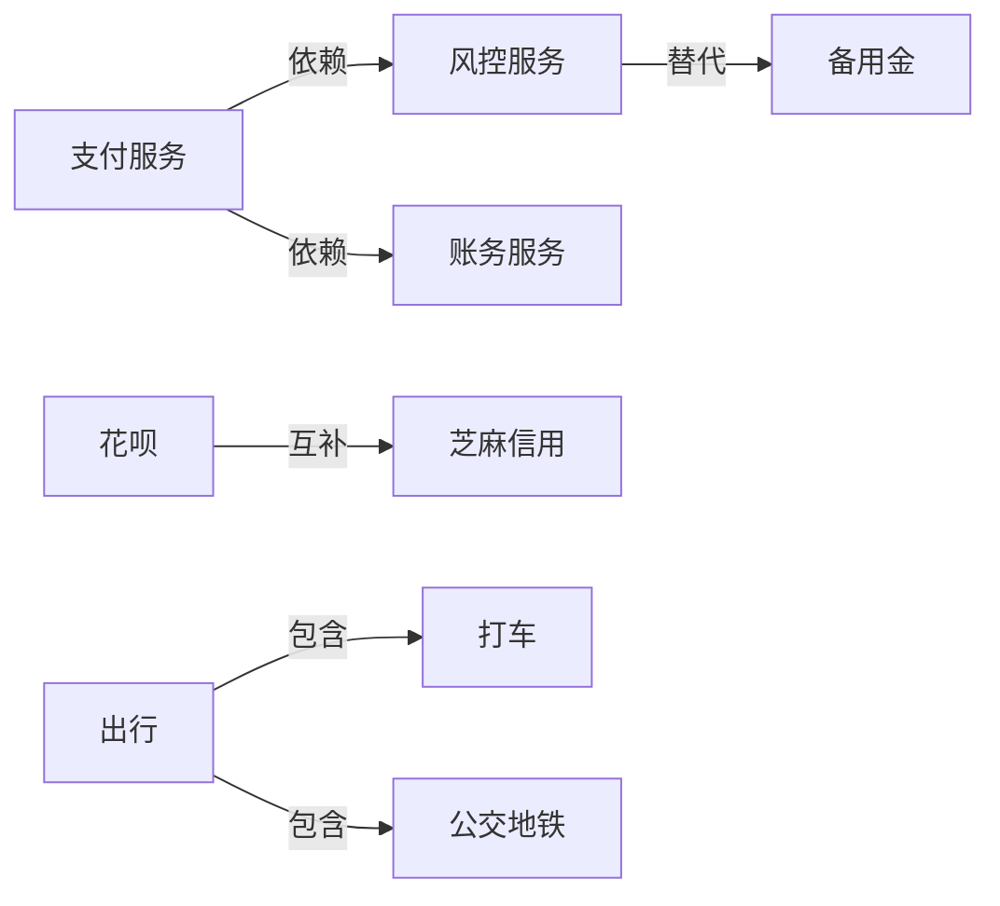

# 评测体系与知识图谱的关系分析报告

## ——以支付宝/支付App为具体场景

---

## 一、支付宝场景下的供给定义

### 1.1 核心业务域

支付宝作为超级App，核心业务可划分为三大域：

| 业务域 | 典型服务 | 供给形态 |
|--------|----------|----------|
| **支付** | 转账、收款、扫码支付、缴费 | API/SDK |
| **金融** | 理财、贷款、保险、信用卡 | 产品/小程序 |
| **生活服务** | 出行、健康、政务、外卖、电影 | 小程序/服务 |

### 1.2 供给的层次定义

在支付宝场景下，「供给」是一个多层次概念：

```
供给层级：
├── 原子能力层（基础API）
│   ├── 支付能力（alipay.trade）
│   ├── 认证能力（alipay.auth）
│   ├── 消息能力（alipay.msg）
│   └── 存储能力（alipay.storage）
│
├── 服务组件层（业务能力封装）
│   ├── 余额服务
│   ├── 花呗服务
│   ├── 信用服务
│   └── 风控服务
│
├── 功能/小程序层（用户可见形态）
│   ├── 第三方小程序（饿了么、滴滴）
│   ├── 支付宝自有小程序（健康码、公积金）
│   └── 工具类小程序（计算器、记账）
│
└── 场景/解决方案层（行业解决方案）
    ├── 商户收款解决方案
    ├── 智慧社区解决方案
    └── 小程序容器解决方案
```

### 1.3 供给的核心特征

| 特征 | 说明 | 示例 |
|------|------|------|
| **异构性** | 形态多样（API/小程序/SDK） | 支付API vs 健康码小程序 |
| **依赖性** | 服务间存在调用链 | 贷款依赖风控、征信 |
| **替代性** | 同类服务可替代 | 花呗 vs 信用卡 |
| **互补性** | 服务组合提供完整体验 | 支付+物流+售后 |
| **时效性** | 供给会上下线/更新 | 节日活动小程序 |

---

## 二、知识图谱能做什么

### 2.1 理解供给之间的关系

知识图谱的核心价值是**结构化表达实体间关系**。在支付宝场景下：

#### 关系类型设计



| 关系类型 | 定义 | 支付宝场景示例 |
|----------|------|----------------|
| **依赖关系** | A的执行必须调用B | 支付→风控 |
| **替代关系** | A和B功能相似可互相替代 | 花呗→信用卡 |
| **包含关系** | A是B的功能子集 | 生活服务→出行 |
| **互补关系** | A和B组合提供完整服务 | 支付+物流 |
| **版本关系** | A是B的升级版本 | 余额宝→余额宝Pro |

#### 典型知识图谱案例

| 行业 | 图谱名称 | 节点类型 | 边的类型 |
|------|----------|----------|----------|
| 电商 | 商品知识图谱 | 商品、品类、品牌 | 同品牌、相似、搭配 |
| 政务 | 服务知识图谱 | 事项、流程、材料 | 前后置、依赖 |
| 金融 | 产品知识图谱 | 理财产品、用户 | 适合人群、收益 |

### 2.2 服务推荐与搜索

#### 智能推荐场景

```
用户画像: 年轻白领 / 有车 / 偶尔出行

知识图谱推理:
├── 用户有车 → 推荐停车、洗车服务
├── 偶尔出行 → 缺省: 打车券
└── 白领 + 有车 → 缺省: 油卡充值

推荐结果: 洗车小程序 + 滴滴打车券 + 中石化充值
```

#### 搜索增强

- **语义理解**：搜索"看病"→理解需要→推荐医院挂号小程序
- **联想推荐**：搜索"外卖"→联想"红包"、"商家"
- **意图消歧**：搜索"医保"→区分→医保查询 vs 医保支付

### 2.3 风险控制

#### 风险链路追溯

```
异常事件: 某商户交易激增

知识图谱查询:
├── 商户 → 关联小程序: XX商城
├── XX商城 → 关联API: 支付API
├── 支付API → 关联风控规则: 大额预警
└── 历史模式: 该商户曾有套现记录

结论: 高风险 → 触发人工审核
```

#### 团伙欺诈检测

- 识别异常关系模式（多个商户共用同一支付通道）
- 传播路径分析（资金链路追踪）
- 异常子图挖掘

### 2.4 合规检测

#### 监管合规

```
场景: 金融产品上线审查

知识图谱检查:
├── 产品A → 关联产品: 理财产品
├── 理财产品 → 资质要求: 金融许可证
└── 商户B → 资质: 缺省

结果: 拒绝上架 → 缺少资质
```

#### 内容合规

- 小程序内容与类目是否匹配
- 资质证照是否在有效期
- 是否有禁止共现的服务组合

---

## 三、如何基于知识图谱构建评测集

### 3.1 图谱Schema设计

#### 节点定义（实体类型）

```json
{
  "entity_types": [
    {"id": "service", "name": "服务", "attributes": ["name", "type", "provider", "status"]},
    {"id": "api", "name": "API能力", "attributes": ["name", "endpoint", "version"]},
    {"id": "miniapp", "name": "小程序", "attributes": ["name", "category", "provider"]},
    {"id": "product", "name": "金融产品", "attributes": ["name", "risk_level", "yield"]},
    {"id": "merchant", "name": "商户", "attributes": ["name", "type", "license"]}
  ]
}
```

#### 边定义（关系类型）

```json
{
  "relation_types": [
    {"id": "depends_on", "name": "依赖", "domain": "service", "range": "service"},
    {"id": "replaces", "name": "替代", "domain": "service", "range": "service"},
    {"id": "complements", "name": "互补", "domain": "service", "range": "service"},
    {"id": "contains", "name": "包含", "domain": "service", "range": "service"},
    {"id": "requires", "name": "需要资质", "domain": "service", "range": "merchant"}
  ]
}
```

### 3.2 评测维度与指标

#### 1. 覆盖率评测

| 指标 | 计算方法 | 目标值 |
|------|----------|--------|
| **实体覆盖率** | 图谱实体数 / 实际服务总数 | ≥95% |
| **关系覆盖率** | 图谱边数 / 实际关系数 | ≥90% |
| **属性覆盖率** | 实体属性完整度平均值 | ≥85% |
| **场景覆盖率** | 覆盖的业务场景数 / 总场景数 | ≥90% |

#### 2. 准确性评测

| 指标 | 计算方法 | 目标值 |
|------|----------|--------|
| **实体准确率** | 正确实体数 / 图谱实体总数 | ≥98% |
| **关系准确率** | 正确边数 / 图谱边总数 | ≥95% |
| **属性准确率** | 正确属性数 / 属性总数 | ≥95% |
| **链接预测准确率** | MRR / HITS@K | 按场景设定 |

#### 3. 一致性评测

| 指标 | 说明 |
|------|------|
| ** Schema一致性** | 实体和关系是否符合预定义Schema |
| ** 上下位一致性** | 包含关系是否形成有效层次结构 |
| ** 互斥关系一致性** | 替代关系是否产生冲突 |
| ** 时效一致性** | 过期信息是否及时更新 |

### 3.3 评测集构建方法

#### 步骤1: 需求分析

```python
# 确定评测范围
evaluation_scope = {
    "services": ["支付", "金融", "生活服务"],
    "apis": ["核心API", "第三方API"],
    "coverage": "全量"
}
```

#### 步骤2: 数据采集

| 数据来源 | 采集内容 |
|----------|----------|
| 开放平台 | 小程序信息、API列表 |
| 业务数据库 | 服务配置、依赖关系 |
| 运营数据 | 服务使用情况、上下线记录 |
| 人工标注 | 专家确认的关系数据 |

#### 步骤3: 标注测试集

```python
# 测试集划分
test_dataset = {
    "train": "70%",      # 用于图谱构建
    "valid": "15%",     # 用于调参
    "test": "15%"       # 用于评测
}
```

#### 步骤4: 自动化评测

```python
# 评测流程
def evaluate_kg(kg, test_set):
    results = {
        "coverage": calc_coverage(kg, test_set),
        "accuracy": calc_accuracy(kg, test_set),
        "consistency": calc_consistency(kg)
    }
    return results
```

### 3.4 评测集示例

#### 实体测试集

```
服务实体:
- 支付宝支付 (type: payment, provider: alipay)
- 余额宝 (type: financial_product, provider: ant)
- 滴滴出行 (type: miniapp, provider: didi)
- 健康码 (type: miniapp, provider: government)
```

#### 关系测试集

```
正向关系:
- 支付宝支付 --依赖--> 风险控制服务
- 花呗 --互补--> 芝麻信用
- 出行服务 --包含--> 打车服务

反向关系:
- 银行卡支付 --替代--> 花呗支付
```

#### 边界case测试集

```
边界case:
- 新上线服务（无历史数据）
- 下线服务（需标注为过期）
- 第三方服务（资质不全）
- 跨场景服务（多业务域交叉）
```

---

## 四、结论与建议

### 4.1 核心结论

1. **评测团队需要构建供给知识图谱**
   - 支付宝供给量大、关系复杂，人工维护成本高
   - 知识图谱是理解服务关系的最佳方式

2. **知识图谱对评测有三大价值**
   - 理解服务间关系（依赖/替代/互补）
   - 支撑推荐搜索评测
   - 赋能风险合规评测

3. **评测集构建需要覆盖三个维度**
   - 覆盖率（实体、关系、属性）
   - 准确性（实体、关系、属性）
   - 一致性（Schema、上下位、时效）

### 4.2 实施建议

| 阶段 | 任务 | 优先级 |
|------|------|--------|
| **第一阶段** | 定义Schema，梳理核心服务 | P0 |
| **第二阶段** | 构建基础图谱，覆盖核心服务 | P0 |
| **第三阶段** | 设计评测指标，开发评测工具 | P1 |
| **第四阶段** | 积累测试集，持续迭代优化 | P1 |

### 4.3 风险与挑战

- **数据质量**：多源数据整合的一致性
- **时效性**：服务上下线频繁，需持续更新
- **主观性**：关系定义可能存在歧义，需专家介入
- **规模问题**：全量服务构建复杂度高，建议分阶段推进

---

*本报告由 Codex 评测体系分析生成*
