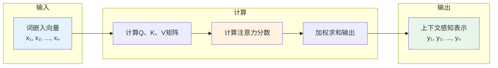
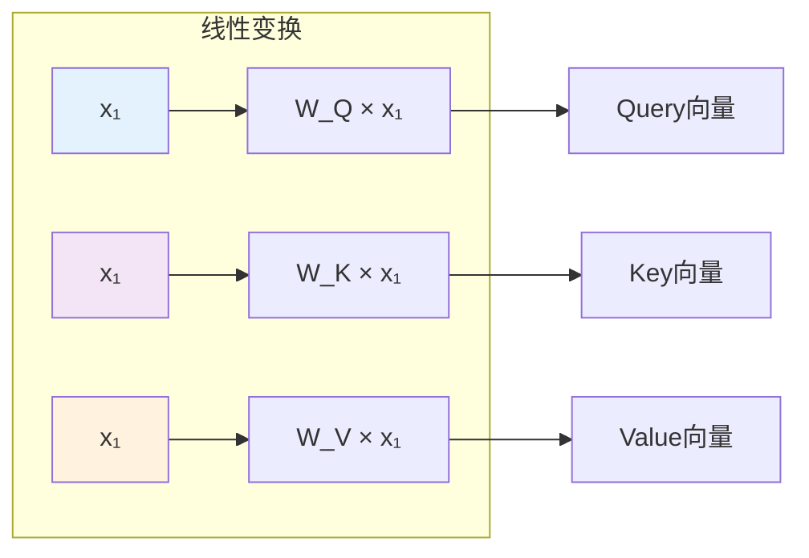
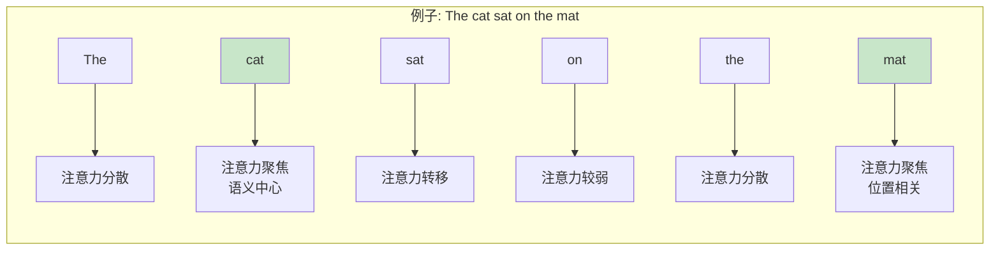

# 图1: Self-Attention计算流程概述



**说明**: Self-Attention通过计算序列内部元素间的关联，学习上下文相关的表示。

---

# 图2: Q、K、V矩阵计算



**说明**: 输入向量通过三个独立的线性变换矩阵，生成Query、Key、Value向量。

---

# 图3: 注意力分数计算

```mermaid
flowchart LR
    subgraph "Scaled Dot-Product"
        S1[Q·Kᵀ] --> S2[除以√dₖ]
        S2 --> S3[Softmax]
    end
    
    S3 --> S4[注意力权重<br/>α₁, α₂, ..., αₙ]
    
    S4 --> S5[加权求和]
    S5 --> S6[Attention(Q,K,V) = ΣαᵢVᵢ]
    
    style S1 fill:#ffcdd2
    style S4 fill:#c8e6c9
```

**说明**: 计算Query与Key的相似度，经过缩放和Softmax得到注意力权重，再对Value加权求和。

---

# 图4: 多位置注意力示例



**说明**: Self-Attention可以同时关注序列中的多个位置，动态分配注意力权重。

---

# 图5: 自注意力计算复杂度

```mermaid
flowchart LR
    subgraph "计算复杂度"
        C1[序列长度n] --> C2[n × n 注意力矩阵]
    end
    
    C2 --> C3[O(n² × d)]
    
    subgraph "对比"
        C4[RNN: O(n × d²)]
        C5[CNN: O(n × k × d)]
    end
    
    C3 --> C6[长序列挑战]
    C4 --> C6
    C5 --> C6
    
    style C1 fill:#e3f2fd
    style C6 fill:#ffcdd2
```

**说明**: Self-Attention的计算复杂度是序列长度的平方，在处理长文本时面临计算挑战。
