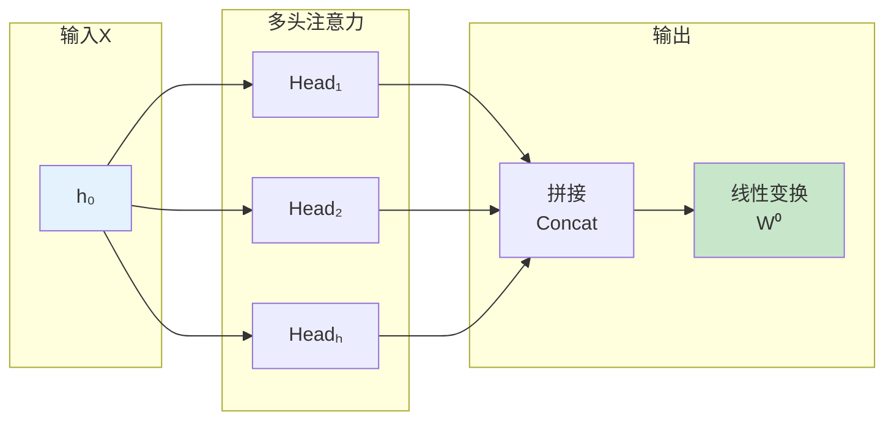
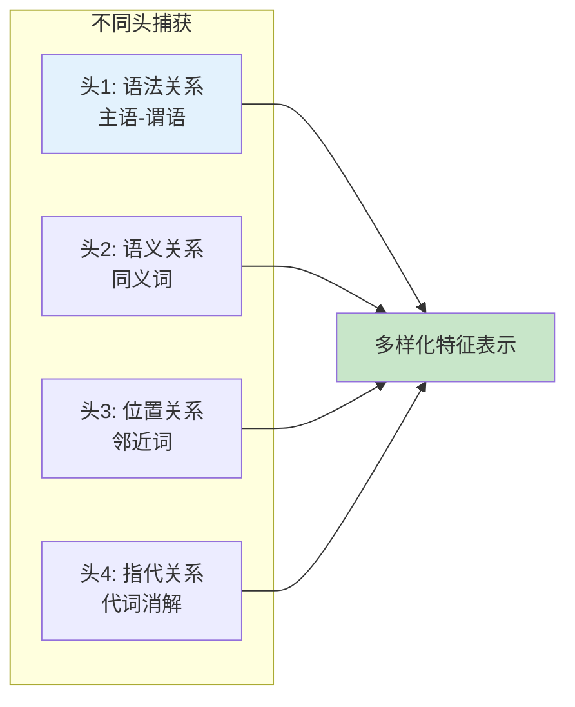
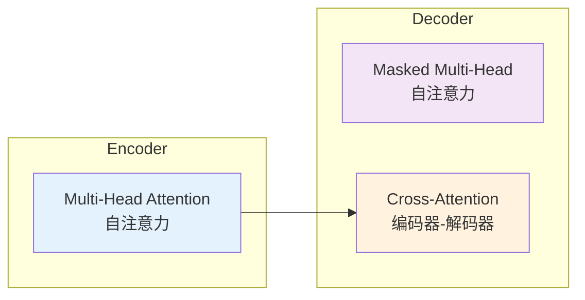

# 图1: Multi-Head Attention架构



**说明**: Multi-Head Attention并行运行多个注意力头，捕捉不同类型的语义关系。

---

# 图2: 单头注意力计算

```mermaid
flowchart LR
    subgraph "第i个头"
        HI1[Qᵢ = XWᵢᴼ] --> HI2[Kᵢ = XWᵢᴷ]
        HI2 --> HI3[Vᵢ = XWᵢⱽ]
        HI3 --> HI4[Attention(Qᵢ,Kᵢ,Vᵢ)]
    end
    
    HI4 --> HI5[输出Zᵢ]
    
    style HI1 fill:#fff3e0
    style HI4 fill:#c8e6c9
```

**说明**: 每个头使用独立的W_Q、W_K、W_V参数，学习不同的注意力模式。

---

# 图3: 多头注意力的优势



**说明**: 不同注意力头可以学习捕获不同类型的语义关系，提升模型表达能力。

---

# 图4: 头数选择与性能

```mermaid
flowchart TD
    A[选择头数h] --> B{任务需求}
    B -->|小数据集| C[h=4~8]
    B -->|标准设置| D[h=8~12]
    B -->|大模型| E[h=16~32]
    
    C --> F[计算效率]
    D --> F
    E --> F
    
    F --> G[Attention(Q,K,V) = Concat(head₁...headₕ)W⁰]
    
    style A fill:#e1f5fe
    style G fill:#81d4fa
```

**说明**: 头数根据任务复杂度和计算资源选择，通常8-12个头是较好的平衡点。

---

# 图5: 多头注意力在Transformer中的应用



**说明**: Transformer中Encoder使用自注意力，Decoder同时使用自注意力和交叉注意力。
