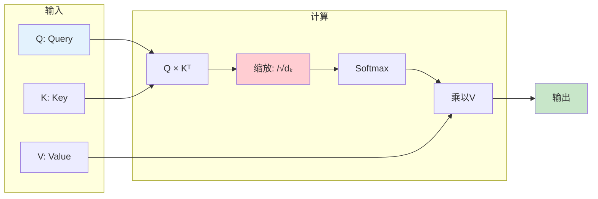
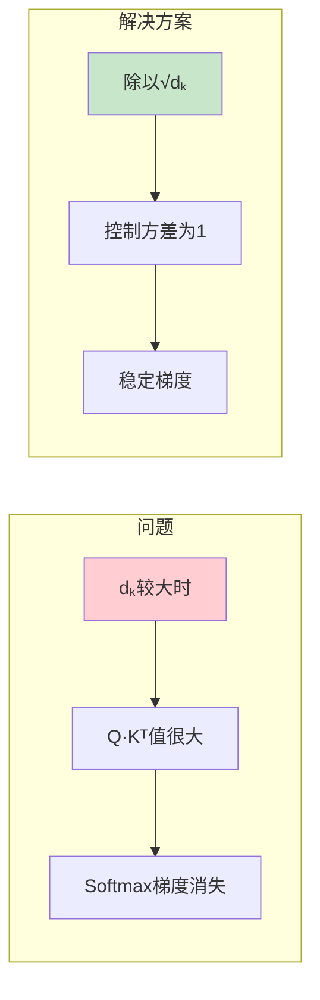
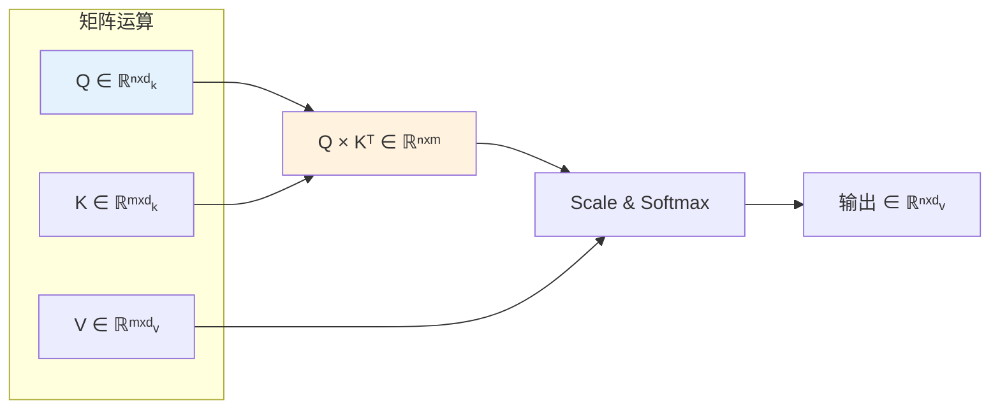

# 图1: Scaled Dot-Product Attention结构



**说明**: Scaled Dot-Product Attention通过QK相似度计算注意力权重，再对V加权求和。

---

# 图2: 缩放因子作用



**说明**: 缩放因子√dₖ保证softmax输入的方差为1，防止梯度饱和。

---

# 图3: 矩阵形式计算



**说明**: 可以将多个Query打包成矩阵，同时计算多个位置的注意力。

---

# 图4: Masked Attention

```mermaid
flowchart LR
    subgraph "Mask矩阵"
        MK1[上三角设为-∞]
        MK1 --> MK2[阻止访问未来信息]
    end
    
    MK2 --> MK3[Softmax(-∞)=0]
    MK3 --> MK4[自回归生成]
    
    style MK1 fill:#ffcdd2
    style MK4 fill:#c8e6c9
```

**说明**: Decoder中使用mask防止看到未来位置，实现自回归生成。

---

# 图5: 注意力计算示例

```mermaid
flowchart TD
    A[输入句子] --> B["The cat ate the mouse"]
    
    B --> C[计算每个词的注意力]
    C --> D[结果示例]
    D --> D1["cat" → 0.8关注"ate"]
    D --> D2["mouse" → 0.7关注"cat"]
    D --> D3["ate" → 0.6关注"cat"<br/>0.4关注"mouse"]
    
    style A fill:#e1f5fe
    style D1 fill:#c8e6c9
    style D2 fill:#c8e6c9
```

**说明**: 注意力权重反映词与词之间的相关性，"ate"同时关注动作的主语和宾语。
