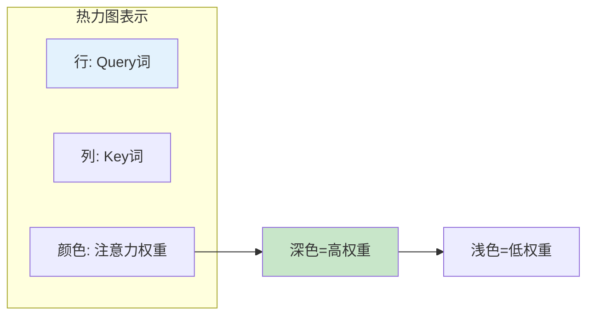
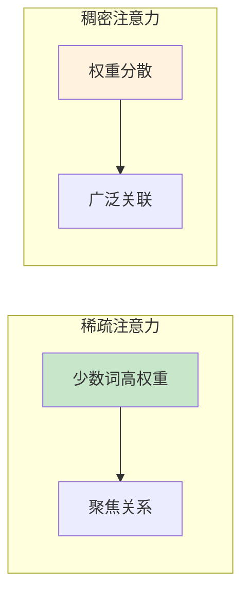
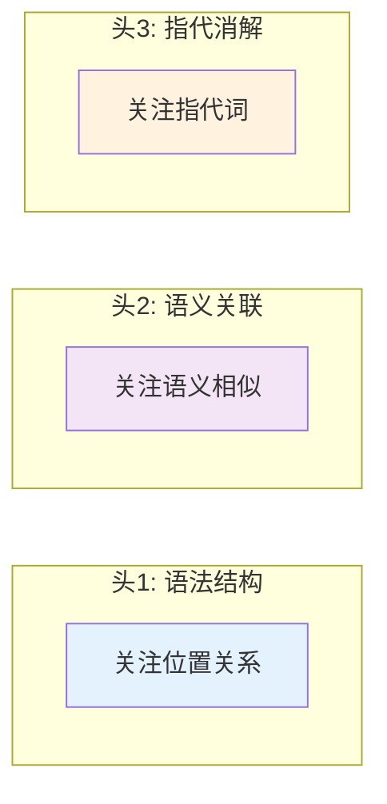
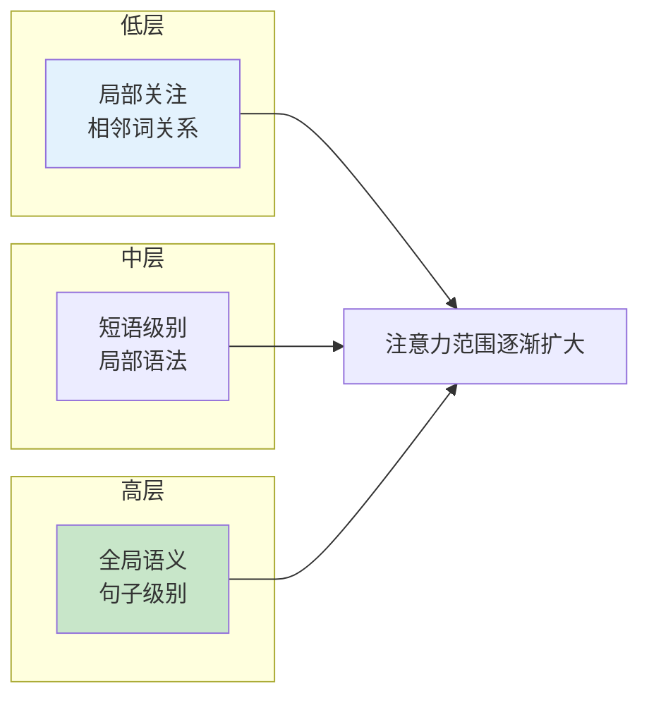
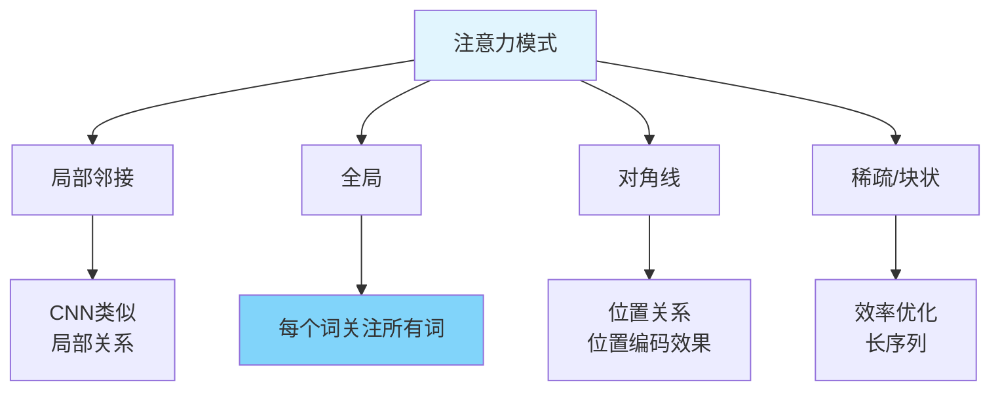

# 图1: 注意力热力图

**说明**: 注意力热力图直观展示词与词之间的关联强度，颜色越深表示关注度越高。

---

# 图2: 注意力权重分布

**说明**: 不同层的注意力分布不同，浅层更稀疏，深层更稠密。

---

# 图3: 多头注意力可视化对比

**说明**: 不同注意力头学习不同的模式，可视化可以观察头的分工。

---

# 图4: 层级间注意力变化

**说明**: 从底层到高层，注意力从关注局部逐步扩展到全局上下文。

---

# 图5: 注意力模式类型

**说明**: Transformer展现出多种注意力模式，包括局部、全局、对角线和稀疏模式。
