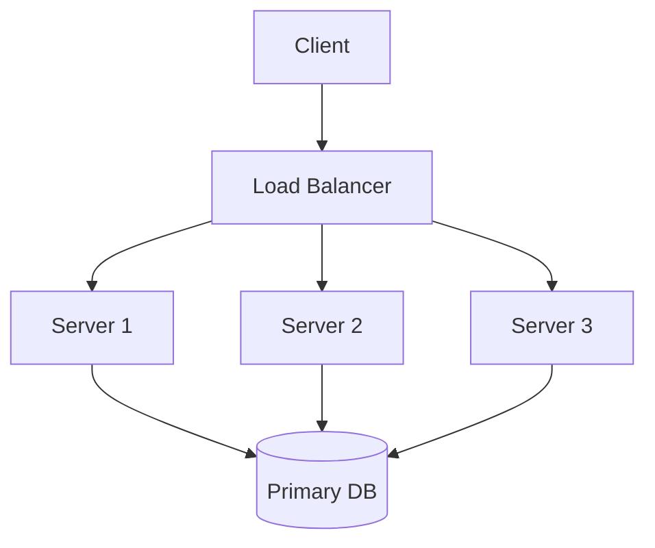
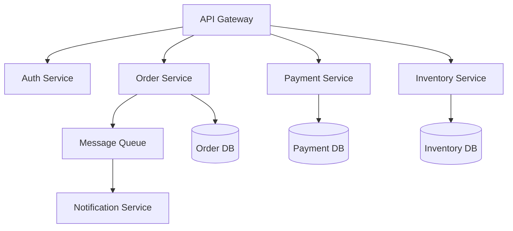
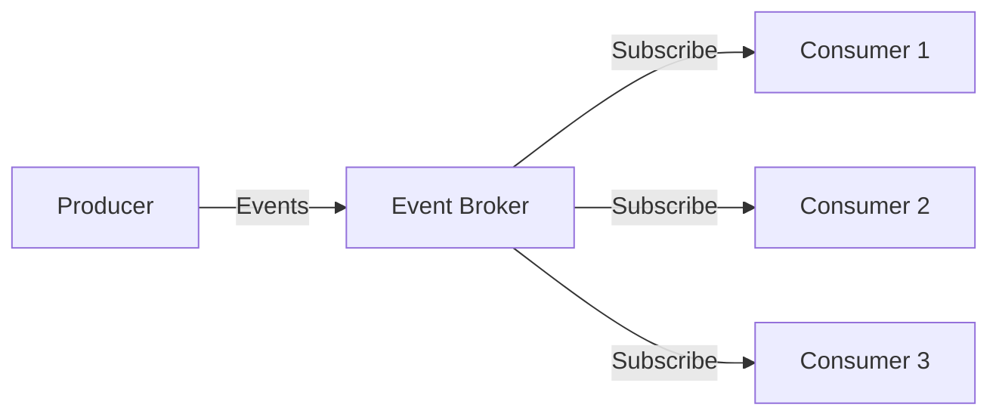
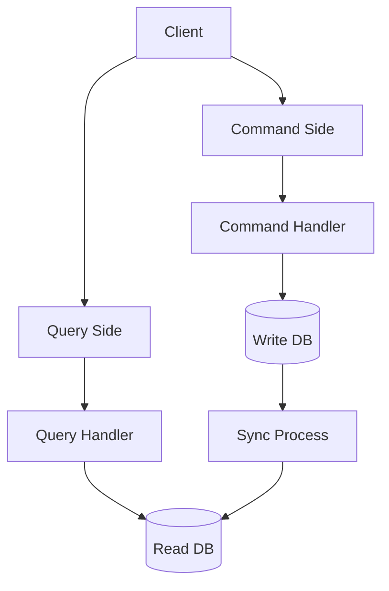
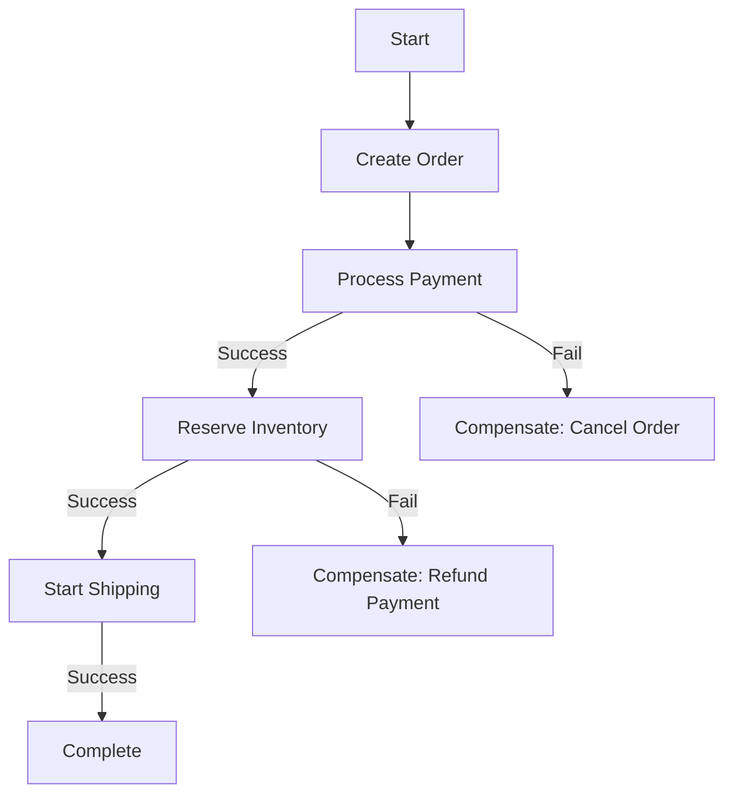
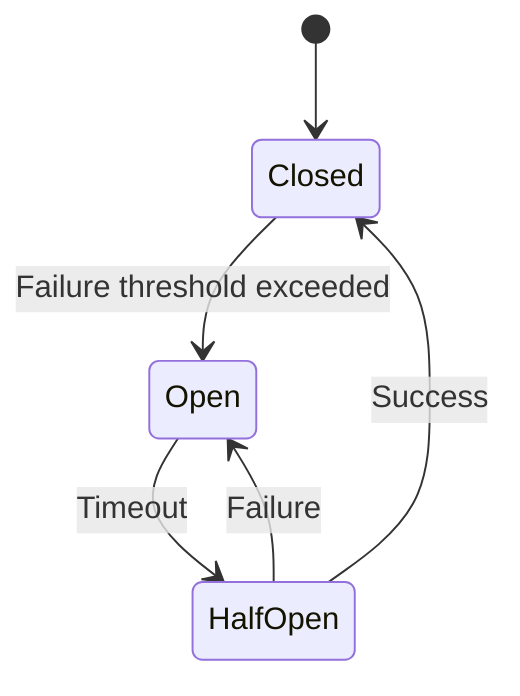
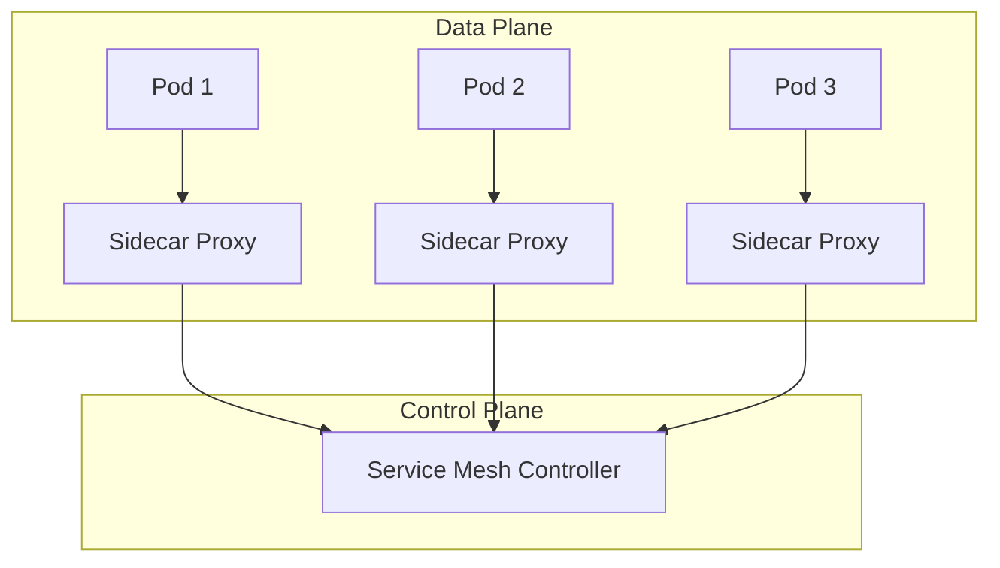
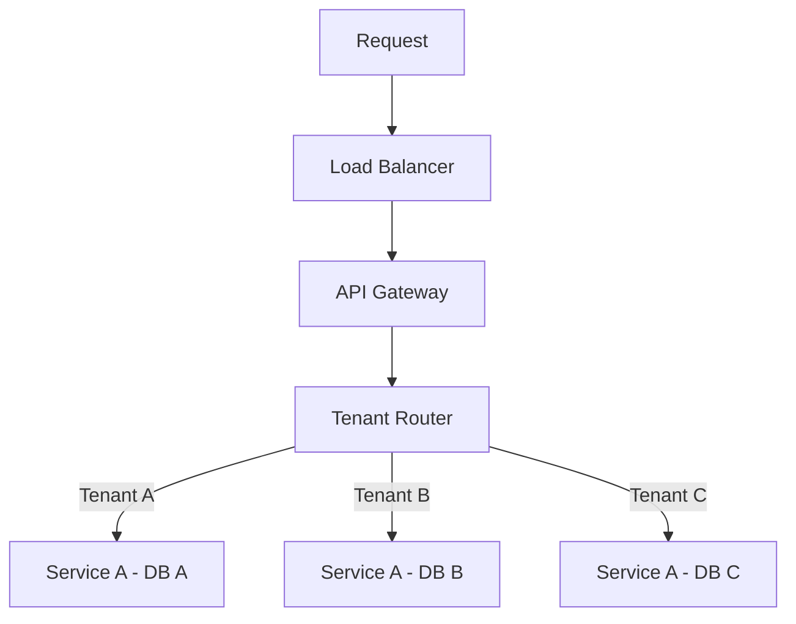
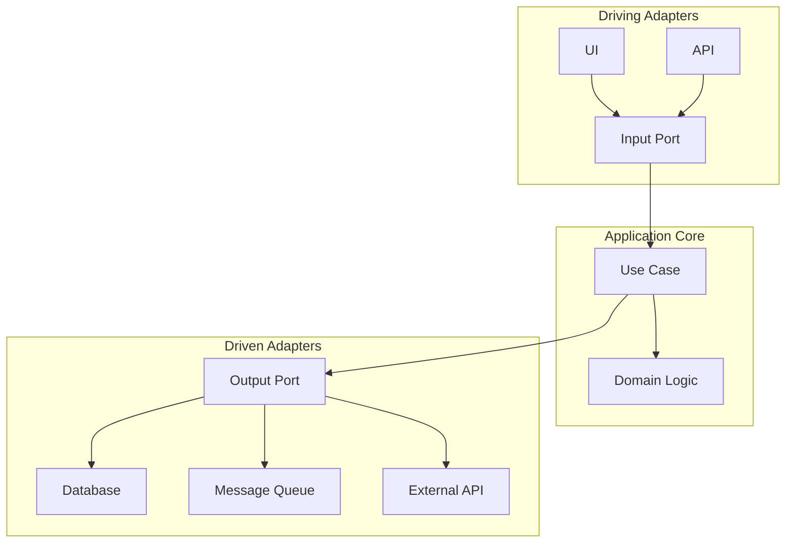

# Chapter 11: Industrial Practice - System Architecture Design Patterns

## Diagram 1: Load Balancing Architecture


## Diagram 2: Microservices Architecture


## Diagram 3: Event-Driven Architecture


## Diagram 4: CQRS Pattern


## Diagram 5: Saga Pattern


## Diagram 6: Circuit Breaker Pattern


## Diagram 7: API Gateway Pattern
```mermaid
graph TD
    Client --> Gateway[API Gateway]
    Gateway --> Auth[/auth]
    Gateway --> Users[/users]
    Gateway --> Products[/products]
    Gateway --> Orders[/orders]
    Auth --> AuthSvc[Auth Service]
    Users --> UserSvc[User Service]
    Products --> ProductSvc[Product Service]
    Orders --> OrderSvc[Order Service]
```

## Diagram 8: Service Mesh Architecture


## Diagram 9: Multi-Tenant Architecture


## Diagram 10: Hexagonal Architecture

