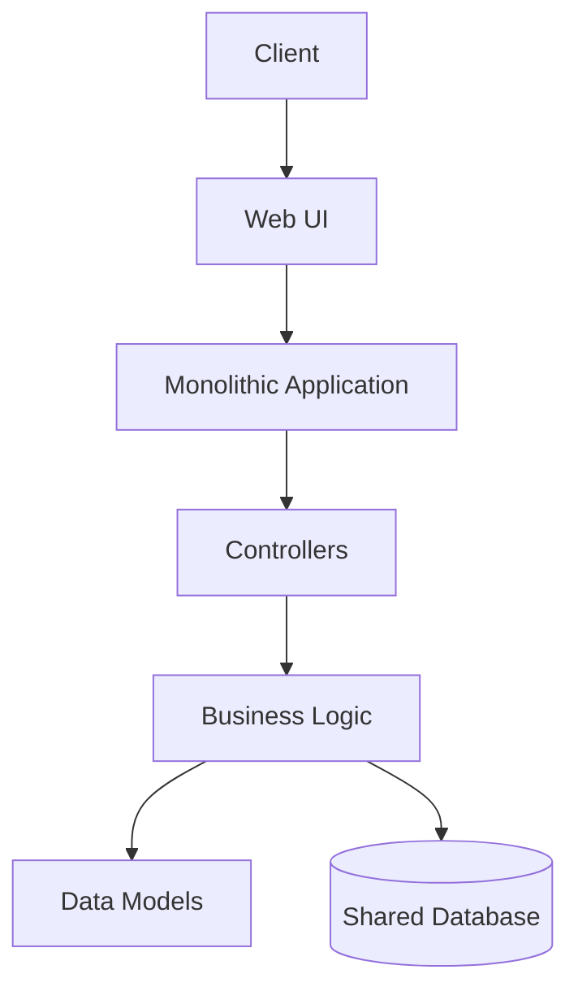
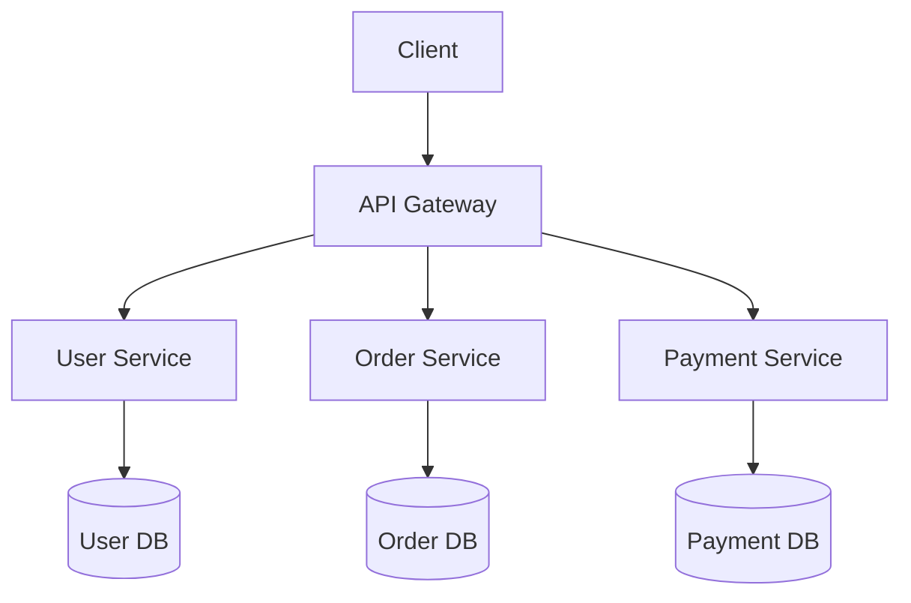
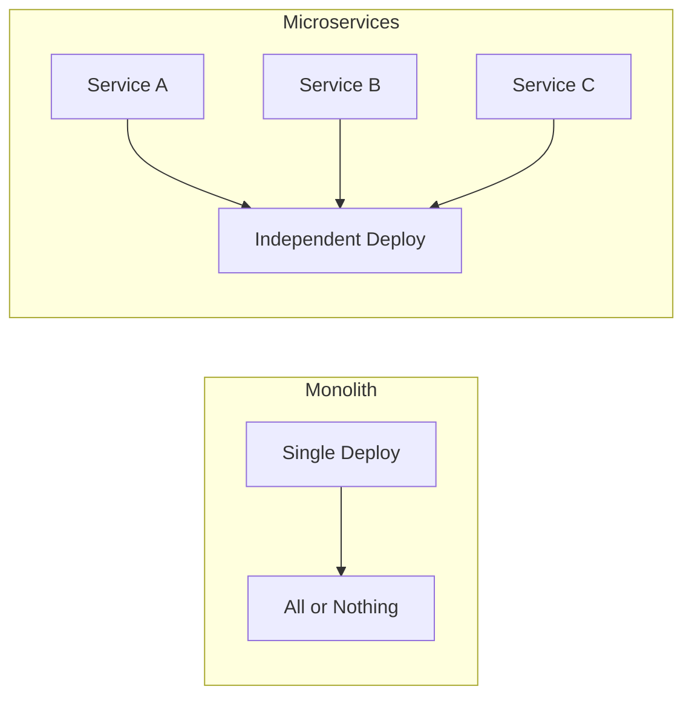
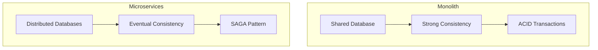
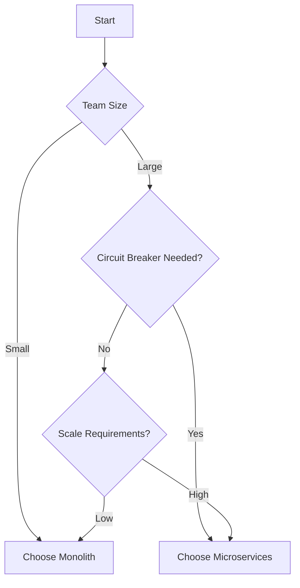

# Chapter 11: Microservices vs Monolith Comparison

## Diagram 1: Monolithic Architecture

## Diagram 2: Microservices Architecture

## Diagram 3: Comparison - Deployment

## Diagram 4: Comparison - Data Management

## Diagram 5: Decision Matrix

