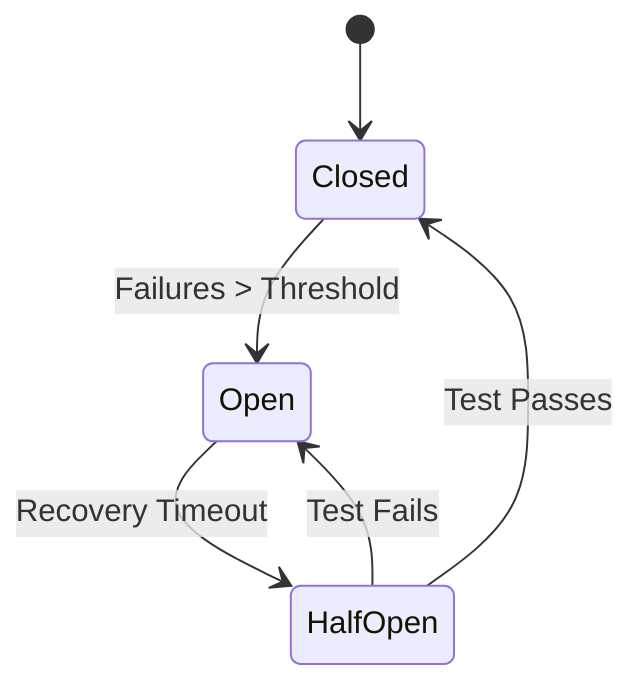
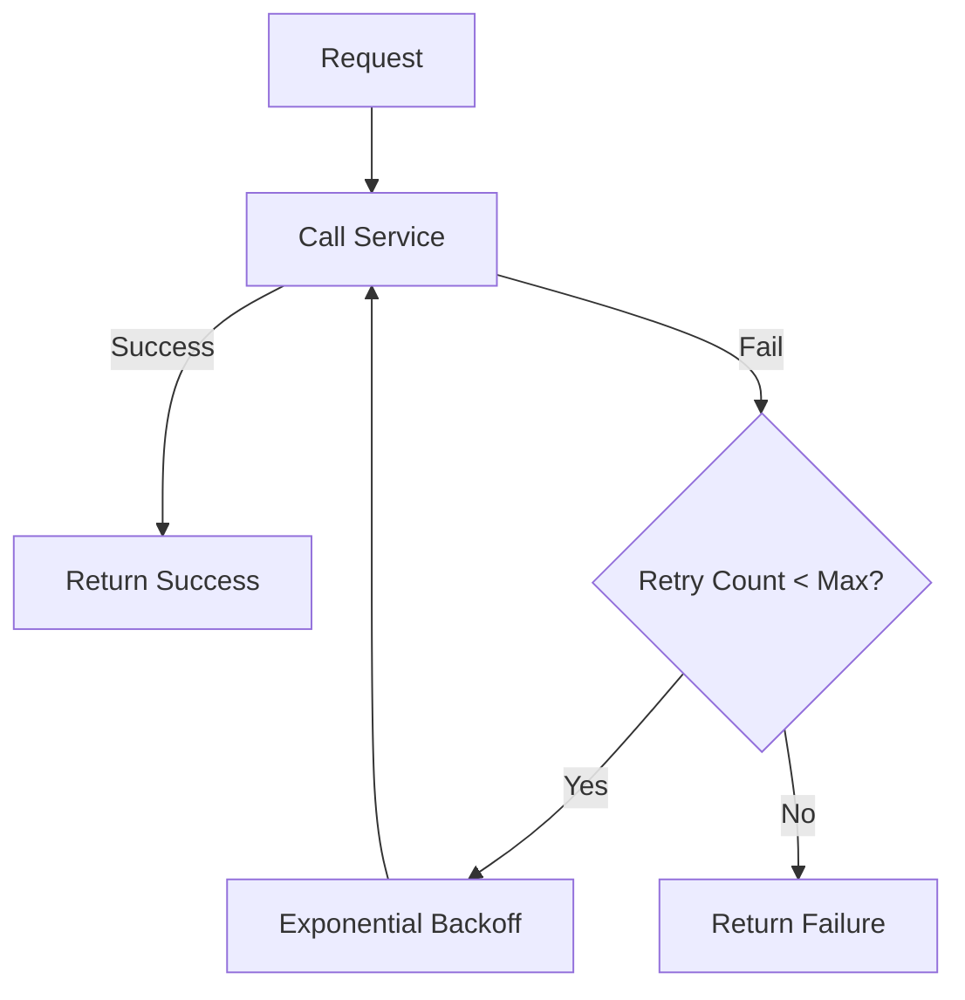
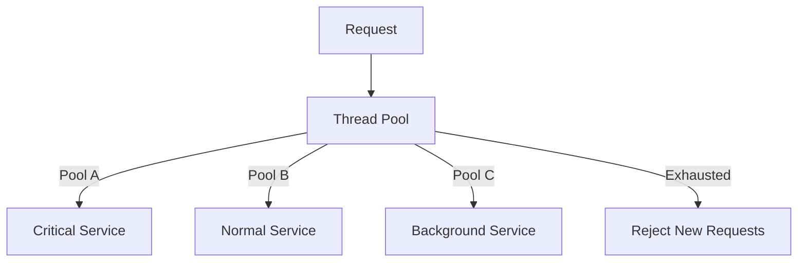
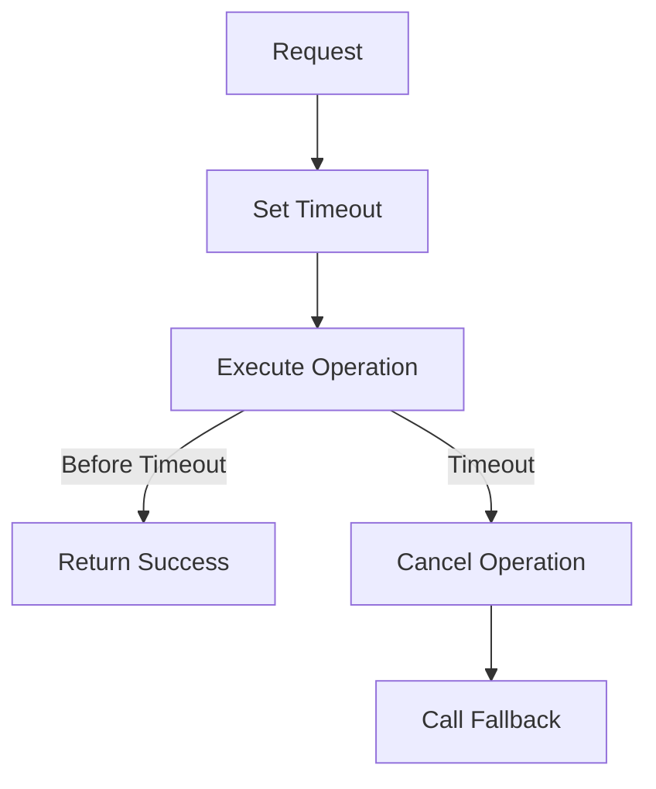
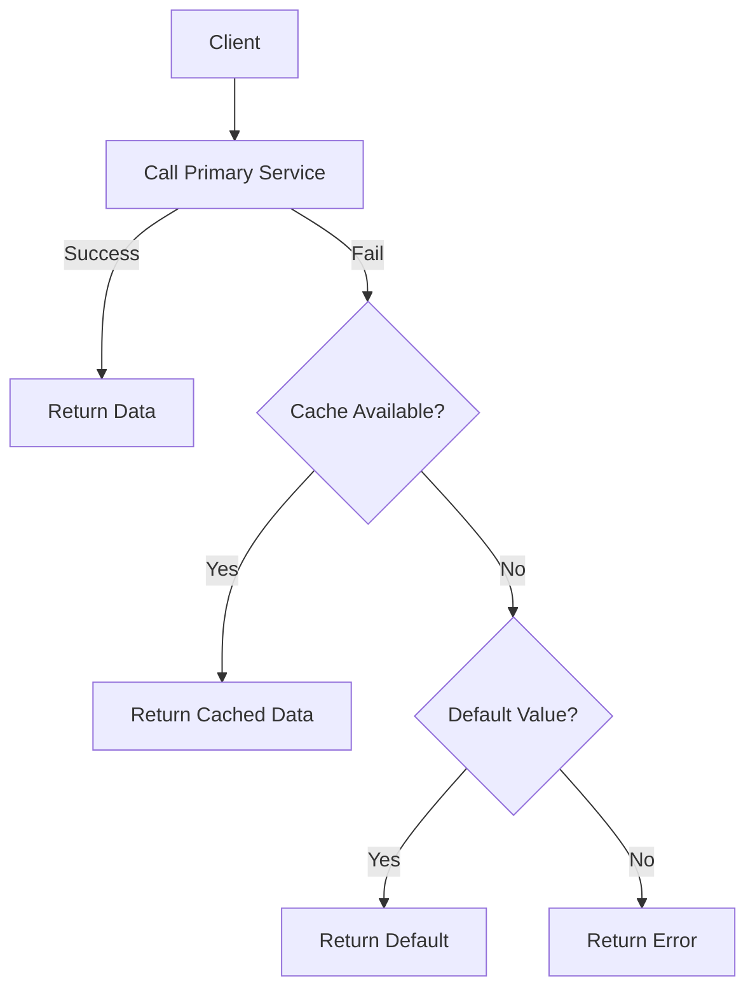

# Chapter 11: Fault Tolerance Design Patterns

## Diagram 1: Circuit Breaker States

## Diagram 2: Retry Pattern

## Diagram 3: Bulkhead Pattern

## Diagram 4: Timeout Pattern

## Diagram 5: Fallback Pattern

