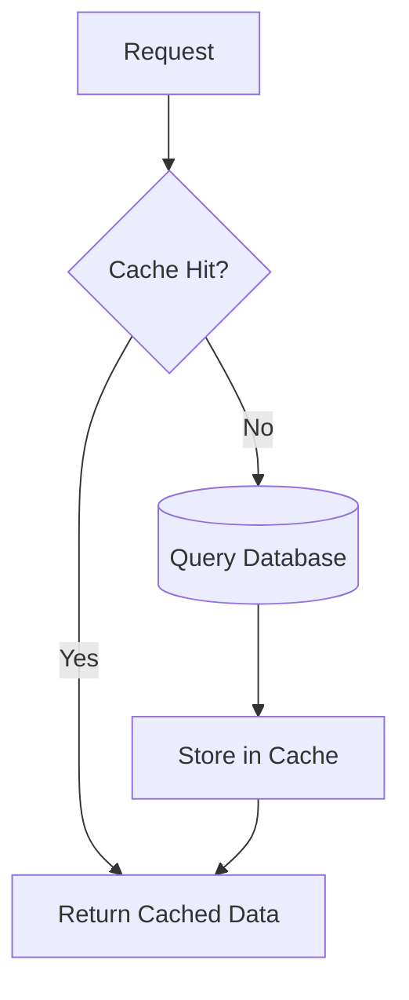
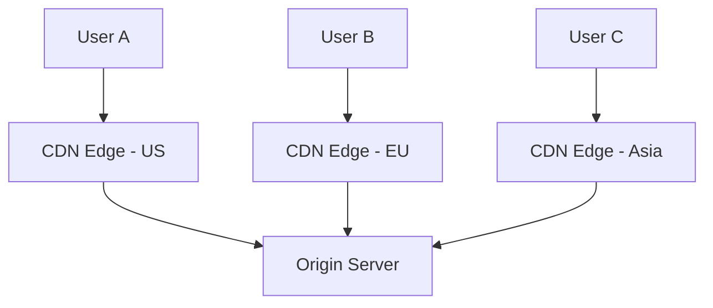
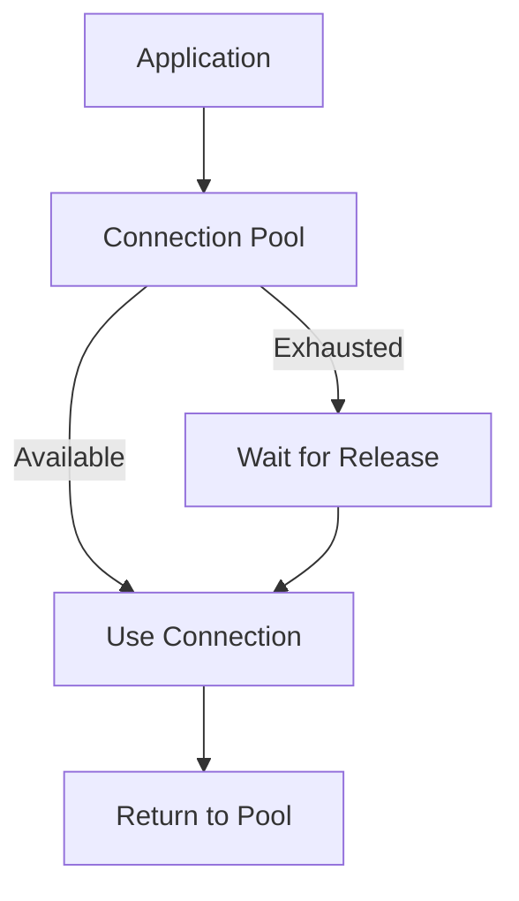
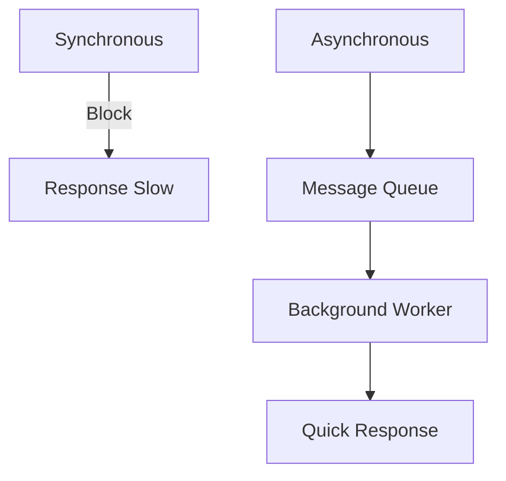
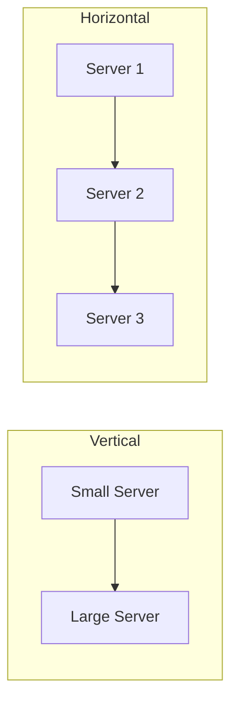
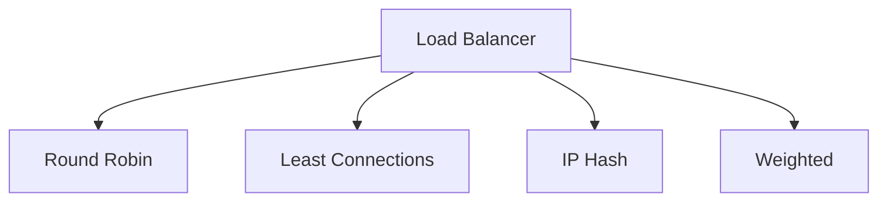
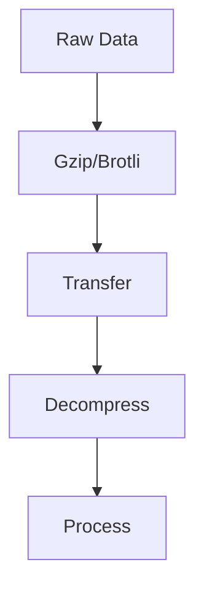
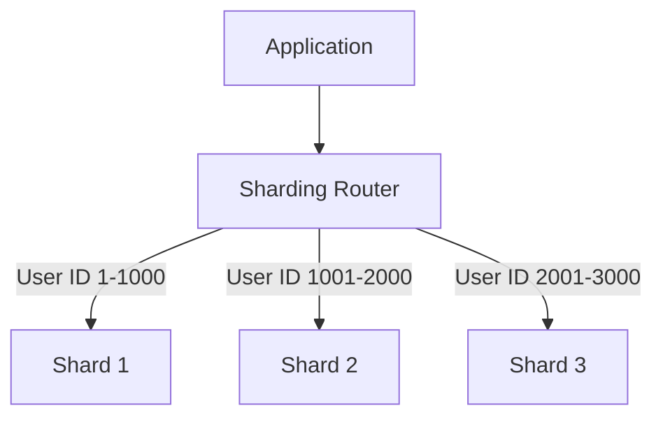
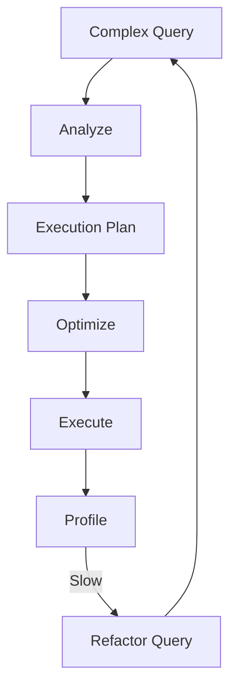

# Chapter 11: Performance Optimization Strategies

## Diagram 1: Caching Strategy


## Diagram 2: CDN Distribution


## Diagram 3: Database Indexing
```mermaid
graph TD
    Query[SQL Query] --> Optimizer[Query Optimizer]
    Optimizer -->|Without Index| Scan[Full Table Scan]
    Optimizer -->|With Index| IndexSeek[Index Seek]
    Scan --> Slow[Slow - O(n)]
    IndexSeek --> Fast[Fast - O(log n)]
```

## Diagram 4: Connection Pooling


## Diagram 5: Asynchronous Processing


## Diagram 6: Horizontal vs Vertical Scaling


## Diagram 7: Load Balancing Algorithms


## Diagram 8: Compression Pipeline


## Diagram 9: Database Sharding


## Diagram 10: Query Optimization

