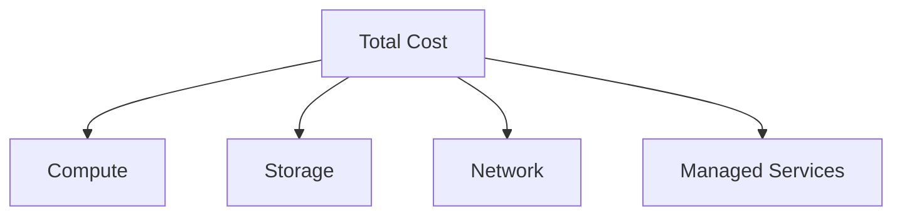
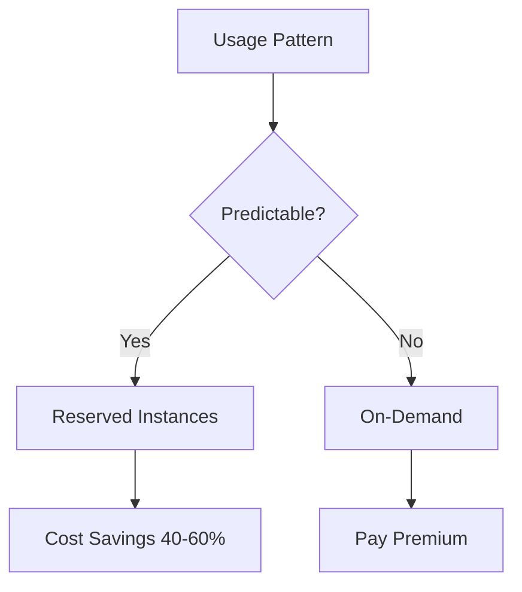
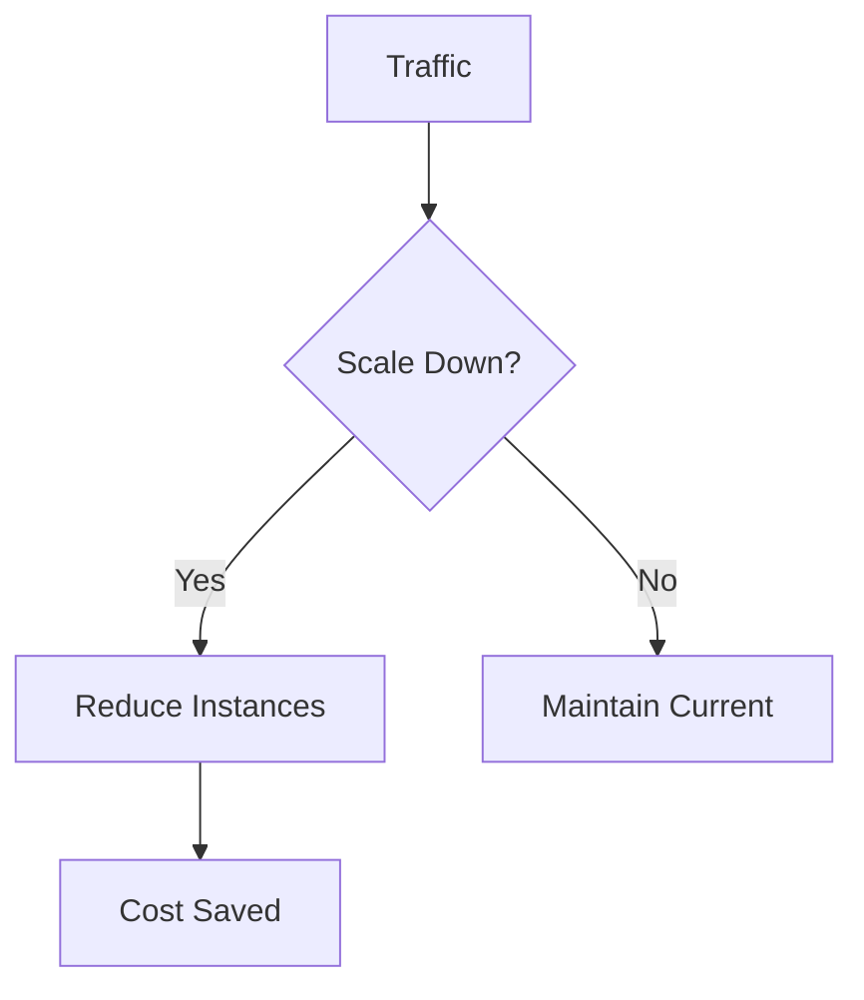
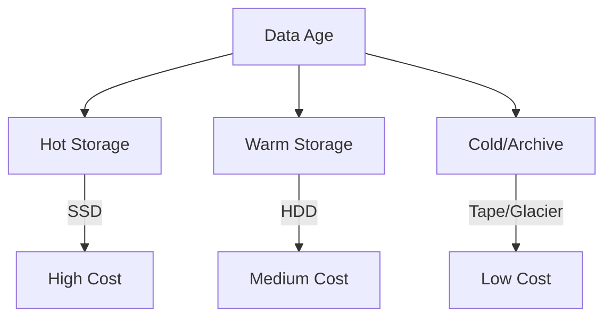
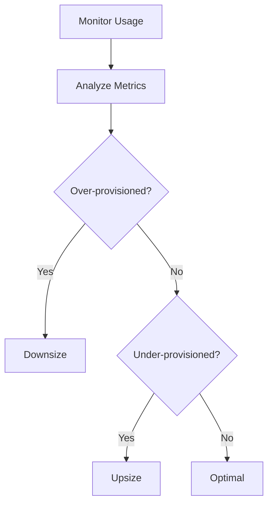

# Chapter 11: Cost Optimization Methods

## Diagram 1: Cloud Cost Hierarchy

## Diagram 2: Reserved vs On-Demand

## Diagram 3: Auto Scaling Cost

## Diagram 4: Storage Tiering

## Diagram 5: Right-Sizing Resources

