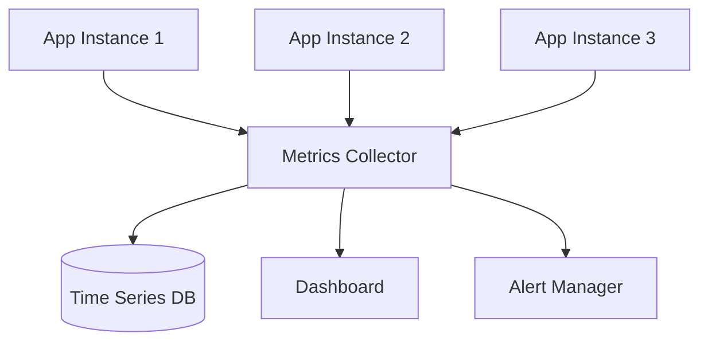
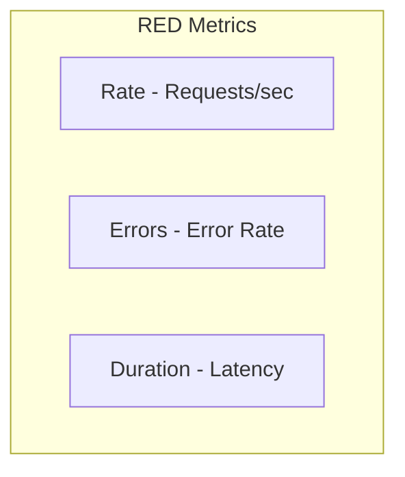
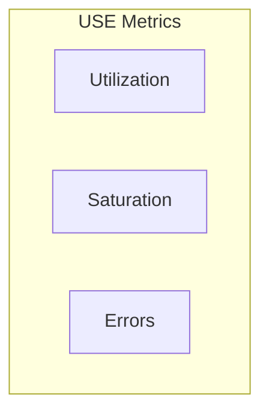
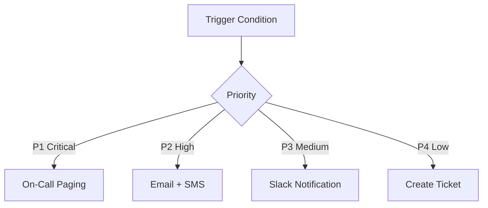
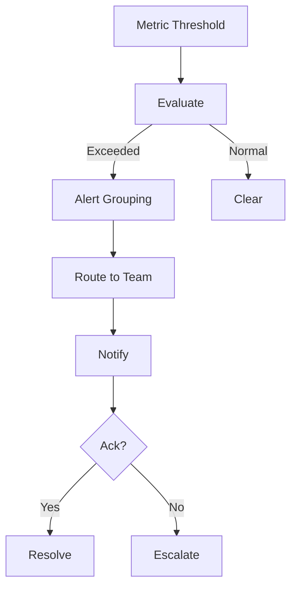

# Chapter 11: Monitoring and Alerting System

## Diagram 1: Monitoring Architecture

## Diagram 2: The RED Method

## Diagram 3: The USE Method

## Diagram 4: Alert Severity Levels

## Diagram 5: Alert Flow

