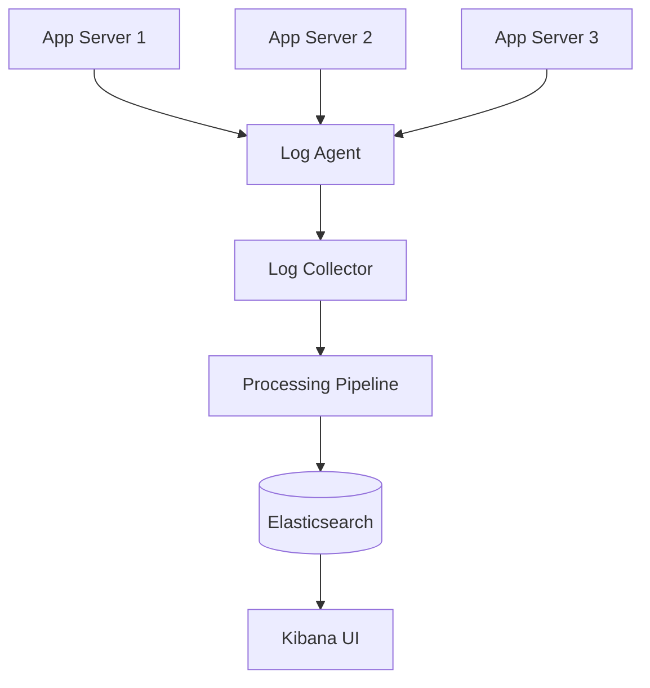
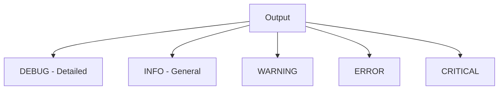
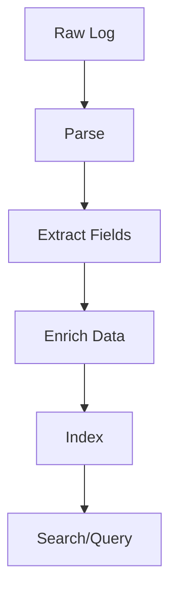
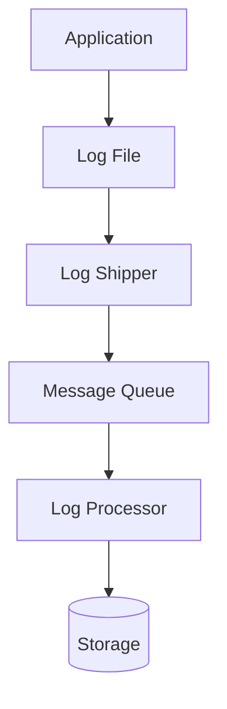
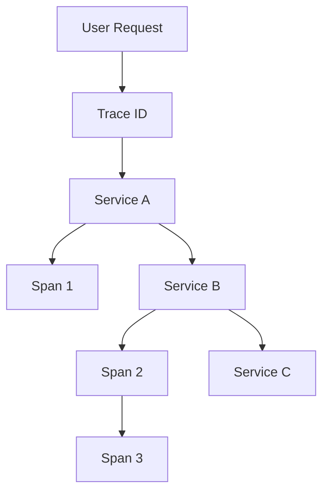

# Chapter 11: Log Analysis System

## Diagram 1: Centralized Logging

## Diagram 2: Log Levels

## Diagram 3: Structured Logging

## Diagram 4: Log Aggregation Flow

## Diagram 5: Distributed Tracing

