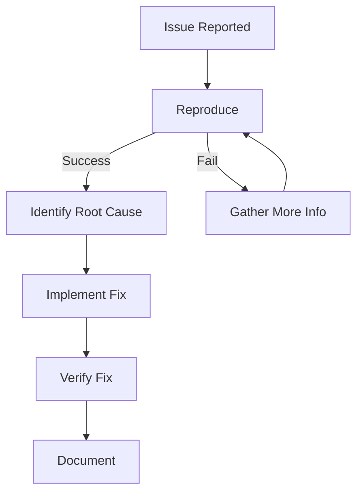
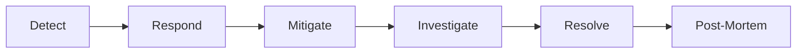
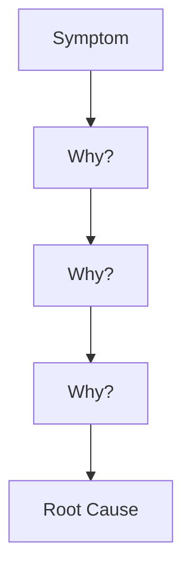
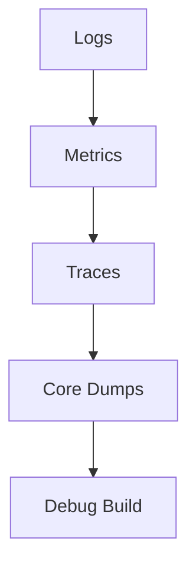
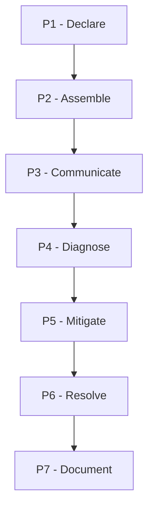

# Chapter 11: Troubleshooting Process

## Diagram 1: Troubleshooting Flow

## Diagram 2: Incident Timeline

## Diagram 3: Root Cause Analysis

## Diagram 4: Debugging Pyramid

## Diagram 5: War Room Process

