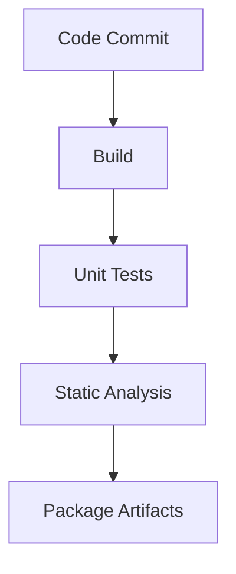
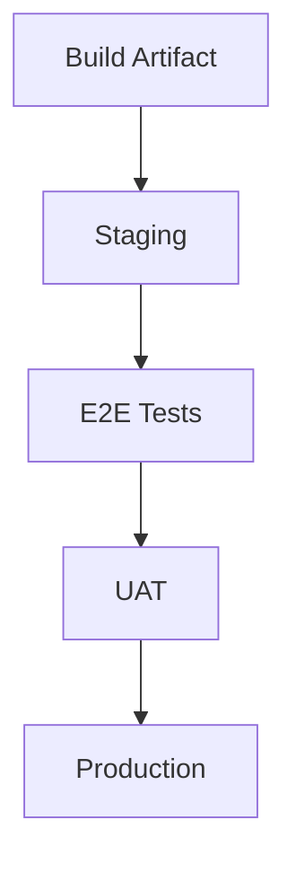
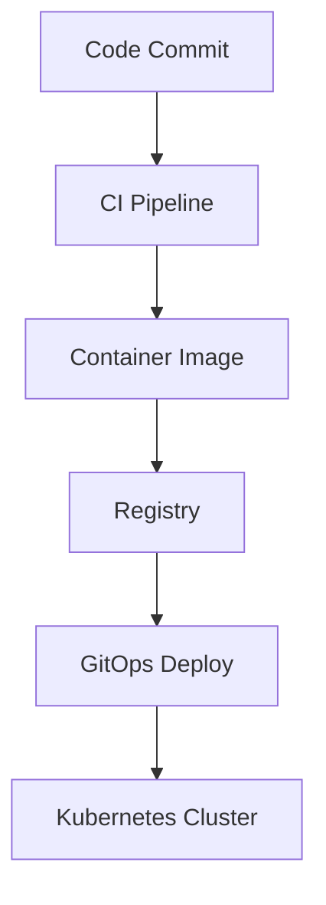
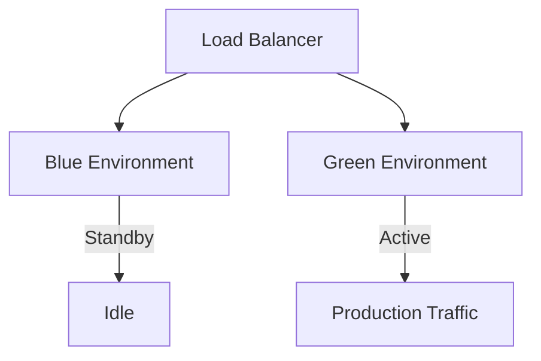
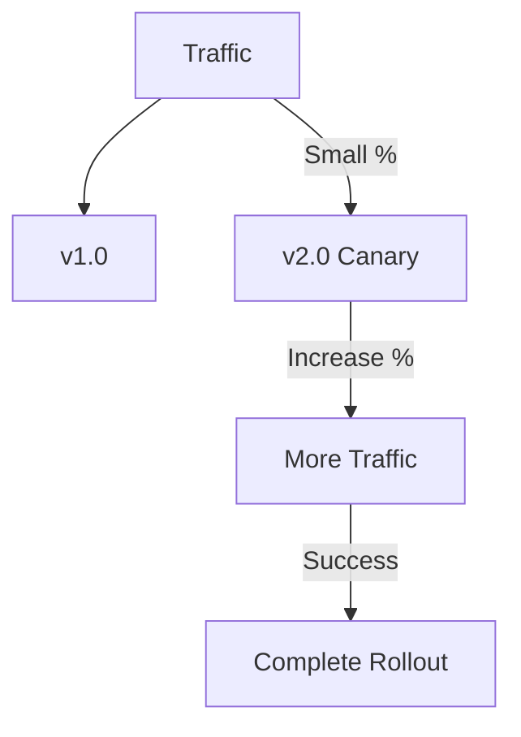

# Chapter 11: CI/CD Pipeline

## Diagram 1: CI Pipeline

```mermaid
graph TD
    Code[Code Commit] --> Build[Build]
    Build --> Test[Unit Tests]
    Test --> Analyze[Static Analysis]
    Analyze --> Package[Package Artifacts]
```

## Diagram 2: CD Pipeline

```mermaid
graph TD
    Artifact[Build Artifact] --> Stage[Staging]
    Stage --> E2E[E2E Tests]
    E2E --> UAT[UAT]
    UAT --> Prod[Production]
```

## Diagram 3: GitOps Workflow

```mermaid
graph TD
    Commit[Code Commit] --> CI[CI Pipeline]
    CI --> Image[Container Image]
    Image --> Registry[Registry]
    Registry --> Deploy[GitOps Deploy]
    Deploy --> Cluster[Kubernetes Cluster]
```

## Diagram 4: Blue-Green Deployment

```mermaid
graph TD
    LB[Load Balancer] --> Blue[Blue Environment]
    LB --> Green[Green Environment]
    Green -->|Active| Traffic[Production Traffic]
    Blue -->|Standby| Idle
```

## Diagram 5: Canary Deployment

```mermaid
graph TD
    Traffic --> V1[v1.0]
    Traffic -->|Small %| V2[v2.0 Canary]
    V2 -->|Increase %| More[More Traffic]
    More -->|Success| Complete[Complete Rollout]
```
