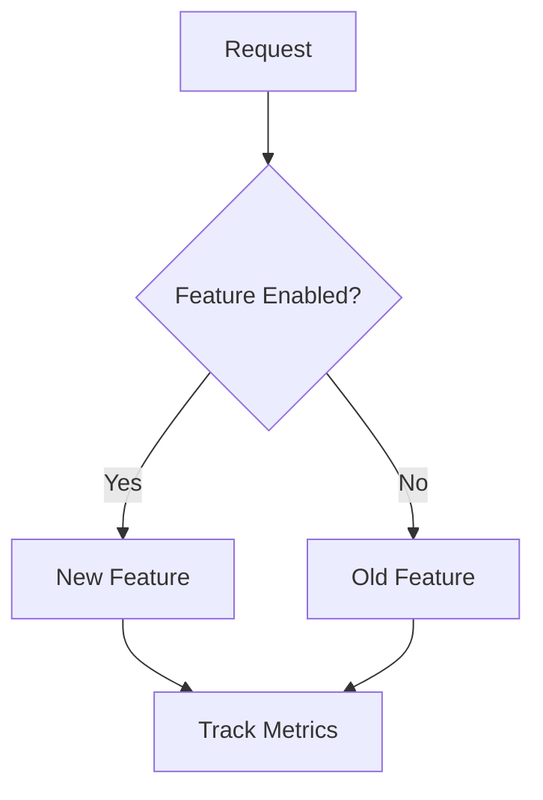
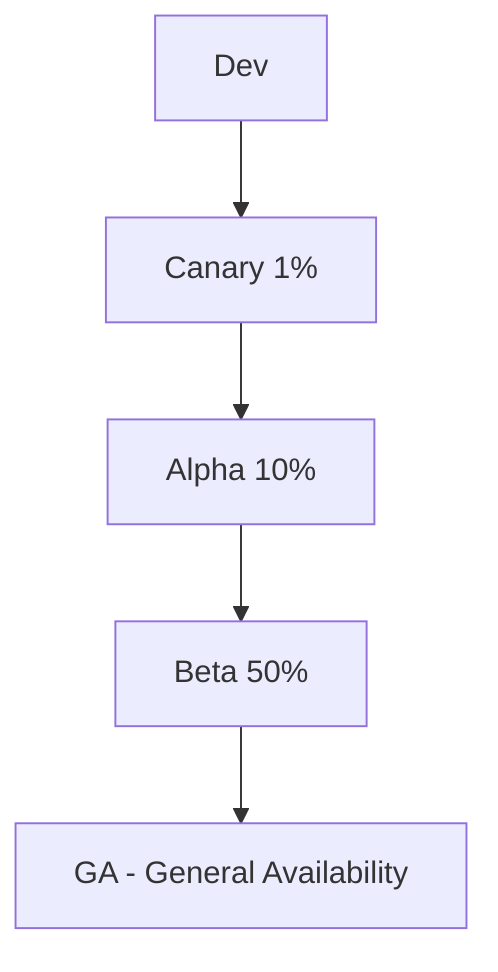
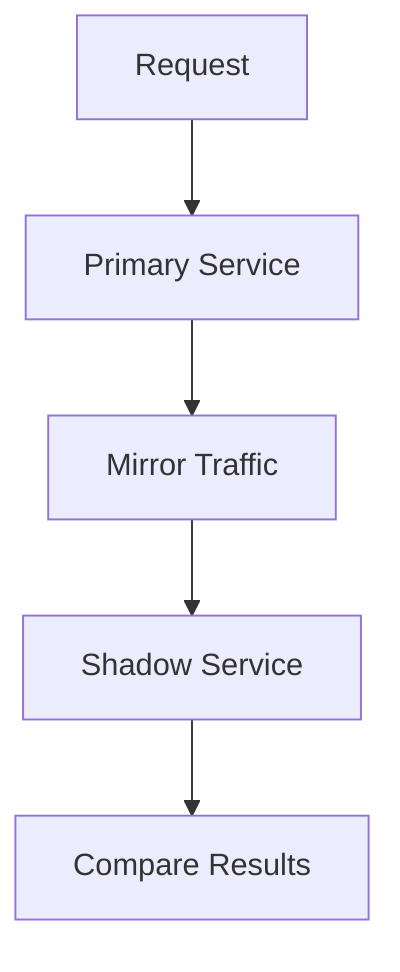
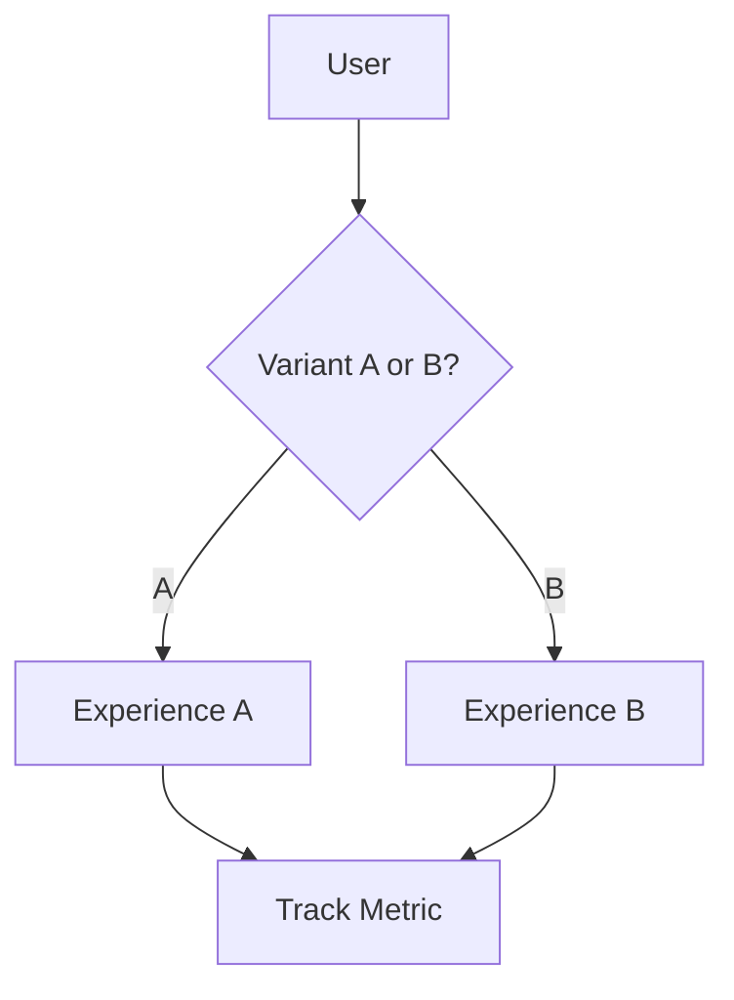
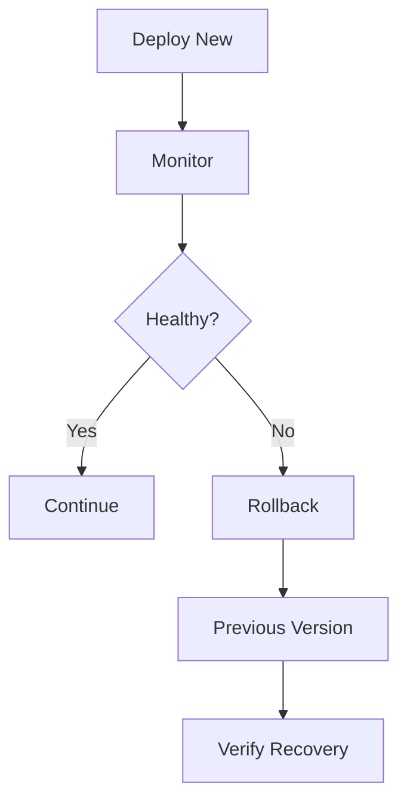

# Chapter 11: Gray Release Strategies

## Diagram 1: Feature Flags

## Diagram 2: Ring-Based Deployment

## Diagram 3: Traffic Mirroring

## Diagram 4: A/B Testing

## Diagram 5: Rollback Process

