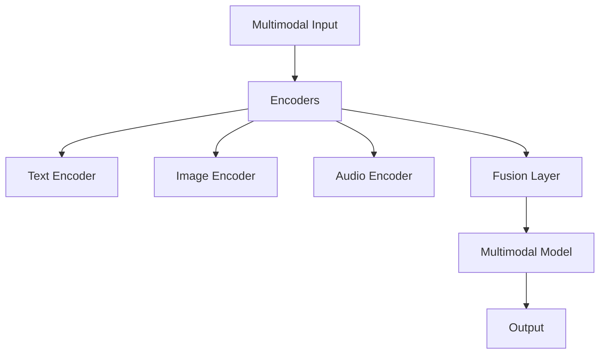
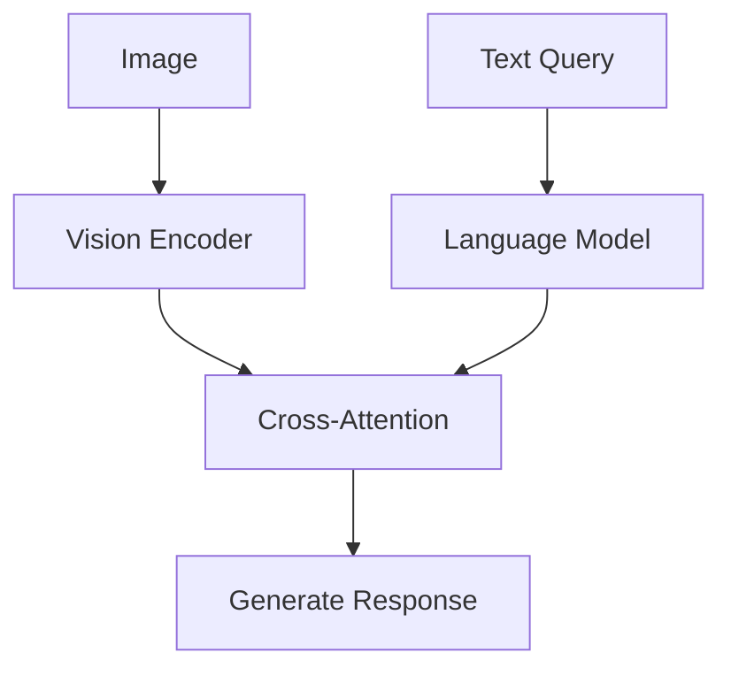
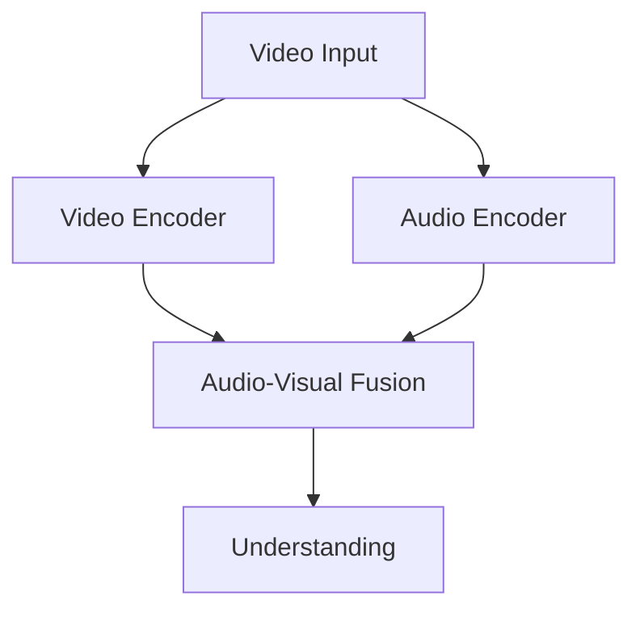
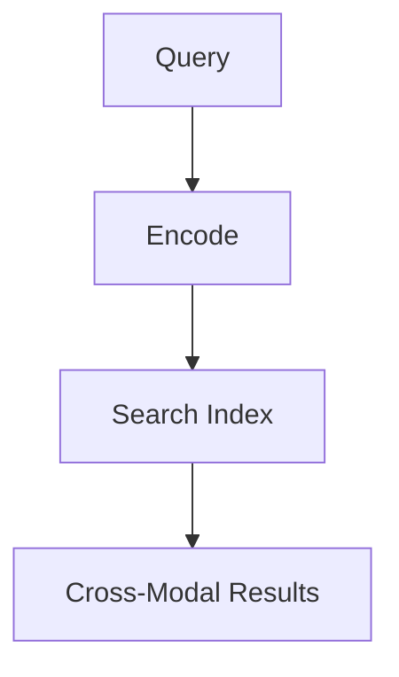
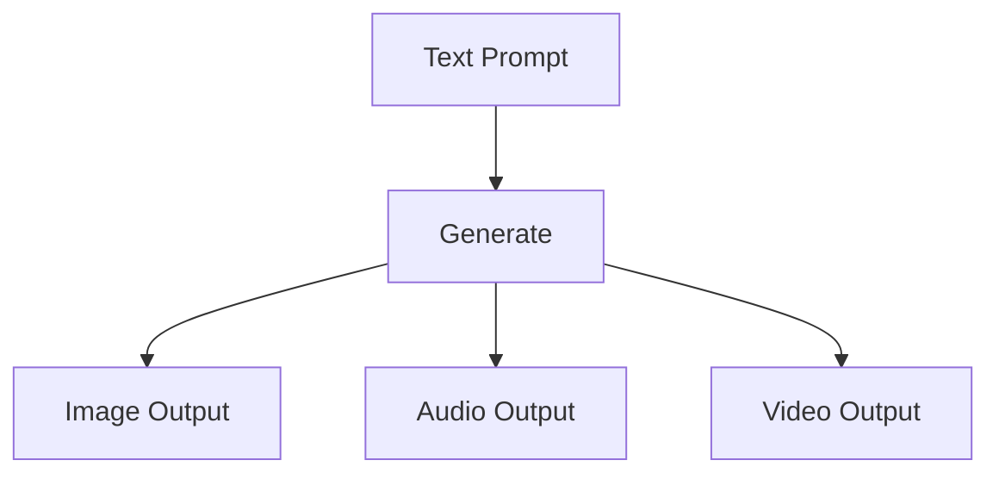

# Chapter 12: Multimodal Development Trends

## Diagram 1: Multimodal AI Architecture

## Diagram 2: Vision-Language Models

## Diagram 3: Audio-Visual Understanding

## Diagram 4: Cross-Modal Retrieval

## Diagram 5: Multimodal Generation

