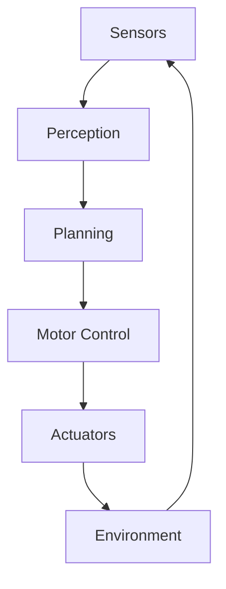
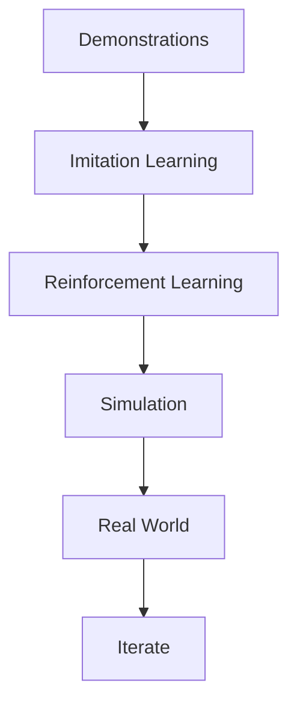
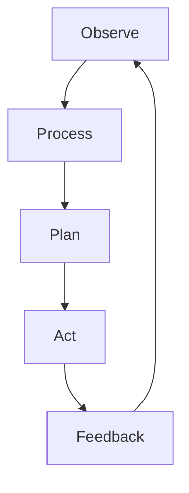
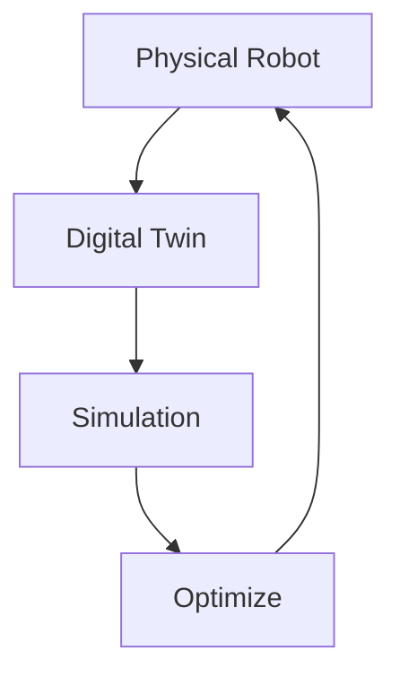
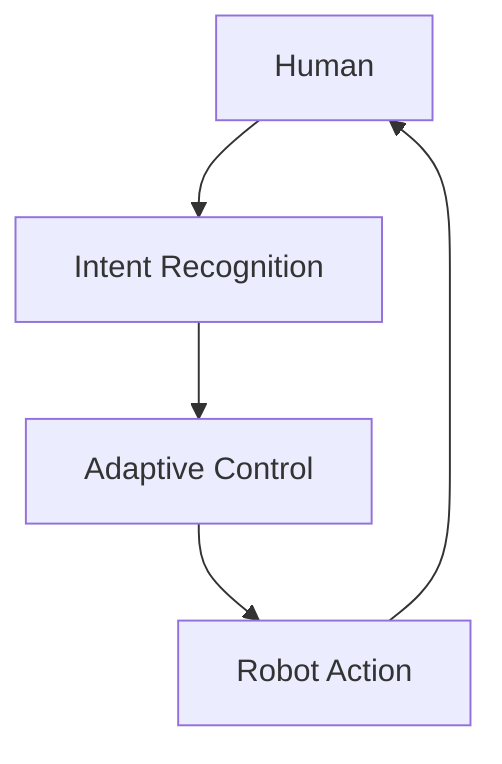

# Chapter 12: Embodied Intelligence Outlook

## Diagram 1: Embodied AI System

## Diagram 2: Robot Learning Pipeline

## Diagram 3: Perception-Action Loop

## Diagram 4: Digital Twin Integration

## Diagram 5: Human-Robot Collaboration

