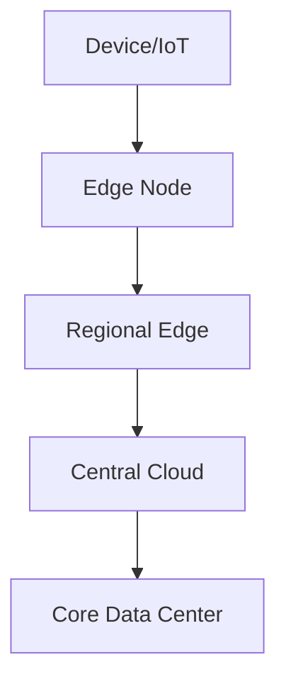
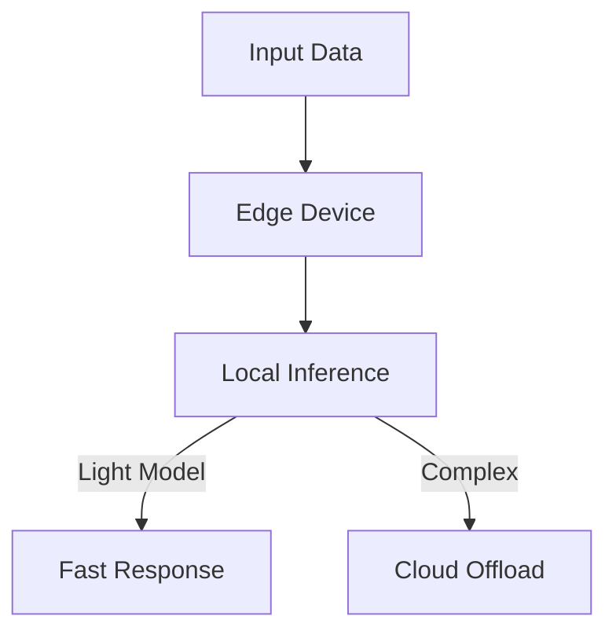
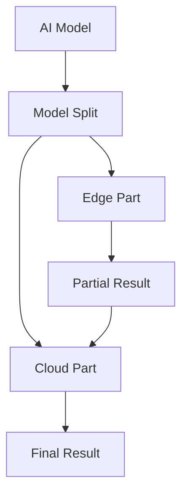
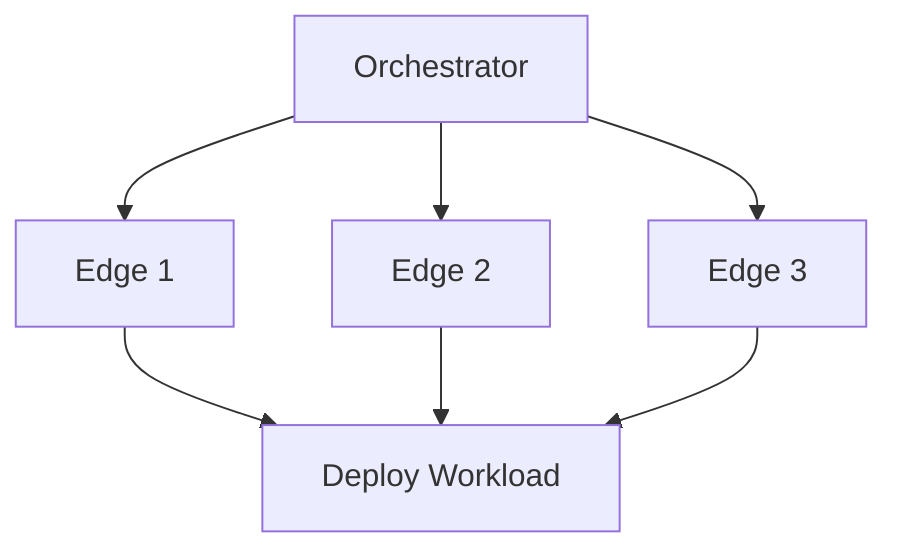
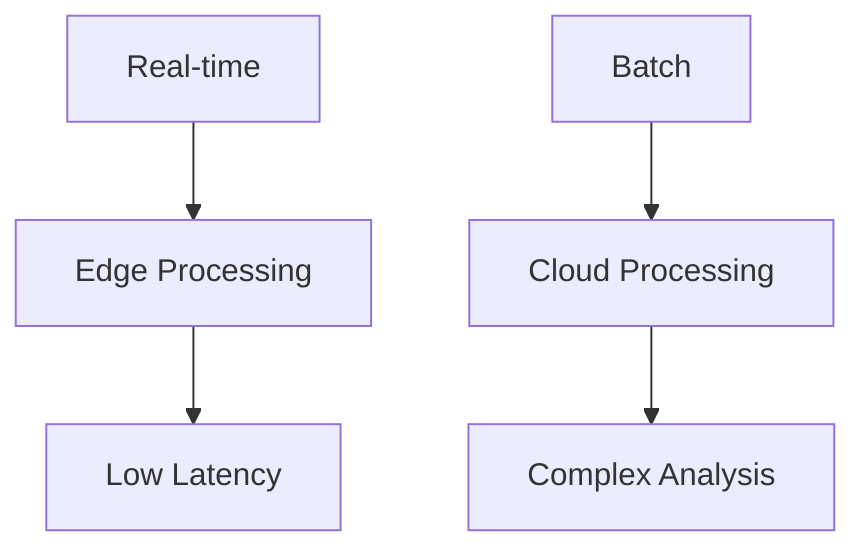

# Chapter 12: Edge Computing Trends

## Diagram 1: Edge-Cloud Continuum

## Diagram 2: Edge AI Inference

## Diagram 3: Distributed Inference

## Diagram 4: Edge Orchestration

## Diagram 5: Edge-Cloud Synergy

