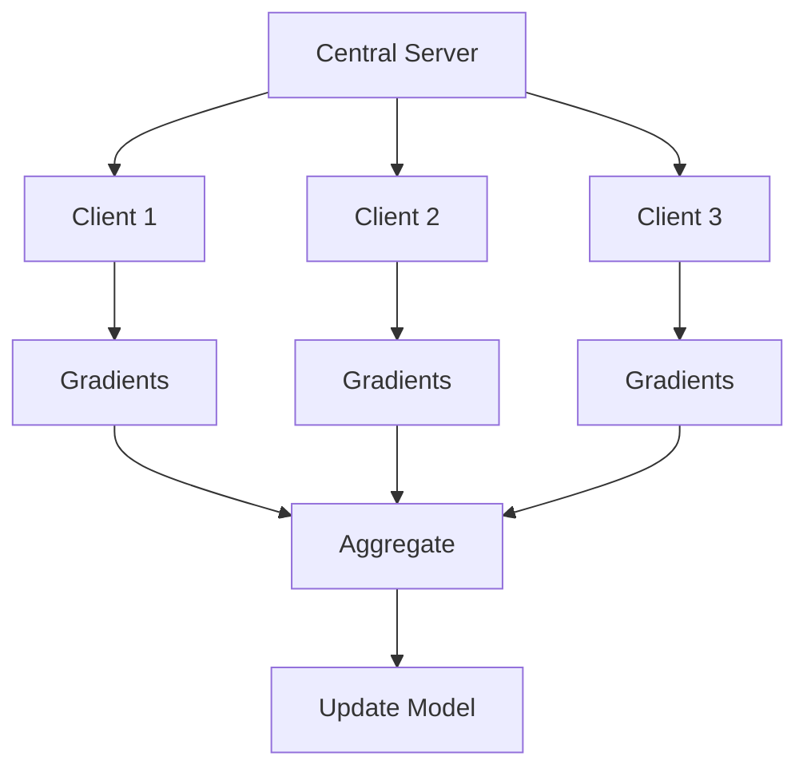
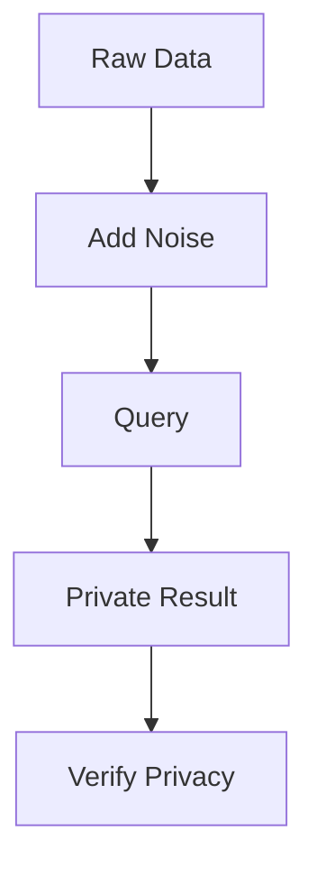
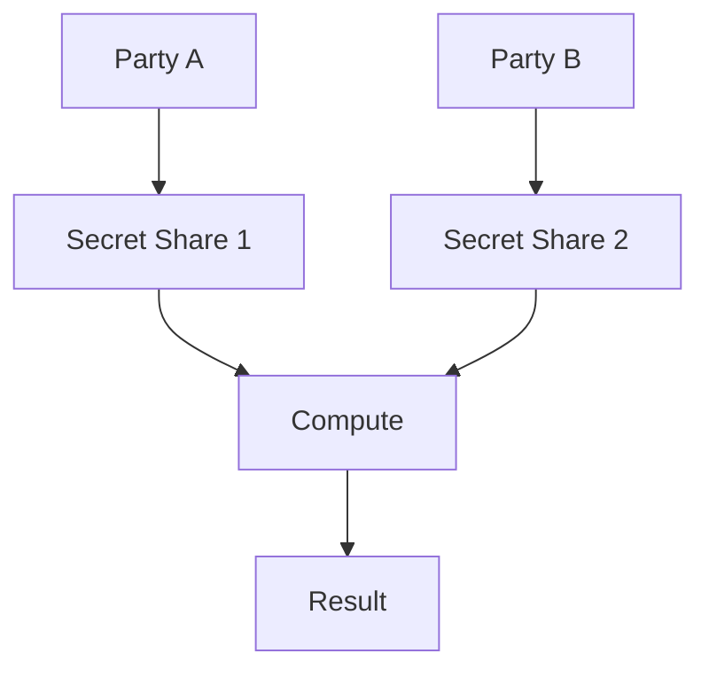
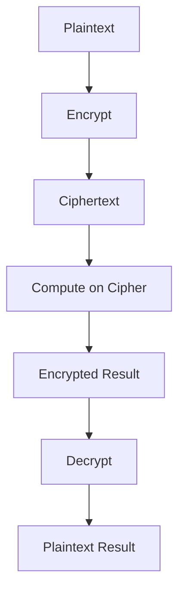
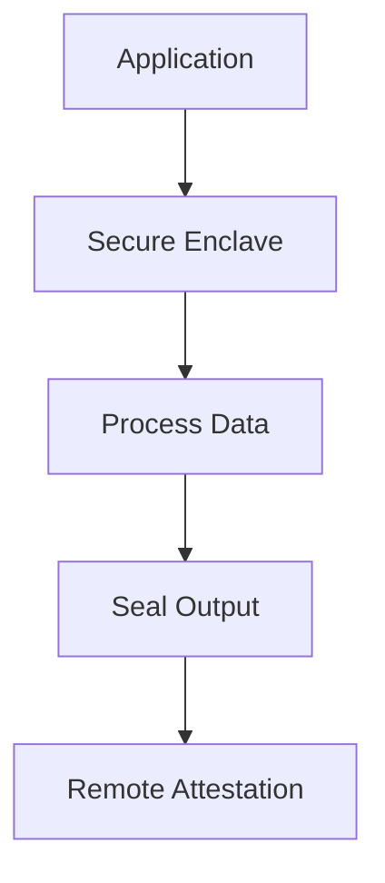

# Chapter 12: Privacy Computing Technologies

## Diagram 1: Federated Learning

## Diagram 2: Differential Privacy

## Diagram 3: Secure Multi-Party Computation

## Diagram 4: Homomorphic Encryption

## Diagram 5: TEE (Trusted Execution Environment)

