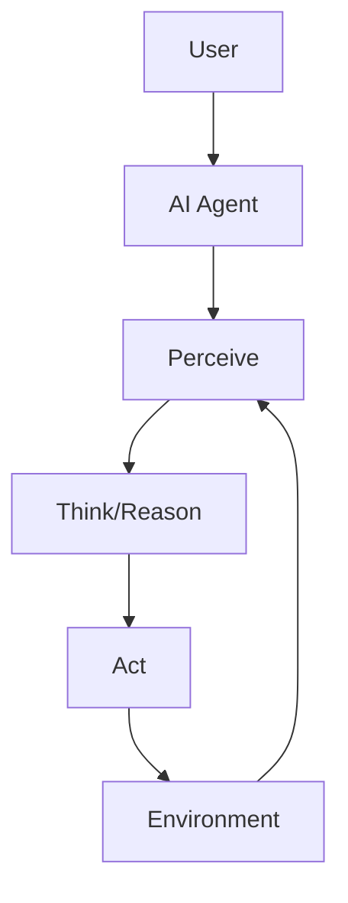
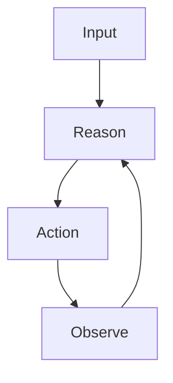
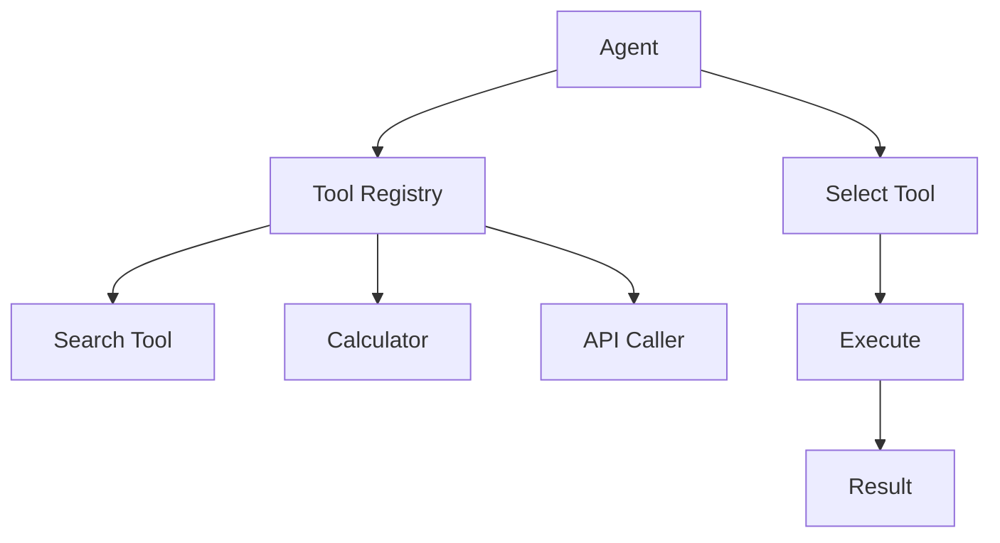
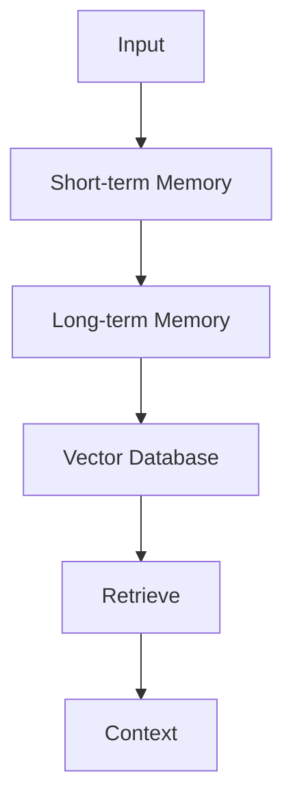
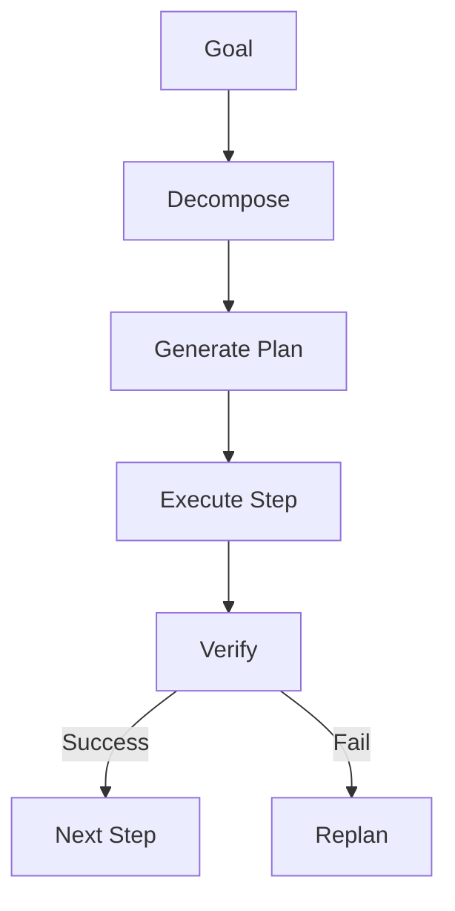
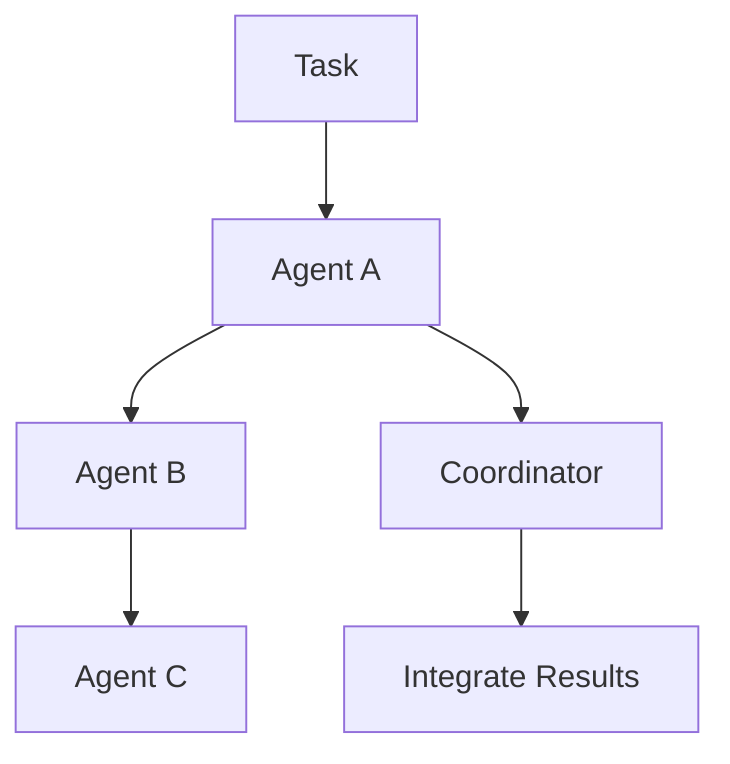
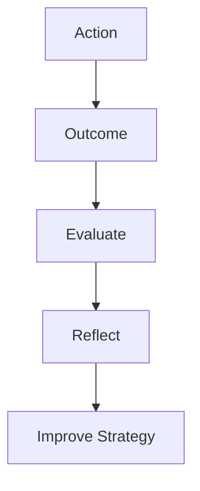
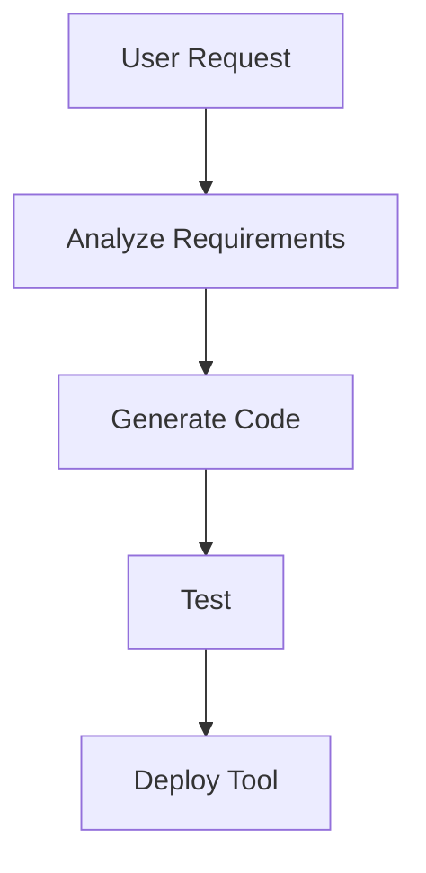
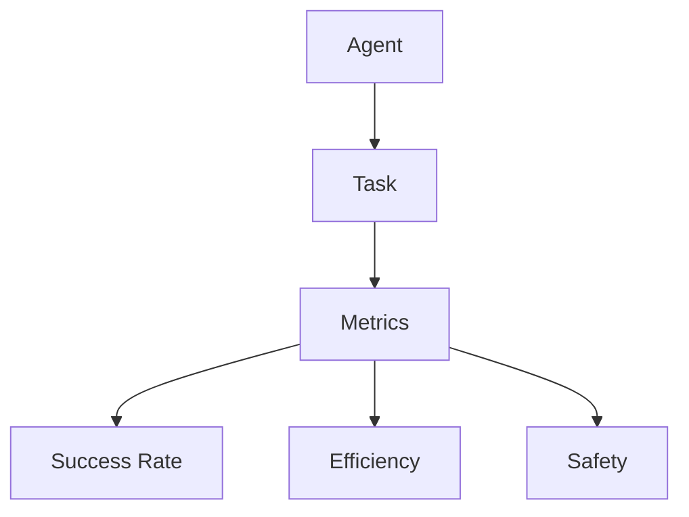
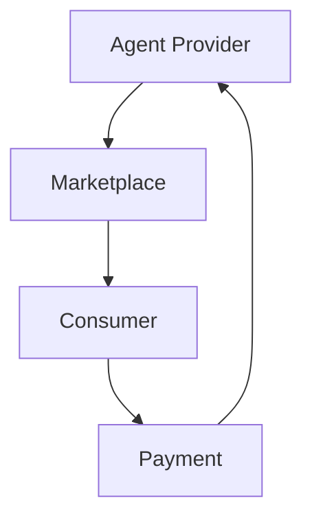

# Chapter 12: AI Agent Development Directions

## Diagram 1: Agent Architecture

## Diagram 2: ReAct Pattern

## Diagram 3: Tool Use Framework

## Diagram 4: Memory Systems

## Diagram 5: Planning & Execution

## Diagram 6: Multi-Agent Collaboration

## Diagram 7: Reflection & Self-Correction

## Diagram 8: Agent Tool Creation

## Diagram 9: Agent Evaluation

## Diagram 10: Agent Economy

