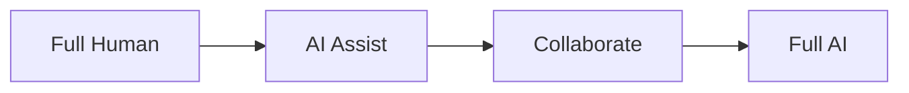
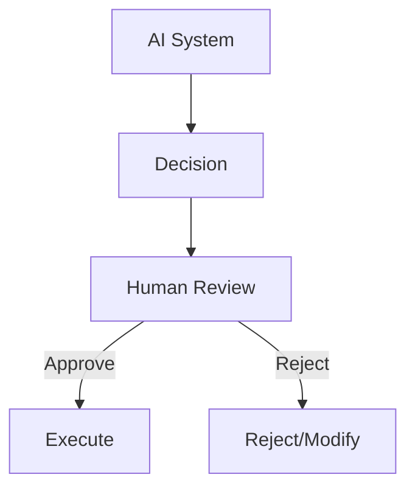
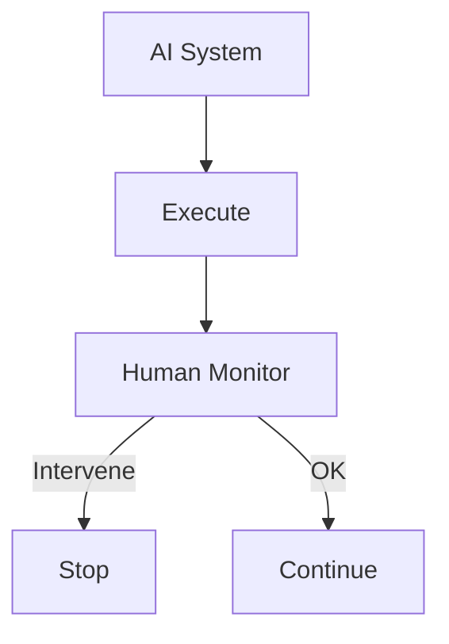
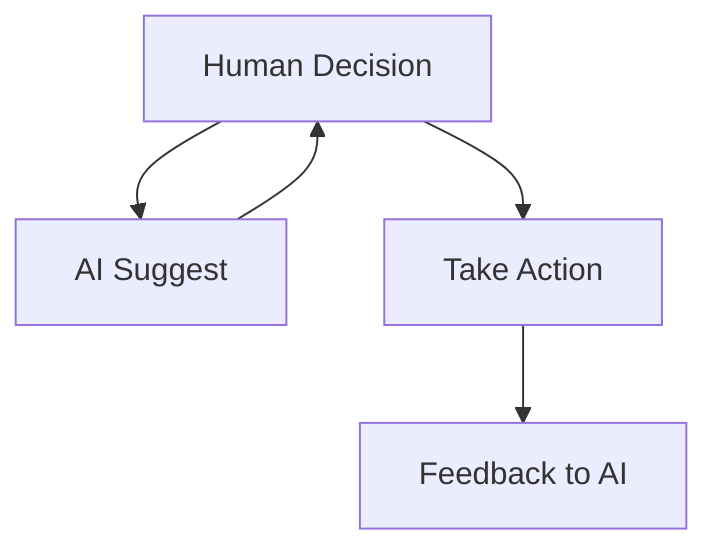
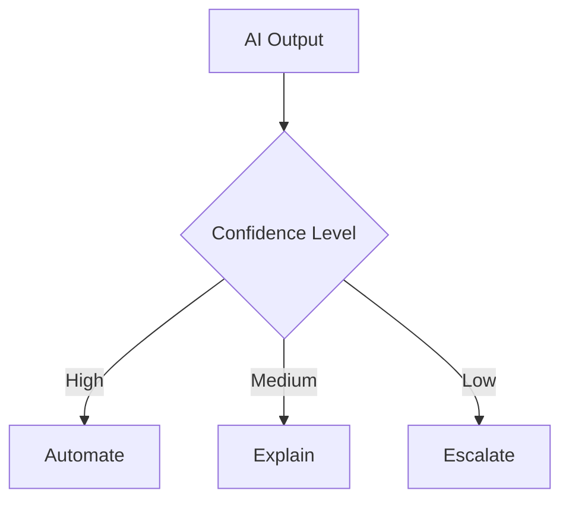

# Chapter 12: Human-Machine Collaboration Modes

## Diagram 1: Automation Spectrum

## Diagram 2: Human-in-the-Loop

## Diagram 3: Human-on-the-Loop

## Diagram 4: Mixed Initiative

## Diagram 5: Trust Calibration

