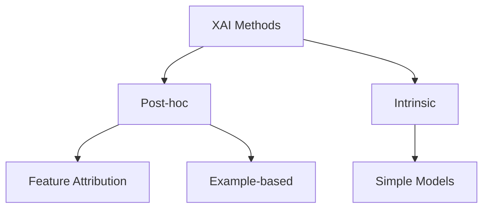
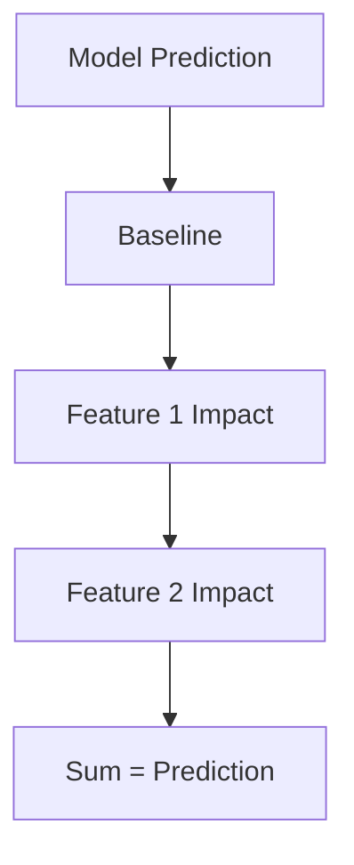
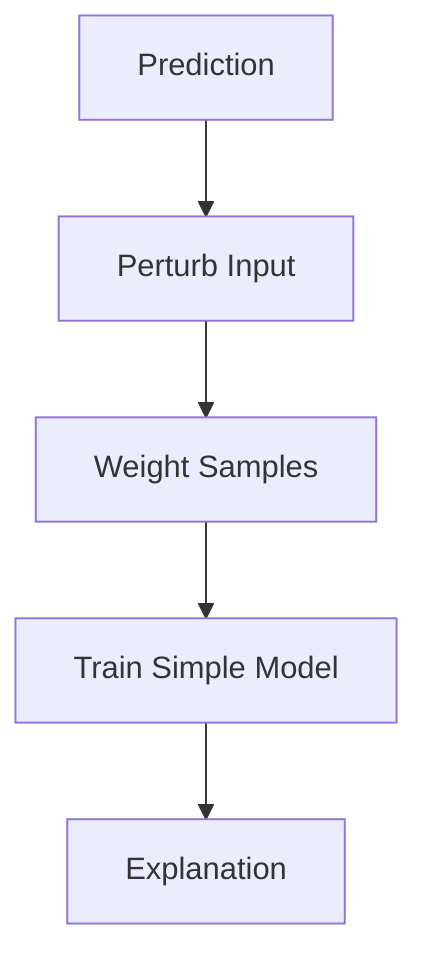
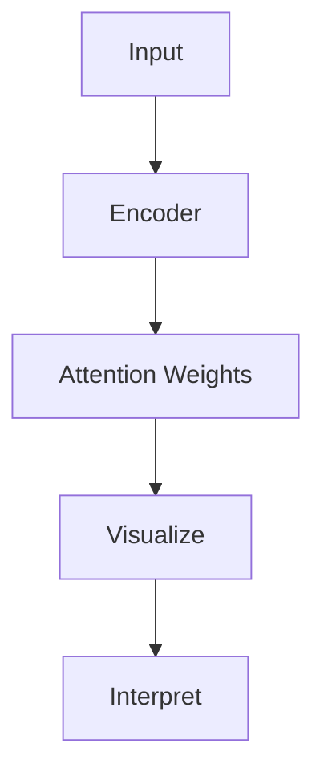
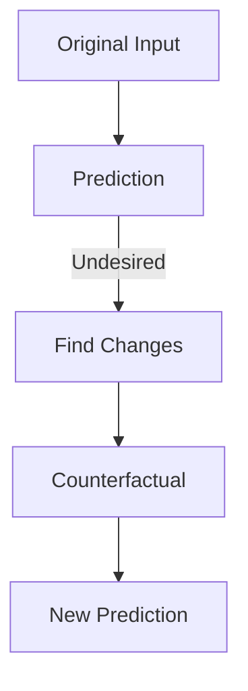

# Chapter 12: Explainable AI Trends

## Diagram 1: XAI Methods

## Diagram 2: SHAP Values

## Diagram 3: LIME Explanation

## Diagram 4: Attention Visualization

## Diagram 5: Counterfactual Explanations

