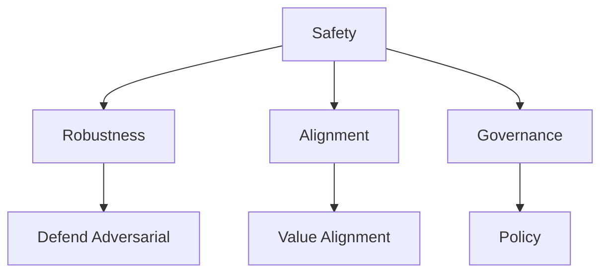
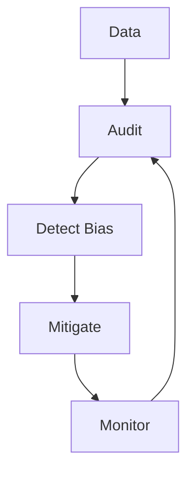
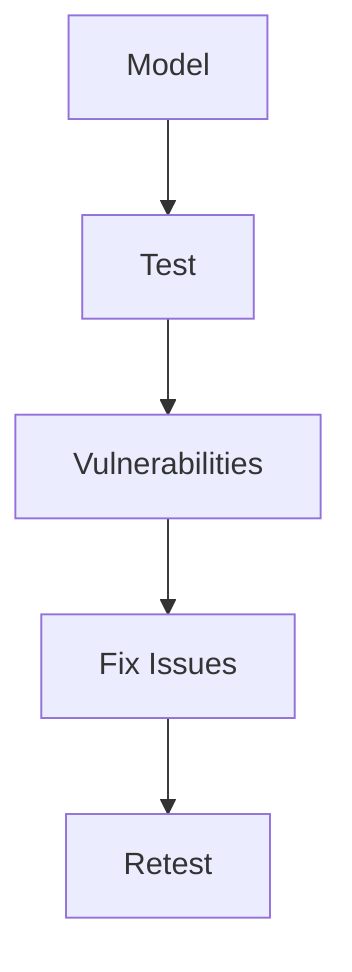
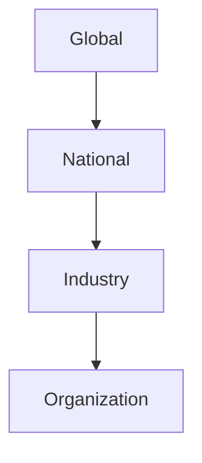
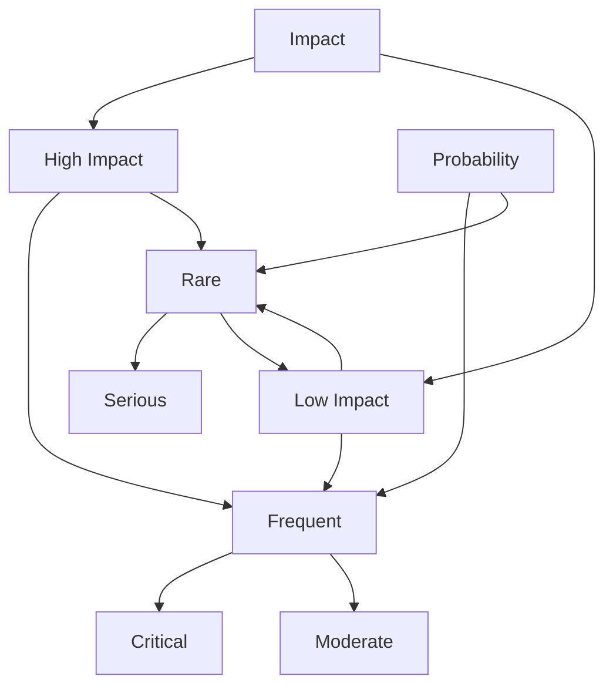

# Chapter 12: Ethics and Safety Trends

## Diagram 1: AI Safety Framework

## Diagram 2: Bias Detection Pipeline

## Diagram 3: Red Teaming Process

## Diagram 4: AI Governance Layers

## Diagram 5: Risk Assessment Matrix

