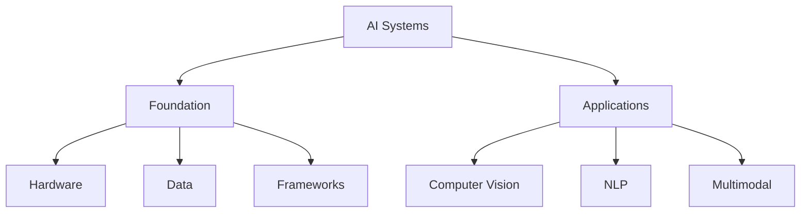
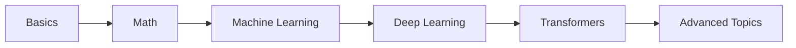
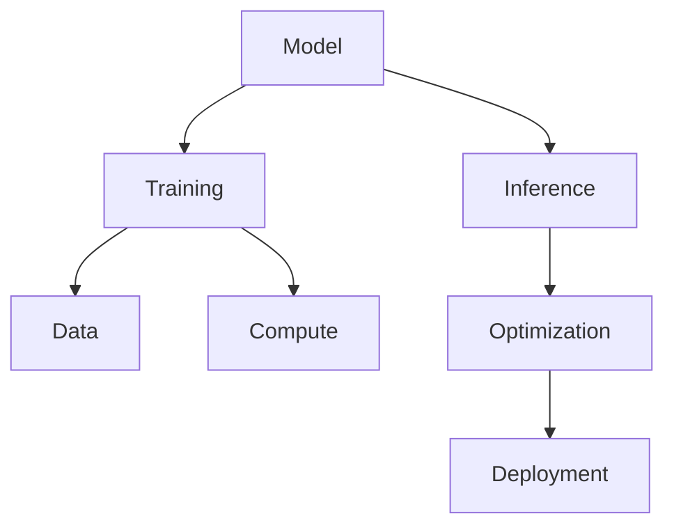
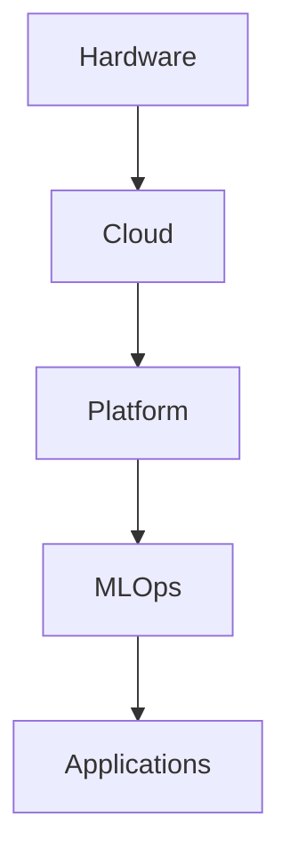
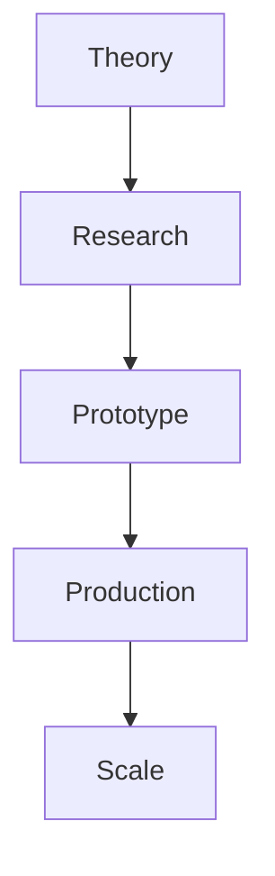

# Chapter 13: Book Knowledge Map

## Diagram 1: AI Infrastructure Overview

## Diagram 2: Learning Path Map

## Diagram 3: Core Concepts Network

## Diagram 4: Technology Stack

## Diagram 5: From Theory to Practice

