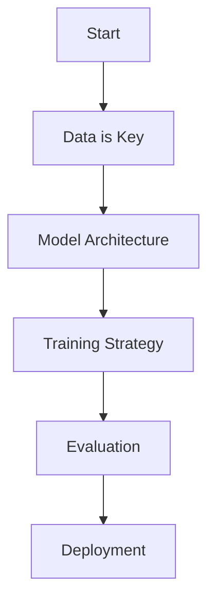
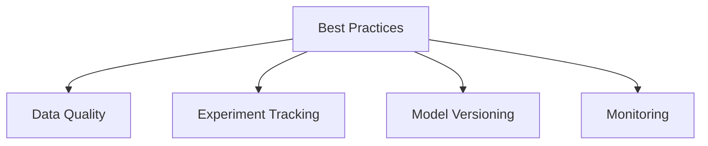
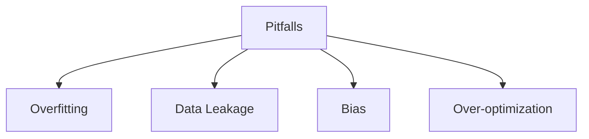
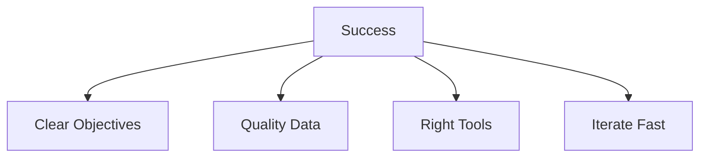
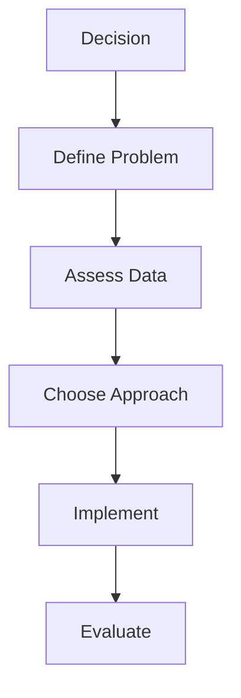

# Chapter 13: Core Points Review

## Diagram 1: Key Takeaways

```mermaid
graph TD
    Start[Start] --> Data[Data is Key]
    Data --> Model[Model Architecture]
    Model --> Training[Training Strategy]
    Training --> Evaluation[Evaluation]
    Evaluation --> Deployment[Deployment]
```

## Diagram 2: Best Practices

```mermaid
graph TD
    Best[Best Practices] --> Quality[Data Quality]
    Best --> Experiment[Experiment Tracking]
    Best --> Version[Model Versioning]
    Best --> Monitor[Monitoring]
```

## Diagram 3: Common Pitfalls

```mermaid
graph TD
    Pitfalls --> Overfitting[Overfitting]
    Pitfalls --> Leakage[Data Leakage]
    Pitfalls --> Bias[Bias]
    Pitfalls --> Cost[Over-optimization]
```

## Diagram 4: Success Factors

```mermaid
graph TD
    Success --> Clear[Clear Objectives]
    Success --> QualityData[Quality Data]
    Success --> Right[Right Tools]
    Success --> Iterate[Iterate Fast]
```

## Diagram 5: Decision Framework

```mermaid
graph TD
    Decision --> Problem[Define Problem]
    Problem --> Data[Assess Data]
    Data --> Choose[Choose Approach]
    Choose --> Implement[Implement]
    Implement --> Evaluate[Evaluate]
```
