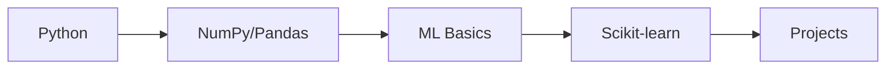
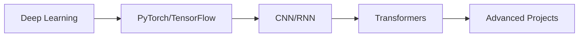
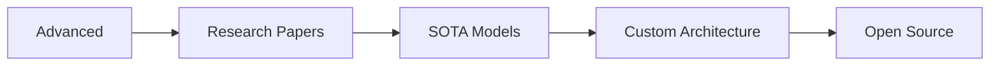
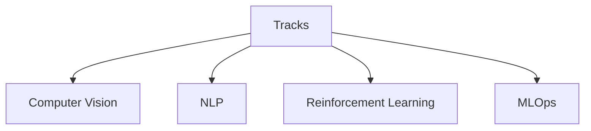
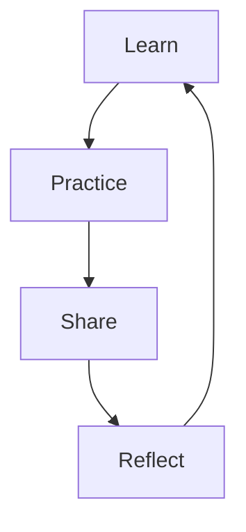

# Chapter 13: Learning Path

## Diagram 1: Beginner Path

```mermaid
graph LR
    Python[Python] --> NumPy[NumPy/Pandas]
    NumPy --> ML[ML Basics]
    ML --> sklearn[Scikit-learn]
    sklearn --> Projects[Projects]
```

## Diagram 2: Intermediate Path

```mermaid
graph LR
    DL[Deep Learning] --> Frameworks[PyTorch/TensorFlow]
    Frameworks --> CNN[CNN/RNN]
    CNN --> Transform[Transformers]
    Transform --> Projects[Advanced Projects]
```

## Diagram 3: Advanced Path

```mermaid
graph LR
    Advanced[Advanced] --> Research[Research Papers]
    Research --> SOTA[SOTA Models]
    SOTA --> Custom[Custom Architecture]
    Custom --> Contribute[Open Source]
```

## Diagram 4: Specialization Tracks

```mermaid
graph TD
    Track[Tracks] --> CV[Computer Vision]
    Track --> NLP[NLP]
    Track --> RL[Reinforcement Learning]
    Track --> MLOps[MLOps]
```

## Diagram 5: Continuous Learning

```mermaid
graph TD
    Learn[Learn] --> Practice[Practice]
    Practice --> Share[Share]
    Share --> Reflect[Reflect]
    Reflect --> Learn
```
