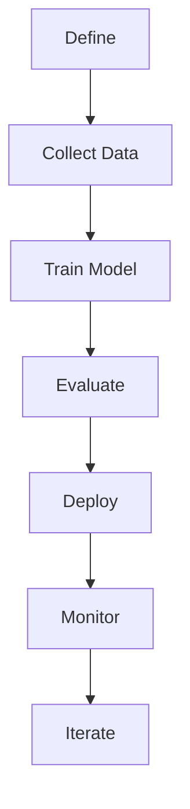
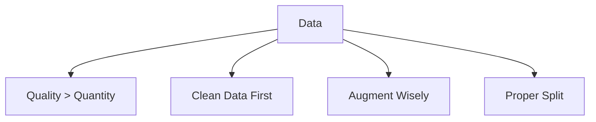
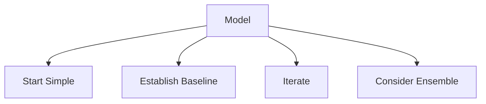
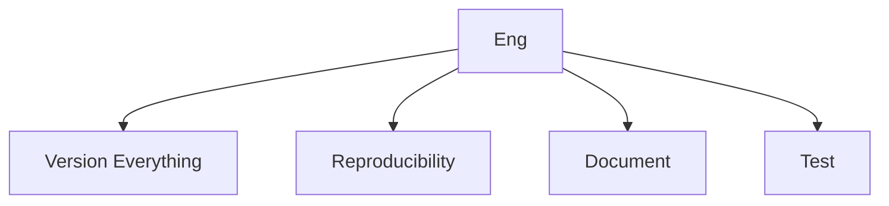
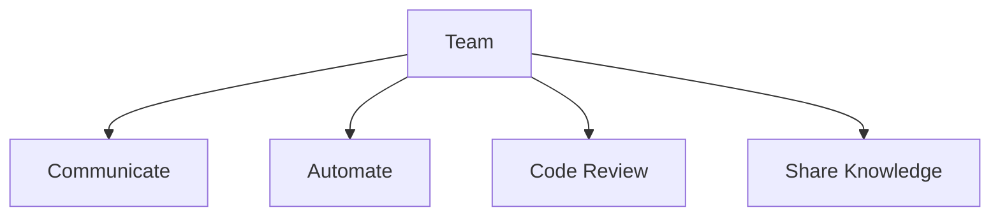

# Chapter 13: Practical Advice Summary

## Diagram 1: Project Lifecycle

```mermaid
graph TD
    Define[Define] --> Collect[Collect Data]
    Collect --> Train[Train Model]
    Train --> Evaluate[Evaluate]
    Evaluate --> Deploy[Deploy]
    Deploy --> Monitor[Monitor]
    Monitor --> Iterate[Iterate]
```

## Diagram 2: Data Advice

```mermaid
graph TD
    Data --> Quality[Quality > Quantity]
    Data --> Clean[Clean Data First]
    Data --> Augment[Augment Wisely]
    Data --> Split[Proper Split]
```

## Diagram 3: Model Advice

```mermaid
graph TD
    Model --> Simple[Start Simple]
    Model --> Baseline[Establish Baseline]
    Model --> Iterate[Iterate]
    Model --> Ensemble[Consider Ensemble]
```

## Diagram 4: Engineering Advice

```mermaid
graph TD
    Eng --> Version[Version Everything]
    Eng --> Reproduce[Reproducibility]
    Eng --> Document[Document]
    Eng --> Test[Test]
```

## Diagram 5: Team Advice

```mermaid
graph TD
    Team --> Communicate[Communicate]
    Team --> Automate[Automate]
    Team --> Review[Code Review]
    Team --> Share[Share Knowledge]
```
