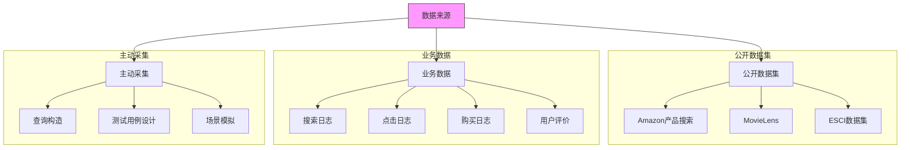

# 图10.1：评测数据采集体系

```mermaid
graph TD
    DS[数据来源] --> PD[公开数据集]
    DS --> BD[业务数据]
    DS --> AC[主动采集]
    
    subgraph 公开数据集
    PD --> APS[Amazon产品搜索]
    PD --> ML[MovieLens]
    PD --> ESCI[ESCI数据集]
    end
    
    subgraph 业务数据
    BD --> SL[搜索日志]
    BD --> CL[点击日志]
    BD --> PL[购买日志]
    BD --> UR[用户评价]
    end
    
    subgraph 主动采集
    AC --> QC[查询构造]
    AC --> TC[测试用例设计]
    AC --> SS[场景模拟]
    end
    
    style DS fill:#f9f,stroke:#333
```

**说明**：展示评测数据的多来源采集体系，包括公开数据集、业务数据和主动采集三种方式。
