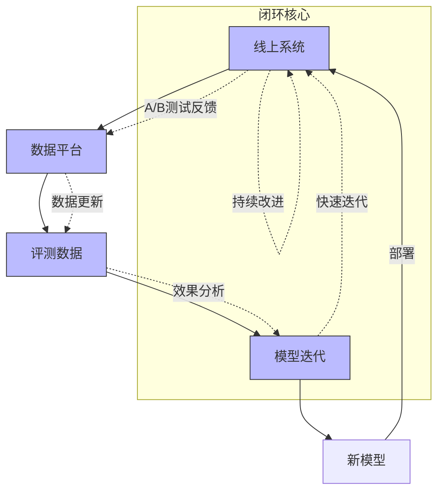

# 图10.2：评测闭环流程

```mermaid
graph TD
    OS[线上系统] --> DP[数据平台]
    DP --> ED[评测数据]
    ED --> MI[模型迭代]
    MI --> NM[新模型]
    NM -->|部署| OS
    
    OS -.->|A/B测试反馈| DP
    DP -.->|数据更新| ED
    ED -.->|效果分析| MI
    
    subgraph 闭环核心
    OS -.->|持续改进| OS
    MI -.->|快速迭代| OS
    end
    
    style OS fill:#bbf,stroke:#333
    style DP fill:#bbf,stroke:#333
    style ED fill:#bbf,stroke:#333
    style MI fill:#bbf,stroke:#333
```

**说明**：展示评测数据与模型迭代的闭环流程，实现数据与模型的协同进化。
