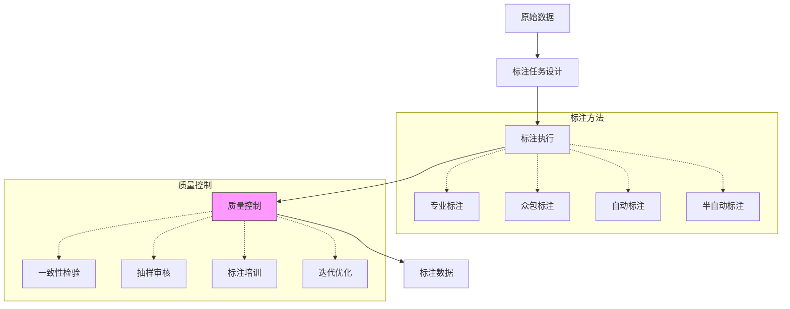

# 图10.3：数据标注工作流

```mermaid
graph TD
    RD[原始数据] --> AT[标注任务设计]
    AT --> AP[标注执行]
    AP --> QC[质量控制]
    QC --> AD[标注数据]
    
    subgraph 标注方法
    AP -.-> PA[专业标注]
    AP -.-> CA[众包标注]
    AP -.-> SA[自动标注]
    AP -.-> SSA[半自动标注]
    end
    
    subgraph 质量控制
    QC -.-> IA[一致性检验]
    QC -.-> SA2[抽样审核]
    QC -.-> ATI[标注培训]
    QC -.-> AT2[迭代优化]
    end
    
    style QC fill:#f9f,stroke:#333
```

**说明**：展示数据标注的完整工作流，包括标注任务设计、标注执行和质量控制环节。
