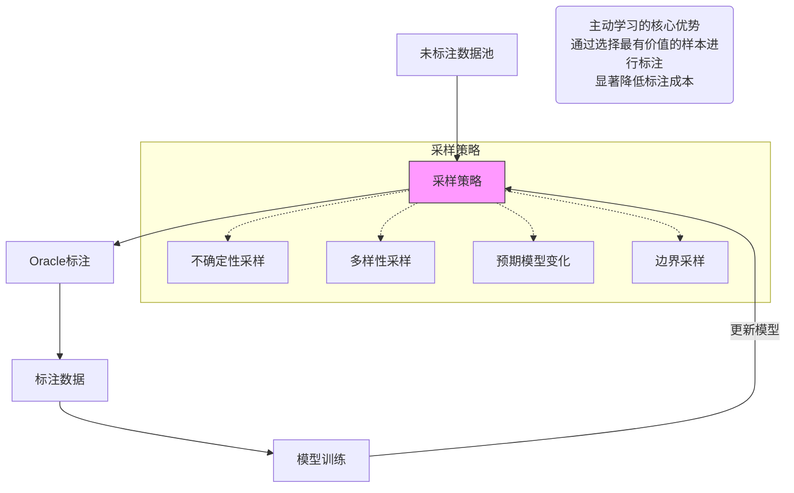

# 图10.4：主动学习流程

```mermaid
graph TD
    UD[未标注数据池] --> SS[采样策略]
    SS --> OA[Oracle标注]
    OA --> LD[标注数据]
    LD --> MT[模型训练]
    MT -->|更新模型| SS
    
    subgraph 采样策略
    SS -.-> US[不确定性采样]
    SS -.-> DS[多样性采样]
    SS -.-> EMC[预期模型变化]
    SS -.-> MS[边界采样]
    end
    
    note(主动学习的核心优势<br/>通过选择最有价值的样本进行标注<br/>显著降低标注成本)
    
    style SS fill:#f9f,stroke:#333
```

**说明**：展示主动学习的循环流程，通过智能采样策略选择最有价值的样本进行标注。
