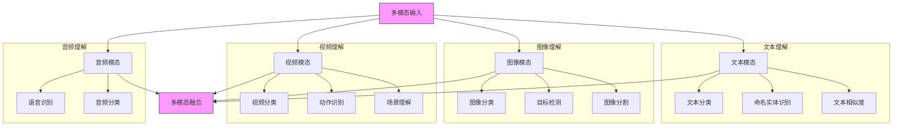

# 图11.1：多模态数据理解概览

```mermaid
graph TD
    I[多模态输入] --> TM[文本模态]
    I --> IM[图像模态]
    I --> VM[视频模态]
    I --> AM[音频模态]
    
    subgraph 文本理解
    TM --> TC[文本分类]
    TM --> NER[命名实体识别]
    TM --> TS[文本相似度]
    end
    
    subgraph 图像理解
    IM --> IC[图像分类]
    IM --> OD[目标检测]
    IM --> IS[图像分割]
    end
    
    subgraph 视频理解
    VM --> VC[视频分类]
    VM --> AR[动作识别]
    VM --> SU[场景理解]
    end
    
    subgraph 音频理解
    AM --> SR[语音识别]
    AM --> AC[音频分类]
    end
    
    TM & IM & VM & AM --> MF[多模态融合]
    
    style I fill:#f9f,stroke:#333
    style MF fill:#f9f,stroke:#333
```

**说明**：展示电商场景中的多模态数据类型及其对应的理解技术。
