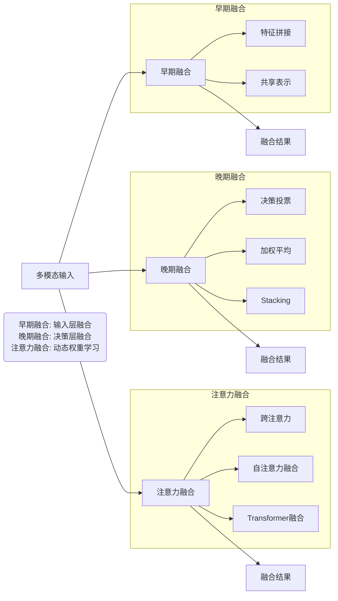

# 图11.2：跨模态融合方法对比

```mermaid
graph LR
    MI[多模态输入] --> EF[早期融合]
    MI --> LF[晚期融合]
    MI --> AF[注意力融合]
    
    subgraph 早期融合
    EF --> FC[特征拼接]
    EF --> SR[共享表示]
    end
    
    subgraph 晚期融合
    LF --> DV[决策投票]
    LF --> WA[加权平均]
    LF --> ST[Stacking]
    end
    
    subgraph 注意力融合
    AF --> CA[跨注意力]
    AF --> SAF[自注意力融合]
    AF --> TF[Transformer融合]
    end
    
    EF --> Result1[融合结果]
    LF --> Result2[融合结果]
    AF --> Result3[融合结果]
    
    note(早期融合: 输入层融合<br/>晚期融合: 决策层融合<br/>注意力融合: 动态权重学习)
```

**说明**：对比早期融合、晚期融合和注意力融合三种主流跨模态融合方法。
