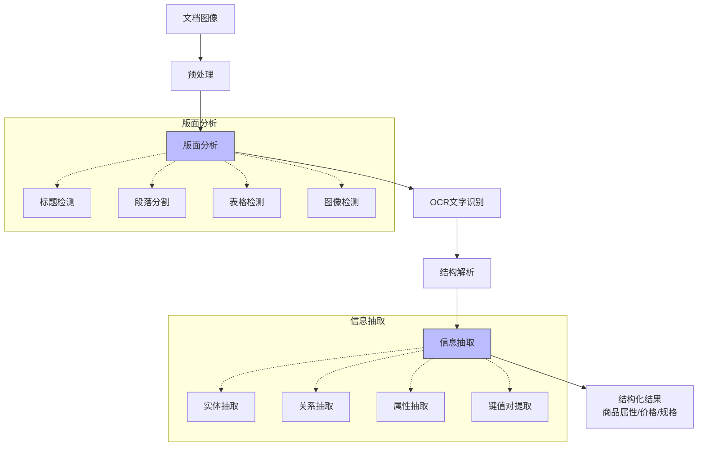

# 图11.3：文档解析流水线

```mermaid
graph TD
    DI[文档图像] --> P[预处理]
    P --> LA[版面分析]
    LA --> TR[OCR文字识别]
    TR --> SP[结构解析]
    SP --> IE[信息抽取]
    
    subgraph 版面分析
    LA -.-> TD[标题检测]
    LA -.-> PS[段落分割]
    LA -.-> TD2[表格检测]
    LA -.-> ID[图像检测]
    end
    
    subgraph 信息抽取
    IE -.-> EE[实体抽取]
    IE -.-> RE[关系抽取]
    IE -.-> AE[属性抽取]
    IE -.-> KVP[键值对提取]
    end
    
    IE --> SR[结构化结果<br/>商品属性/价格/规格]
    
    style LA fill:#bbf,stroke:#333
    style IE fill:#bbf,stroke:#333
```

**说明**：展示从文档图像到结构化信息的完整解析流水线。
