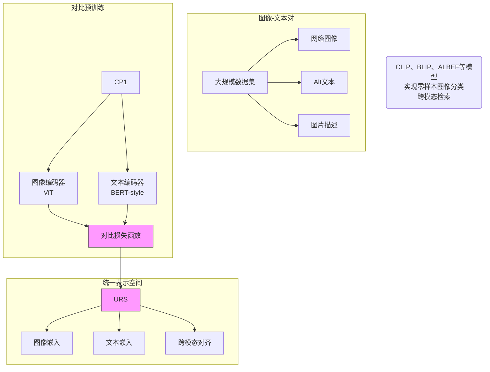

# 图11.4：视觉-语言预训练模型

```mermaid
graph TD
    D[大规模数据集]
    
    subgraph 图像-文本对
    D --> WI[网络图像]
    D --> AT[Alt文本]
    D --> CP[图片描述]
    end
    
    subgraph 对比预训练
    CP1 --> IE[图像编码器<br/>ViT]
    CP1 --> TE[文本编码器<br/>BERT-style]
    IE --> CL[对比损失函数]
    TE --> CL
    end
    
    subgraph 统一表示空间
    CL --> URS
    URS --> IE2[图像嵌入]
    URS --> TE2[文本嵌入]
    URS --> CA[跨模态对齐]
    end
    
    note(CLIP、BLIP、ALBEF等模型<br/>实现零样本图像分类<br/>跨模态检索)
    
    style CL fill:#f9f,stroke:#333
    style URS fill:#f9f,stroke:#333
```

**说明**：展示视觉-语言预训练模型（如CLIP）的工作原理和统一表示空间的构建。
