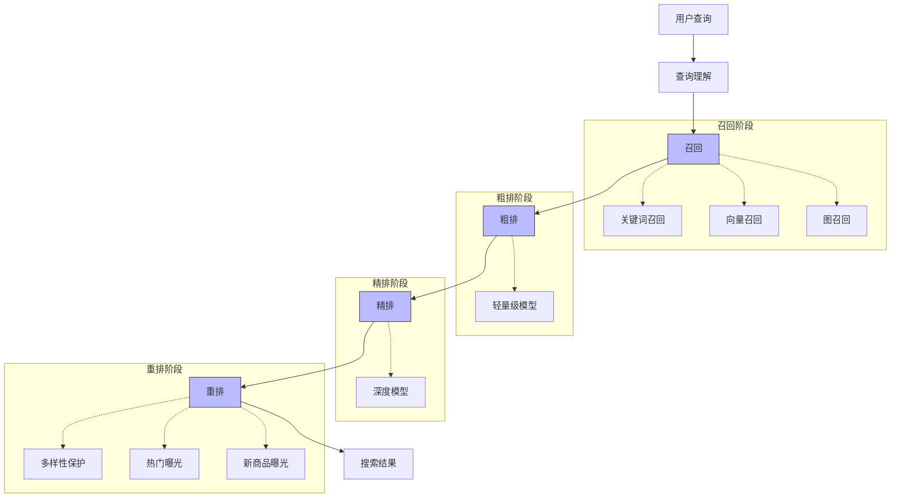

# 图12.1：工业级搜索系统架构

```mermaid
graph TD
    Q[用户查询] --> QU[查询理解]
    QU --> R[召回]
    R --> CR[粗排]
    CR --> FR[精排]
    FR --> RR[重排]
    RR --> RES[搜索结果]
    
    subgraph 召回阶段
    R -.-> KC[关键词召回]
    R -.-> VC[向量召回]
    R -.-> GC[图召回]
    end
    
    subgraph 粗排阶段
    CR -.-> LM[轻量级模型]
    end
    
    subgraph 精排阶段
    FR -.-> DM[深度模型]
    end
    
    subgraph 重排阶段
    RR -.-> DP[多样性保护]
    RR -.-> HE[热门曝光]
    RR -.-> NR[新商品曝光]
    end
    
    style R fill:#bbf,stroke:#333
    style CR fill:#bbf,stroke:#333
    style FR fill:#bbf,stroke:#333
    style RR fill:#bbf,stroke:#333
```

**说明**：展示工业级搜索系统的多阶段架构，从召回到重排的完整流程。
