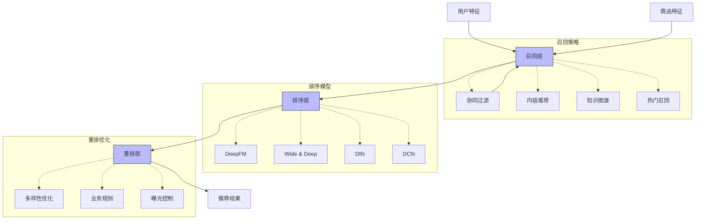

# 图12.2：工业级推荐系统架构

```mermaid
graph TD
    UF[用户特征] --> RL[召回层]
    IF[商品特征] --> RL
    CF[上下文特征] --> RL
    
    subgraph 召回策略
    RL -.-> CF[协同过滤]
    RL -.-> CB[内容推荐]
    RL -.-> KG[知识图谱]
    RL -.-> HI[热门召回]
    end
    
    RL --> RKL[排序层]
    
    subgraph 排序模型
    RKL -.-> DF[DeepFM]
    RKL -.-> WLD[Wide & Deep]
    RKL -.-> DIN[DIN]
    RKL -.-> DCN[DCN]
    end
    
    RKL --> RERL[重排层]
    
    subgraph 重排优化
    RERL -.-> DO[多样性优化]
    RERL -.-> BR[业务规则]
    RERL -.-> EC[曝光控制]
    end
    
    RERL --> RES[推荐结果]
    
    style RL fill:#bbf,stroke:#333
    style RKL fill:#bbf,stroke:#333
    style RERL fill:#bbf,stroke:#333
```

**说明**：展示工业级推荐系统的多阶段架构，包括召回、排序和重排三个核心阶段。
