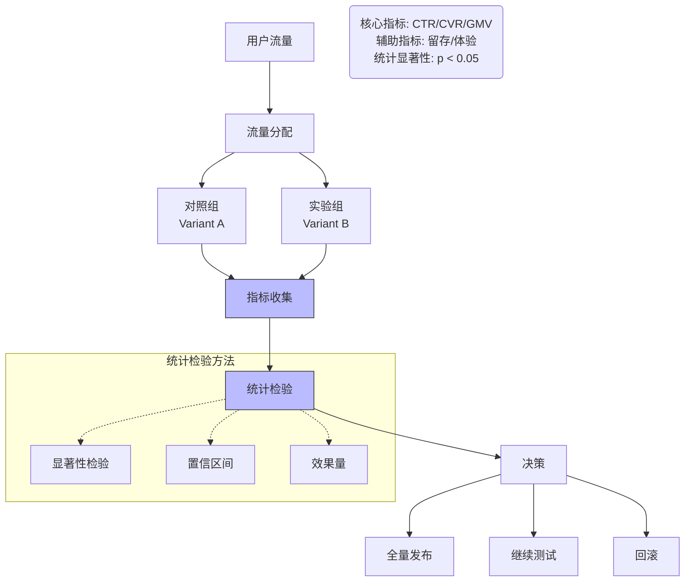

# 图12.3：A/B测试流程

```mermaid
graph TD
    UT[用户流量] --> TA[流量分配]
    TA --> CG[对照组<br/>Variant A]
    TA --> EG[实验组<br/>Variant B]
    
    CG --> MC[指标收集]
    EG --> MC
    
    MC --> ST[统计检验]
    ST --> DEC[决策]
    
    subgraph 统计检验方法
    ST -.-> ST2[显著性检验]
    ST -.-> CI[置信区间]
    ST -.-> ES[效果量]
    end
    
    DEC --> FR[全量发布]
    DEC --> CT[继续测试]
    DEC --> RB[回滚]
    
    note(核心指标: CTR/CVR/GMV<br/>辅助指标: 留存/体验<br/>统计显著性: p < 0.05)
    
    style MC fill:#bbf,stroke:#333
    style ST fill:#bbf,stroke:#333
```

**说明**：展示A/B测试的完整流程，包括流量分配、指标收集、统计检验和决策环节。
