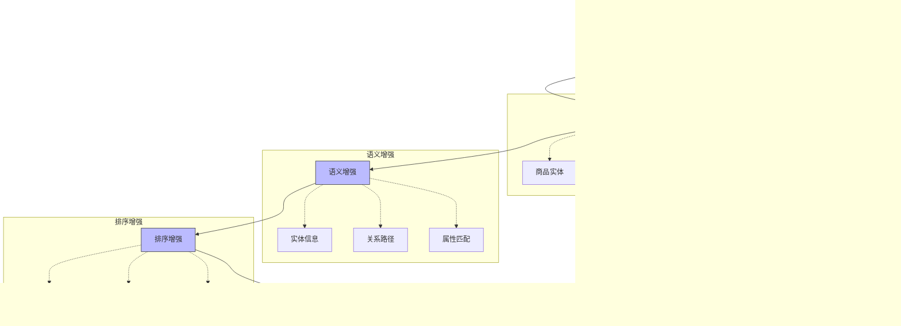

# 图12.4：知识图谱在工业系统中的应用

```mermaid
graph TD
    Q[用户查询] --> EL[实体链接]
    EL --> KG[知识图谱]
    KG --> SA[语义增强]
    SA --> RE[排序增强]
    RE --> REXP[可解释结果]
    
    subgraph 知识图谱
    KG -.-> PE[商品实体]
    KG -.-> BE[品牌实体]
    KG -.-> CE[品类实体]
    KG -.-> UE[用户实体]
    KG -.-> REL[关系边]
    end
    
    subgraph 语义增强
    SA -.-> EI[实体信息]
    SA -.-> RP[关系路径]
    SA -.-> AP[属性匹配]
    end
    
    subgraph 排序增强
    RE -.-> EP[实体流行度]
    RE -.-> RS[关系强度]
    RE -.-> AM[属性匹配度]
    end
    
    EL --> KG
    
    style KG fill:#f9f,stroke:#333
    style SA fill:#bbf,stroke:#333
    style RE fill:#bbf,stroke:#333
```

**说明**：展示知识图谱在搜索推荐系统中的应用，包括实体链接、语义增强和排序增强。
