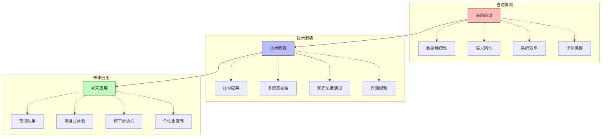

# 图13.1：供给理解技术演进路线图

```mermaid
graph TD
    CC[当前挑战] --> TT[技术趋势]
    TT --> FA[未来应用]
    
    subgraph 当前挑战
    CC -.-> DS[数据稀疏性]
    CC -.-> SG[语义鸿沟]
    CC -.-> EF[系统效率]
    CC -.-> EG[评测差距]
    end
    
    subgraph 技术趋势
    TT -.-> LLM[LLM应用]
    TT -.-> MMF[多模态融合]
    TT -.-> KGE[知识图谱演进]
    TT -.-> EI[评测创新]
    end
    
    subgraph 未来应用
    FA -.-> IA[智能助手]
    FA -.-> IE[沉浸式体验]
    FA -.-> CP[跨平台协同]
    FA -.-> PER[个性化定制]
    end
    
    style CC fill:#fbb,stroke:#333
    style TT fill:#bbf,stroke:#333
    style FA fill:#bfb,stroke:#333
```

**说明**：展示供给理解技术从当前挑战到技术趋势再到未来应用的演进路线。
