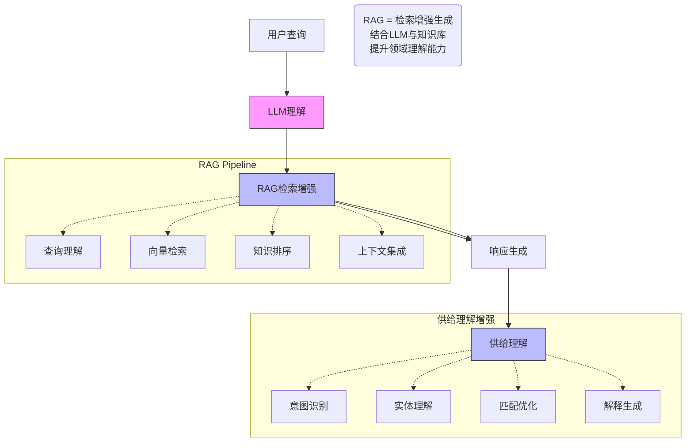

# 图13.2：LLM在供给理解中的应用架构

```mermaid
graph TD
    UQ[用户查询] --> LLMU[LLM理解]
    LLMU --> RAG[RAG检索增强]
    RAG --> RG[响应生成]
    RG --> SU[供给理解]
    
    subgraph RAG Pipeline
    RAG -.-> QU[查询理解]
    RAG -.-> VR[向量检索]
    RAG -.-> KR[知识排序]
    RAG -.-> CI[上下文集成]
    end
    
    subgraph 供给理解增强
    SU -.-> IR[意图识别]
    SU -.-> EU[实体理解]
    SU -.-> MO[匹配优化]
    SU -.-> EG[解释生成]
    end
    
    RAG --> RG
    
    note(RAG = 检索增强生成<br/>结合LLM与知识库<br/>提升领域理解能力)
    
    style LLMU fill:#f9f,stroke:#333
    style RAG fill:#bbf,stroke:#333
    style SU fill:#bbf,stroke:#333
```

**说明**：展示LLM与RAG技术结合在供给理解中的应用架构。
