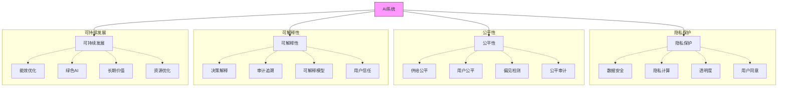

# 图13.3：AI社会责任与伦理框架

```mermaid
graph TD
    AIS[AI系统] --> PP[隐私保护]
    AIS --> F[公平性]
    AIS --> E[可解释性]
    AIS --> S[可持续发展]
    
    subgraph 隐私保护
    PP -.-> DS[数据安全]
    PP -.-> PC[隐私计算]
    PP -.-> TR[透明度]
    PP -.-> UC[用户同意]
    end
    
    subgraph 公平性
    F -.-> SF[供给公平]
    F -.-> UF[用户公平]
    F -.-> BD[偏见检测]
    F -.-> FA[公平审计]
    end
    
    subgraph 可解释性
    E -.-> DE[决策解释]
    E -.-> AT[审计追溯]
    E -.-> IM[可解释模型]
    E -.-> UT[用户信任]
    end
    
    subgraph 可持续发展
    S -.-> EE[能效优化]
    S -.-> GAI[绿色AI]
    S -.-> LTV[长期价值]
    S -.-> RO[资源优化]
    end
    
    style AIS fill:#f9f,stroke:#333
```

**说明**：展示AI系统在隐私保护、公平性、可解释性和可持续发展四个方面的社会责任框架。
