# 第1章：供给理解基础

## 1. 供给概念演进图

### 图1.1 供给概念的历史演进
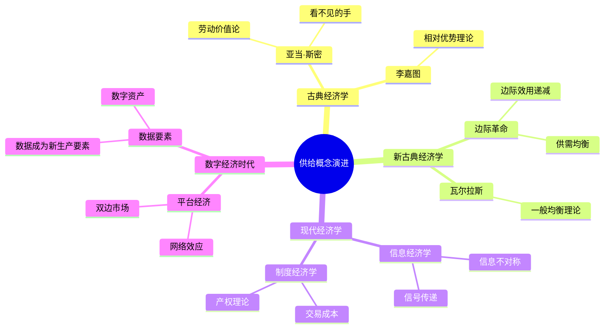

### 图1.2 供给定义的演变


### 图1.3 供给侧改革演进
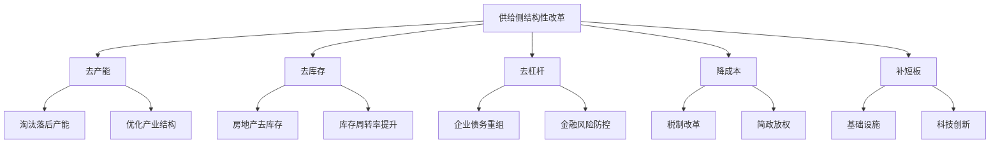

### 图1.4 供给能力的层次
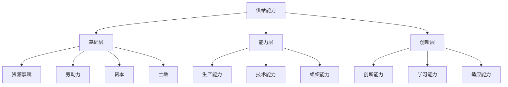

### 图1.5 供给与需求关系演变
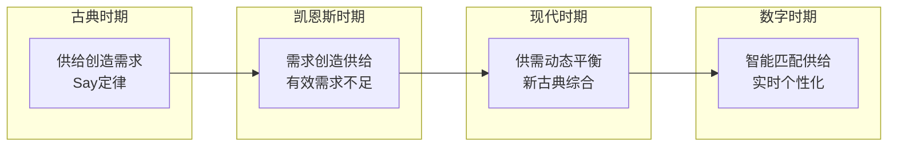

---

## 2. 经济学视角图

### 图1.6 供给的经济学框架
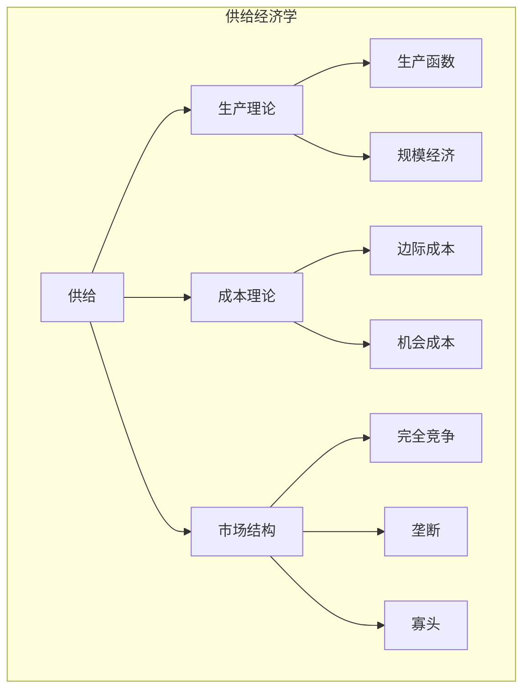

### 图1.7 供给曲线移动
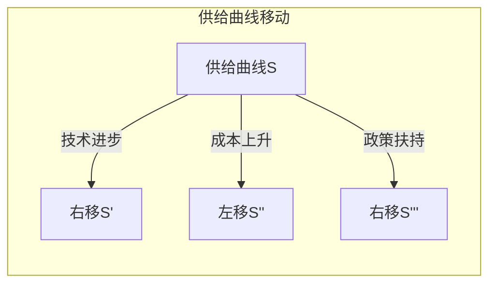

### 图1.8 供需均衡模型
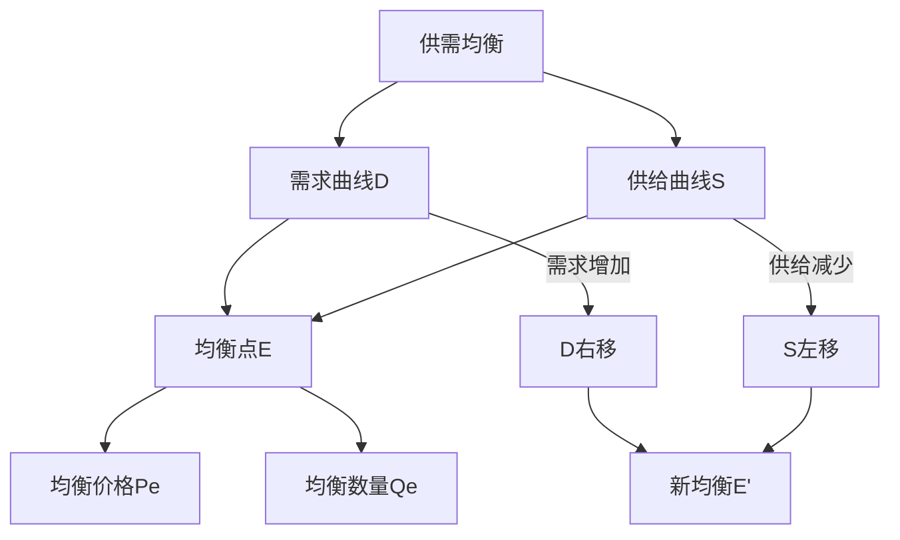

---

## 3. 数字化表示方法对比

### 图1.9 向量表示方法演进


### 图1.10 离散 vs 连续表示
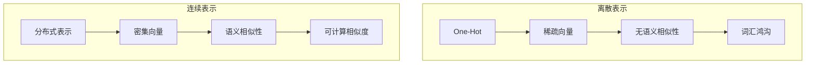

### 图1.11 文本表示方法对比
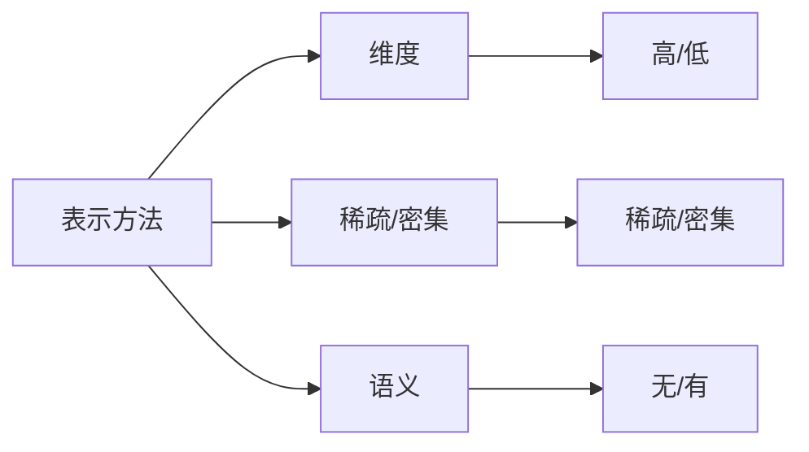

### 图1.12 嵌入空间可视化
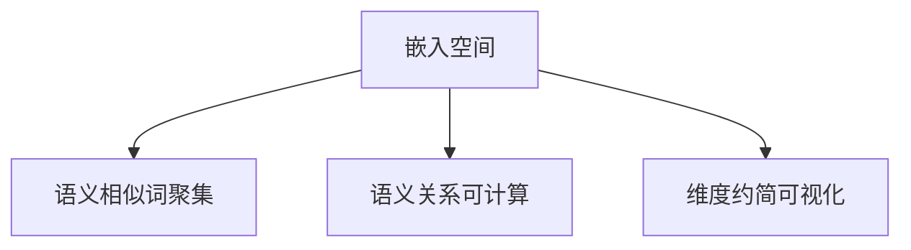

### 图1.13 数字表示的信息密度


---

## 4. TF-IDF原理图

### 图1.14 TF-IDF计算流程
```mermaid
flowchart TD
    A[文档集合] --> B[词频TF计算]
    B --> C[逆文档频率IDF计算]
    C --> D[TF-IDF = TF × IDF]
    D --> E[特征向量]
    
    B --> B1[词出现次数<br/>÷ 文档总词数]
    C --> C1[log(文档数<br/>/ 包含词文档数)]
```

### 图1.15 TF-IDF权重分布
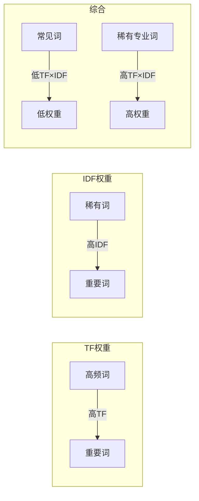

### 图1.16 TF-IDF的局限性
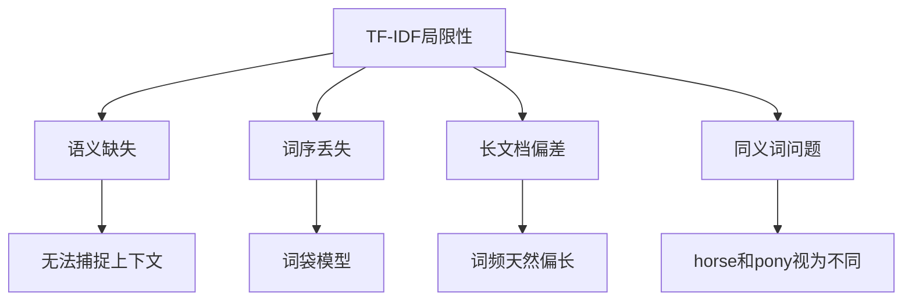

---

## 5. Word2Vec原理图

### 图1.17 Skip-gram模型架构
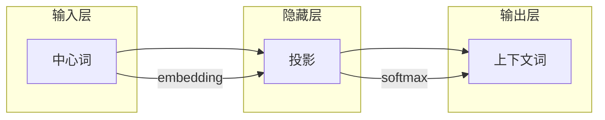

### 图1.18 CBOW模型架构
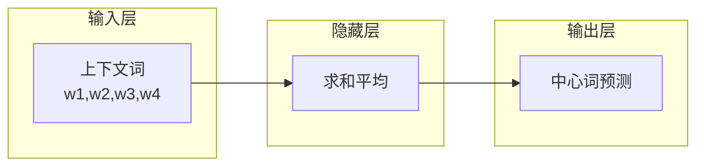

### 图1.19 词向量空间语义关系
```mermaid
flowchart TB
    A[词向量空间] --> B[语义相似词相近]
    A --> C[类比关系可计算]
    
    B --> B1[king - queen ≈ man - woman]
    B --> B2[Paris - France ≈ Tokyo - Japan]
    
    C --> C1[vec(king) - vec(man) + vec(woman) ≈ vec(queen)]
```

---

## 6. BERT vs GPT对比图

### 图1.20 BERT vs GPT架构对比
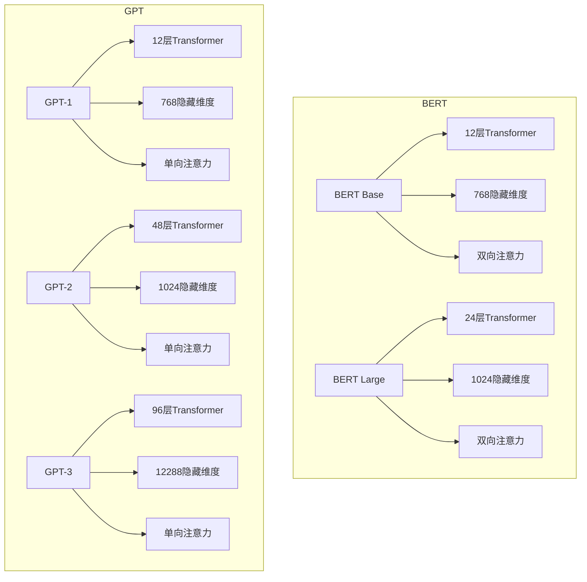

### 图1.21 预训练任务对比
```mermaid
flowchart LR
    subgraph BERT预训练
        A[MLM<br/>掩码语言模型] --> A1[随机掩码15%词]
        A1 --> A2[预测被掩码词]
        
        B[NSP<br/>下一句预测] --> B1[判断两句是否相连]
    end
    
    subgraph GPT预训练
        C[CLM<br/>因果语言模型] --> C1[预测下一个词]
        C1 --> C2[自回归生成]
    end
```

### 图1.22 BERT与GPT注意力模式
```mermaid
flowchart TB
    subgraph BERT双向注意力
        A[所有词<br/>互相关注]
        A --> A1[每个词<br/>看到左右所有词]
    end
    
    subgraph GPT单向注意力
        B[每个词<br/>只看左侧]
        B --> B1[从左到右<br/>自回归生成]
    end
```

### 图1.23 应用场景对比
```mermaid
flowchart TB
    subgraph BERT擅长
        A[理解任务] --> A1[文本分类]
        A --> A2[命名实体识别]
        A --> A3[问答系统]
        A --> A4[句子对关系]
    end
    
    subgraph GPT擅长
        B[生成任务] --> B1[文本续写]
        B --> B2[对话生成]
        B --> B3[代码生成]
        B --> B4[创意写作]
    end
```

---

## 7. CLIP多模态图

### 图1.24 CLIP双塔架构
```mermaid
flowchart TB
    A[CLIP双塔模型] --> B[图像编码器]
    A --> C[文本编码器]
    
    B --> B1[ViT-B/32]
    B --> B2[ResNet-50]
    
    C --> C1[Transformer]
    
    B --> D[对比学习]
    C --> D
    D --> E[图文匹配]
```

### 图1.25 CLIP预训练流程
```mermaid
flowchart TD
    A[大规模图文对] --> B[图像编码器]
    A --> C[文本编码器]
    
    B --> D[图像向量I]
    C --> E[文本向量T]
    
    D --> F[对比损失]
    E --> F
    
    F --> G[优化使I·T匹配对相似度最大化]
```

### 图1.26 CLIP零样本分类
```mermaid
flowchart LR
    A[输入图像] --> B[图像编码器]
    
    C[类别文本<br/>"a photo of a cat"] --> D[文本编码器]
    C1[类别文本<br/>"a photo of a dog"] --> D
    C2[类别文本<br/>"a photo of a bird"] --> D
    
    B --> E[计算相似度]
    D --> E
    
    E --> F[选择最高相似度<br/>作为预测类别]
```

---

## 8. 三层理解细节图

### 图1.27 理解的三层模型
```mermaid
flowchart TB
    A[机器理解三层模型] --> B[表层理解<br/>字面意思]
    A --> C[语义理解<br/>意图含义]
    A --> D[语用理解<br/>隐含意图]
    
    B --> B1[词汇识别]
    B --> B2[语法解析]
    B --> B3[句法结构]
    
    C --> C1[语义角色]
    C --> C2[指代消解]
    C --> C3[逻辑推理]
    
    D --> D1[语境推断]
    D --> D2[隐喻理解]
    D --> D3[意图识别]
```

### 图1.28 语义理解层次
```mermaid
flowchart LR
    A[词义] --> B[句义]
    B --> C[段义]
    C --> D[篇义]
    
    A -->|词汇层面| A1[词向量]
    B -->|句子层面| B1[句向量]
    C -->|段落层面| C1[注意力]
    D -->|篇章层面| D1[长距离依赖]
```

### 图1.29 上下文理解机制
```mermaid
flowchart TD
    A[输入文本] --> B[词级别编码]
    B --> C[句子级别编码]
    C --> D[上下文集成]
    
    D --> E[注意力机制]
    E --> F[上下文向量]
    F --> G[理解输出]
```

### 图1.30 语境建模方法
```mermaid
flowchart TB
    A[语境建模] --> B[局部语境<br/>窗口内]
    A --> C[全局语境<br/>全文]
    A --> D[外部语境<br/>知识库]
    
    B --> B1[滑动窗口]
    C --> C1[Transformer]
    D --> D1[知识增强]
```

### 图1.31 理解评估维度
```mermaid
flowchart TB
    A[理解评估] --> B[准确性]
    A --> C[一致性]
    A --> D[推理能力]
    A --> E[鲁棒性]
    
    B --> B1[答案正确]
    C --> C1[不自相矛盾]
    D --> D1[逻辑推理]
    E --> E1[抗干扰能力]
```

---

## 9. 补充图表

### 图1.32 供给弹性类型
```mermaid
flowchart LR
    E[供给弹性] --> P[点弹性]
    E --> A[弧弹性]
    P --> P1[es = ΔQ/Q ÷ ΔP/P]
```

### 图1.33 生产函数类型
```mermaid
flowchart LR
    PF[生产函数] --> L[线性]
    PF --> C[柯布-道格拉斯]
    PF --> F[固定比例]
```

### 图1.34 成本曲线关系
```mermaid
flowchart LR
    TC[总成本] --> AVC[平均可变成本]
    TC --> AFC[平均固定成本]
    AVC --> MC[边际成本]
```

### 图1.35 市场结构类型
```mermaid
flowchart TB
    MS[市场结构] --> PC[完全竞争]
    MS --> MC[垄断]
    MS --> OL[寡头]
    MS --> MC1[垄断竞争]
```

---

## 11. 更多补充图表

### 图1.36 预训练语言模型对比
```mermaid
flowchart LR
    PLM[预训练模型] --> E[编码器]
    PLM --> D[解码器]
    PLM --> ED[编码器-解码器]
    
    E --> BERT
    D --> GPT
    ED --> T5
```

### 图1.37 提示工程方法
```mermaid
flowchart LR
    PE[提示工程] --> Zero[零样本]
    PE --> Few[少样本]
    PE --> CoT[思维链]
    PE --> ReAct[ReAct]
```

### 图1.38 模型评估指标
```mermaid
flowchart TB
    Eval[评估] --> Acc[准确率]
    Eval --> F1[F1分数]
    Eval --> Rouge[ROUGE]
    Eval --> Bleu[BLEU]
```

### 图1.39 对齐技术发展
```mermaid
flowchart LR
    Align[对齐] --> RLHF
    RLHF --> DPO
    RLHF --> KTO
    RLHF --> ORPO
```

### 图1.40 长上下文技术
```mermaid
flowchart LR
    LC[长上下文] --> Sparse[稀疏注意力]
    LC --> Extend[位置编码扩展]
    LC --> Chunk[分块处理]
```
