# 第2章：技术演进

## 1. CNN原理图

### 图2.1 CNN卷积操作
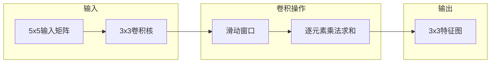

### 图2.2 CNN层级结构
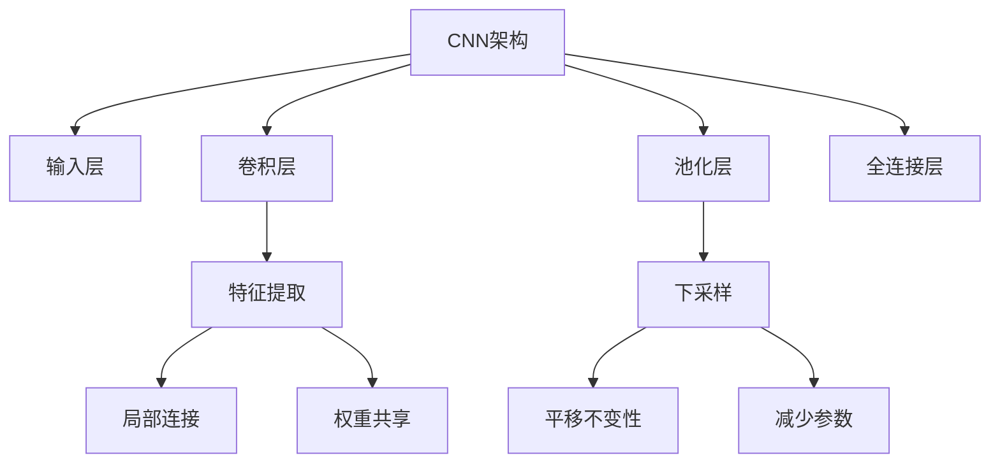

### 图2.3 CNN池化操作
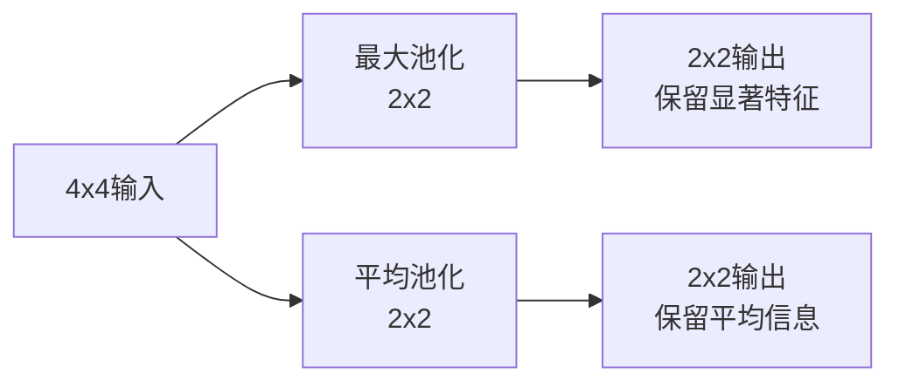

---

## 2. RNN原理图

### 图2.4 RNN循环结构
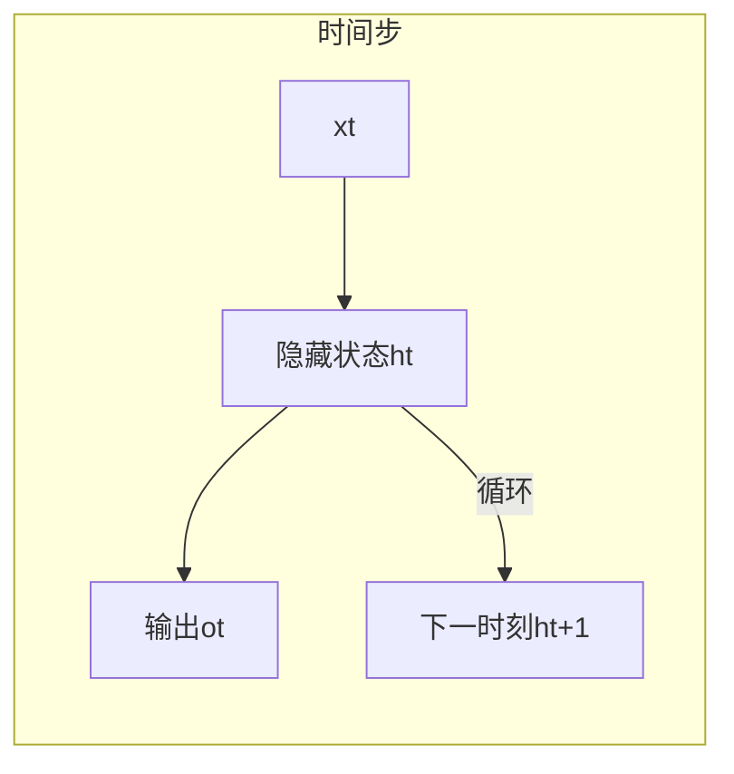

### 图2.5 RNN时间展开
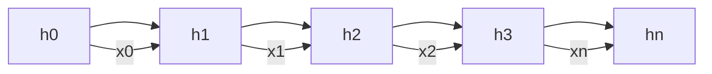

### 图2.6 RNN梯度流动
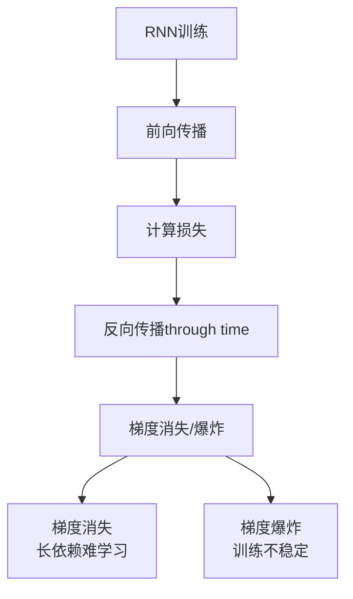

---

## 3. LSTM原理图

### 图2.7 LSTM单元结构
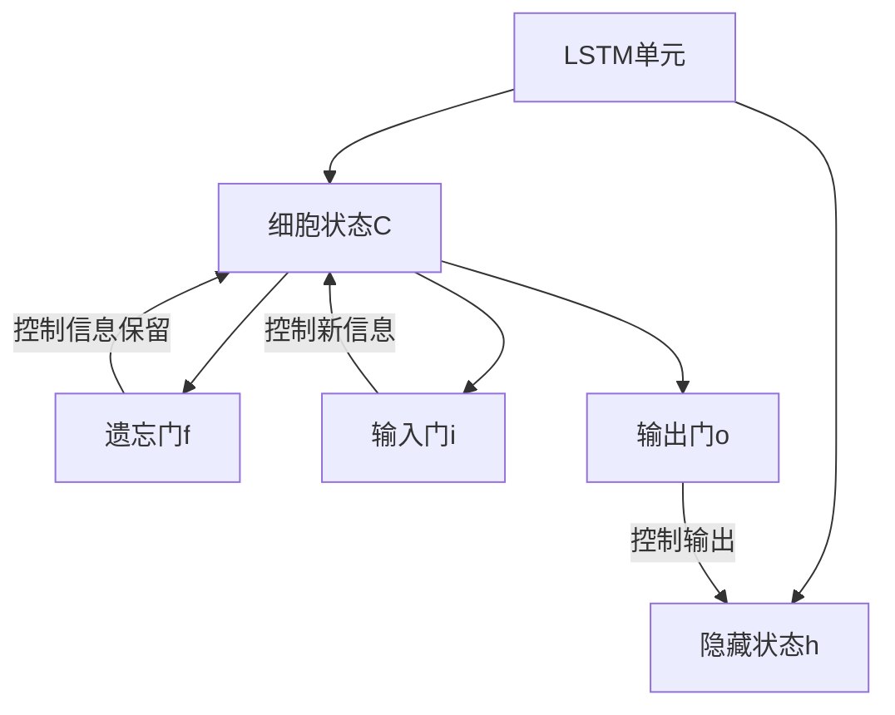

### 图2.8 LSTM门控机制
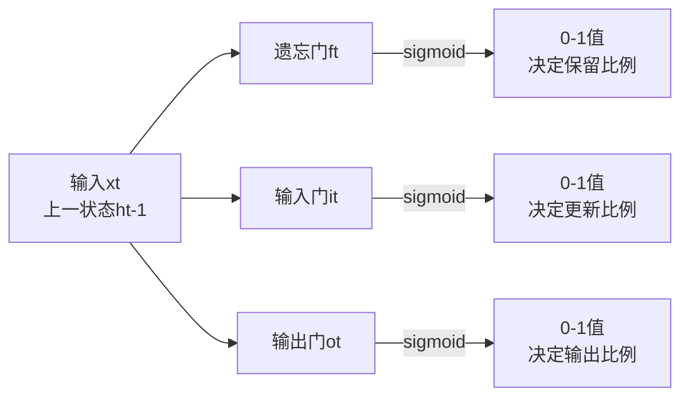

### 图2.9 LSTM vs RNN对比
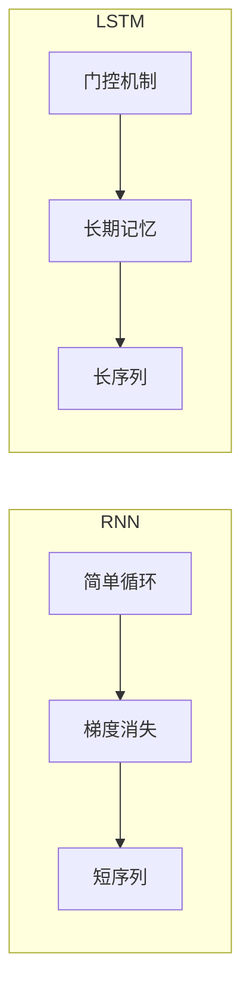

---

## 4. Attention机制细节

### 图2.10 Attention基本原理
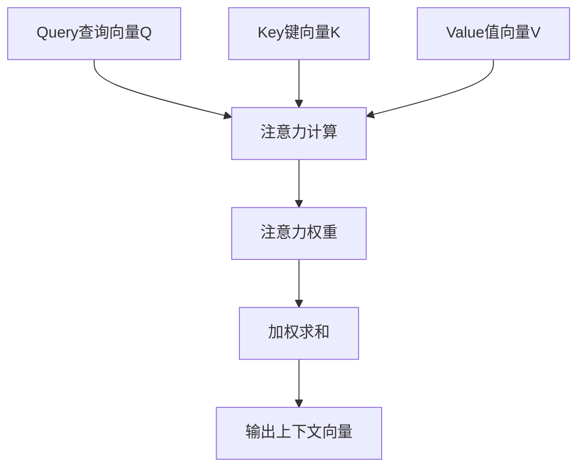

### 图2.11 Scaled Dot-Product Attention
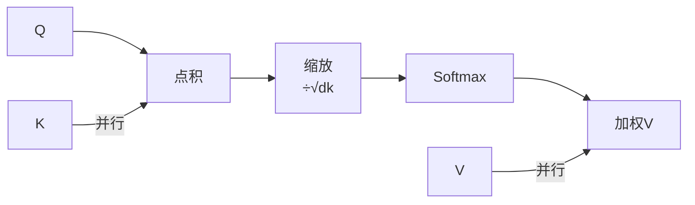

### 图2.12 Multi-Head Attention
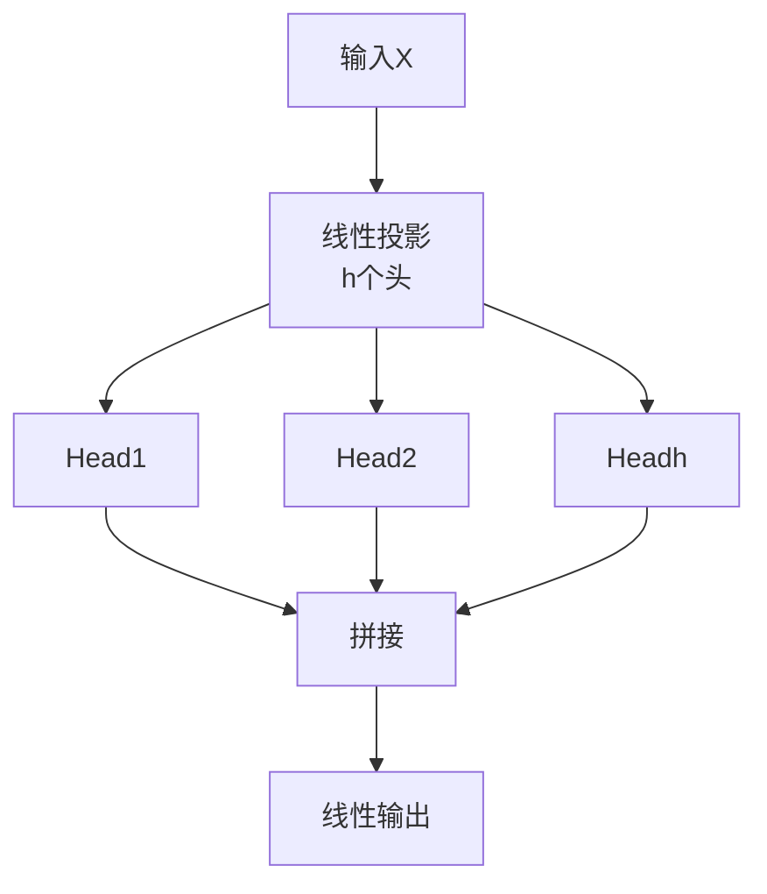

### 图2.13 Self-Attention计算流程
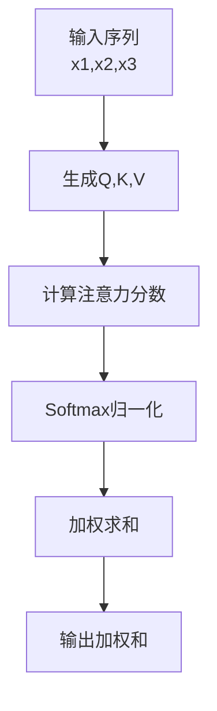

### 图2.14 Attention可视化
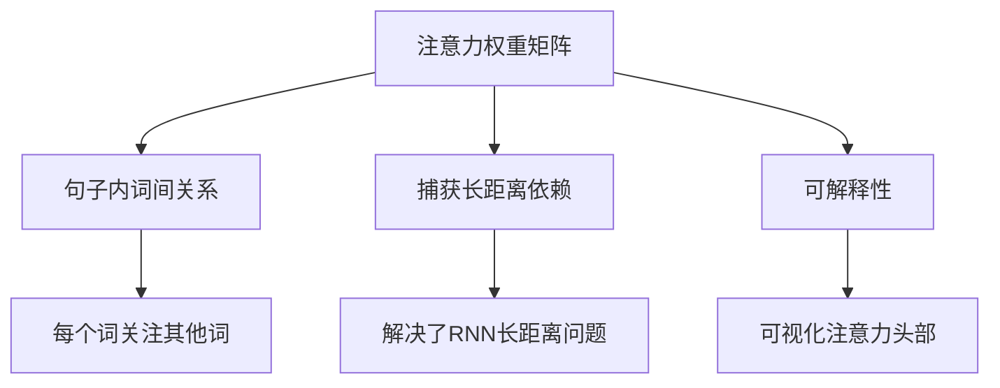

---

## 5. Transformer内部架构

### 图2.15 Transformer整体架构
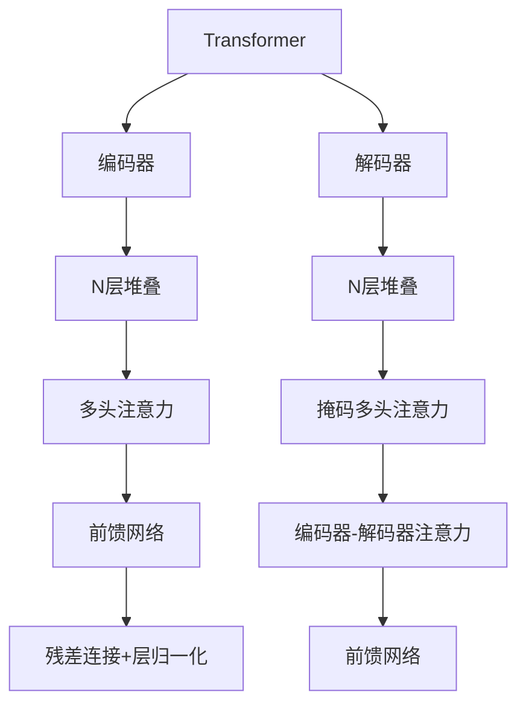

### 图2.16 Transformer编码器层


### 图2.17 Transformer解码器层


### 图2.18 位置编码
```mermaid
flowchart TB
    A[位置编码] --> B[正弦函数]
    A --> C[余弦函数]
    
    B --> B1[PE(pos,2i)=sin(pos/100002i/d)]
    C --> C1[PE(pos,2i+1)=cos(pos/100002i/d)]
```

### 图2.19 残差连接与层归一化
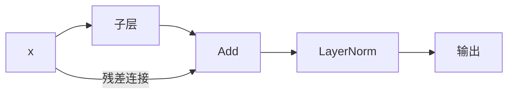

### 图2.20 Transformer前馈网络
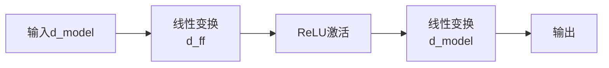

---

## 6. BERT训练流程细节

### 图2.21 BERT预训练任务
```mermaid
flowchart TB
    A[BERT预训练] --> B[MLM任务]
    A --> C[NSP任务]
    
    B --> B1[随机掩码15%token]
    B1 --> B2[预测被掩码词]
    B2 --> B3[完形填空风格]
    
    C --> C1[50%正样本]
    C1 --> C2[50%负样本]
    C2 --> C3[判断句子连续性]
```

### 图2.22 BERT输入表示
```mermaid
flowchart LR
    A[Token Embedding] --> D[输入表示]
    B[Segment Embedding] --> D
    C[Position Embedding] --> D
    
    D --> E[CLS token]
    D --> F[SEP token]
    D --> G[句子A/B]
```

### 图2.23 BERT微调策略
```mermaid
flowchart TB
    A[BERT微调] --> B[分类任务]
    A --> B1[序列标注]
    A --> B2[问答任务]
    A --> B3[句子对任务]
    
    B --> C[添加分类层]
    C --> D[端到端训练]
```

### 图2.24 BERT预训练流程
```mermaid
flowchart TD
    A[大规模语料] --> B[数据预处理]
    B --> C[随机掩码]
    C --> D[预训练任务]
    D --> E[MLM+NSP损失]
    E --> F[反向传播]
    F --> G[更新权重]
    G -->|迭代| D
```

### 图2.25 BERT变体演化
```mermaid
flowchart LR
    A[BERT] --> B[RoBERTa]
    A --> C[ALBERT]
    A --> D[DistilBERT]
    A --> E[ELECTRA]
    
    B -->|动态掩码| B1[更多训练数据]
    C -->|参数共享| C1[更小参数量]
    D -->|蒸馏| D1[更小更快]
    E -->|替换检测| E1[更高效预训练]
```

---

## 7. GPT演进图

### 图2.26 GPT-1架构
```mermaid
flowchart TB
    A[GPT-1] --> B[12层Transformer解码器]
    A --> C[768隐藏维度]
    A --> D[1.17亿参数]
    A --> E[BooksCorpus训练]
```

### 图2.27 GPT-2架构
```mermaid
flowchart TB
    A[GPT-2] --> B[48层Transformer]
    A --> C[1024隐藏维度]
    A --> D[15亿参数]
    A --> E[WebText训练]
    A --> F[零样本能力]
```

### 图2.28 GPT-3架构
```mermaid
flowchart TB
    A[GPT-3] --> B[96层Transformer]
    A --> C[12288隐藏维度]
    A --> D[1750亿参数]
    A --> E[Few-shot学习]
    A --> F[上下文学习]
```

### 图2.29 GPT-4多模态
```mermaid
flowchart TB
    A[GPT-4] --> B[多模态输入]
    A --> C[更长上下文<br/>32K/128K]
    A --> D[更强推理能力]
    A --> E[RLHF微调]
    
    B --> B1[图像+文本]
    B --> B2[视觉理解]
```

---

## 8. RLHF流程图

### 图2.30 RLHF三阶段
```mermaid
flowchart TD
    A[RLHF] --> B[阶段1<br/>监督微调SFT]
    B --> C[阶段2<br/>奖励模型RM]
    C --> D[阶段3<br/>PPO强化学习]
    
    B --> B1[标注数据微调]
    C --> C1[人类偏好训练]
    D --> D2[策略优化]
```

### 图2.31 奖励模型训练
```mermaid
flowchart LR
    A[人类反馈] --> B[比较数据收集]
    B --> C[奖励模型训练]
    C --> D[输出奖励分数]
    
    D --> E[学习人类偏好]
```

### 图2.32 PPO算法流程
```mermaid
flowchart LR
    A[SFT模型] --> B[PPO强化学习]
    B --> C[生成 responses]
    C --> D[奖励模型评分]
    D --> E[策略更新]
    E -->|迭代| C
```

### 图2.33 RLHF优化目标
```mermaid
flowchart TB
    A[优化目标] --> B[最大化奖励]
    A --> C[最小化KL散度]
    A --> D[保持分布接近]
    
    B --> B1[引导生成质量]
    C --> C1[防止过度偏离]
    D --> D1[稳定性]
```

---

## 9. LLM发展时间线

### 图2.34 语言模型发展历程
```mermaid
timeline
    2013 : Word2Vec
    2015 : Seq2Seq
    2017 : Transformer
    2018 : BERT / GPT-1
    2019 : GPT-2 / RoBERTa
    2020 : GPT-3 / T5
    2021 : GPT-3.5 / InstructGPT
    2022 : ChatGPT / GPT-4
    2023 : LLaMA / Claude
    2024 : GPT-4o / Claude 3
```

### 图2.35 模型规模增长
```mermaid
flowchart LR
    A[2018<br/>1亿] --> B[2019<br/>15亿]
    B --> C[2020<br/>1750亿]
    C --> D[2023<br/>1.7万亿]
    
    A -->|参数量| A1
    B -->|参数量| B1
    C -->|参数量| C1
    D -->|参数量| D1
```

### 图2.36 关键技术创新
```mermaid
flowchart TB
    A[LLM创新] --> B[模型架构]
    A --> C[训练方法]
    A --> D[应用范式]
    
    B --> B1[Transformer]
    B1 --> B2[Attention]
    B1 --> B3[Scaling]
    
    C --> C1[预训练]
    C1 --> C2[指令微调]
    C1 --> C3[RLHF]
    
    D --> D1[Zero-shot]
    D1 --> D2[Few-shot]
    D1 --> D3[CoT推理]
```

### 图2.37 算力需求增长
```mermaid
flowchart LR
    A[GPT-1<br/>1GPU-天] --> B[GPT-2<br/>数十GPU-天]
    B --> C[GPT-3<br/>数百GPU-年]
    C --> D[GPT-4<br/>数千GPU-年]
```

### 图2.38 评估基准演进
```mermaid
flowchart TB
    A[评估基准] --> B[GLUE/SuperGLUE]
    A --> C[MMLU]
    A --> D[HumanEval]
    A --> E[MMMU]
    
    B --> B1[语言理解]
    C --> C1[多任务知识]
    D --> D1[代码能力]
    E --> E1[多模态理解]
```

---

## 10. 补充技术图表

### 图2.39 模型并行策略
```mermaid
flowchart LR
    MP[模型并行] --> DP[数据并行]
    MP --> TP[张量并行]
    MP --> PP[流水线并行]
```

### 图2.40 训练优化器对比
```mermaid
flowchart LR
    O[优化器] --> SGD
    O --> M[SGD+Momentum]
    O --> A[Adam]
    O --> L[AdamW]
```

### 图2.41 学习率调度
```mermaid
flowchart LR
    LR[学习率调度] --> C[常数]
    LR --> S[步进]
    LR --> E[指数]
    LR --> C1[余弦退火]
```

### 图2.42 梯度裁剪
```mermaid
flowchart TD
    G[梯度] --> N[计算范数]
    N --> C[判断阈值]
    C -->|超阈值| Clip[裁剪]
    C -->|正常| Pass[直接使用]
```

### 图2.43 混合精度训练
```mermaid
flowchart LR
    FP32 --> FP16[转FP16]
    FP16 --> FWD[前向]
    FWD --> BWD[反向]
    BWD --> Loss[梯度]
    Loss --> UP[更新FP32]
```

---

## 11. 更多补充图表

### 图2.44 GPU集群架构
```mermaid
flowchart TB
    Cluster[GPU集群] --> Switch[高速网络]
    Switch --> GPU1[GPU 1]
    Switch --> GPU2[GPU 2]
    Switch --> GPUN[GPU N]
```

### 图2.45 分布式训练策略
```mermaid
flowchart LR
    DT[分布式训练] --> DataP[数据并行]
    DT --> ModelP[模型并行]
    DT --> PipeP[流水线并行]
```

### 图2.46 显存优化技术
```mermaid
flowchart LR
    Mem[显存优化] --> ZeRO
    ZeRO --> Stage1
    ZeRO --> Stage2
    ZeRO --> Stage3
```

### 图2.47 推理服务架构
```mermaid
flowchart TB
    Serve[推理服务] --> API[API层]
    API --> Engine[推理引擎]
    Engine --> Model[模型]
    Engine --> Cache[KV Cache]
```

### 图2.48 多模态模型架构
```mermaid
flowchart LR
    MM[多模态] --> Enc[分别编码]
    Enc --> Fuse[融合]
    Fuse --> Out[输出]
```
