# 第3章：知识图谱

## 1. 知识图谱分类图

### 图3.1 知识图谱类型
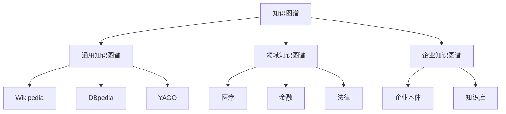

### 图3.2 知识图谱构建流程
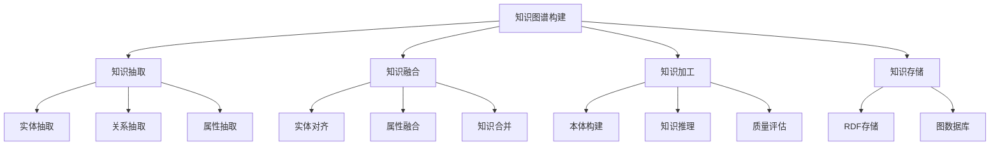

### 图3.3 知识表示形式
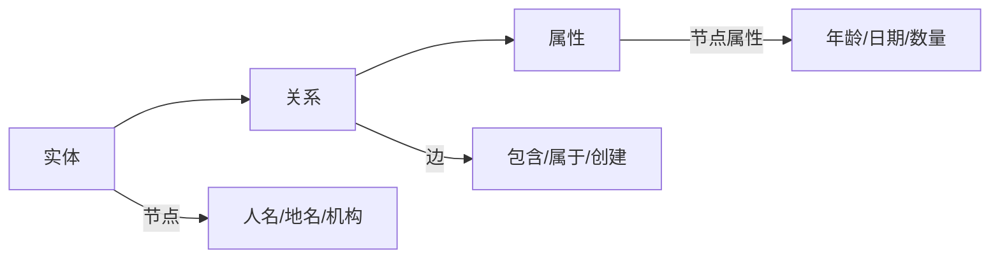

---

## 2. RDF vs 属性图

### 图3.4 RDF三元组结构
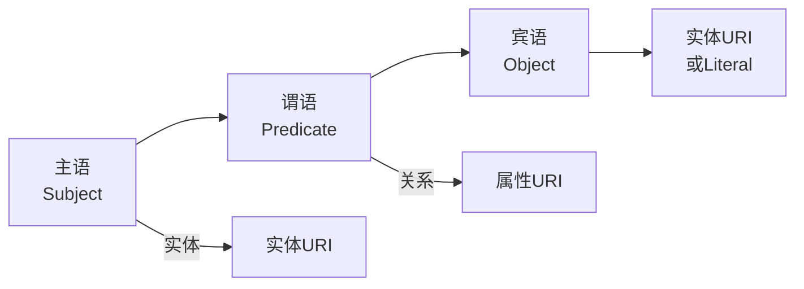

### 图3.5 RDF序列化格式
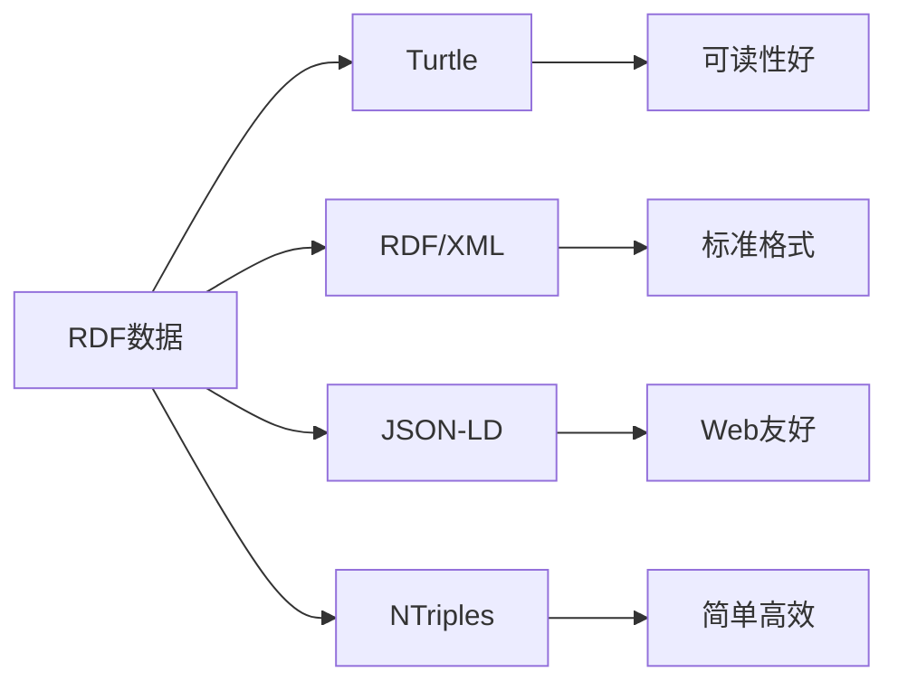

### 图3.6 属性图模型
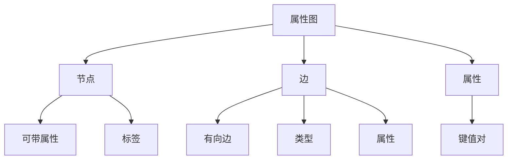

### 图3.7 RDF vs 属性图对比
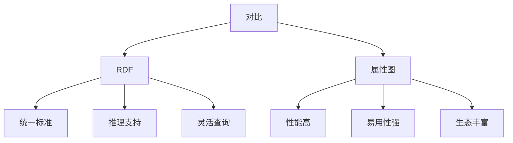

---

## 3. TransE/TransH/TransR细节

### 图3.8 TransE原理
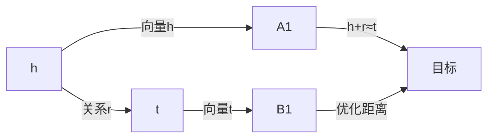

### 图3.9 TransE损失函数
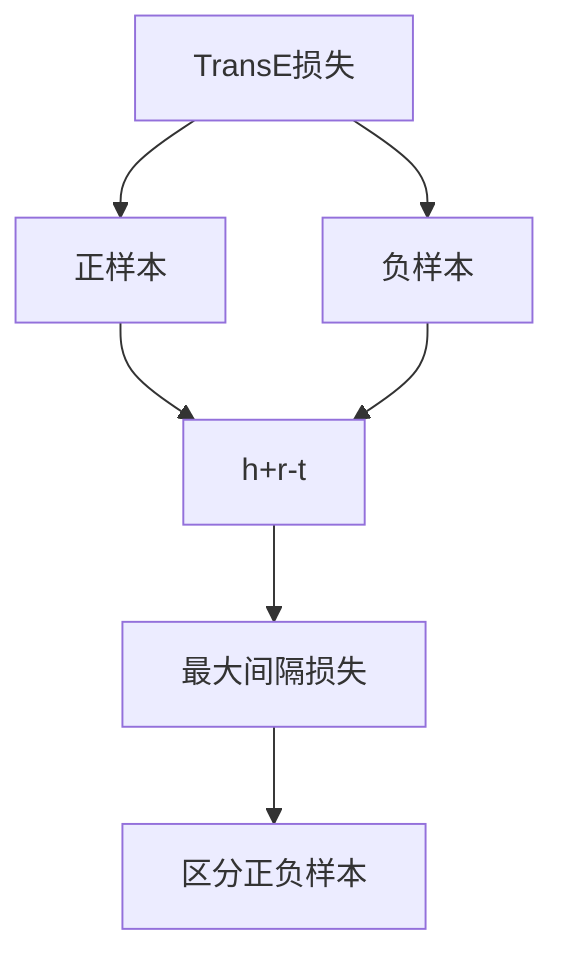

### 图3.10 TransH超平面
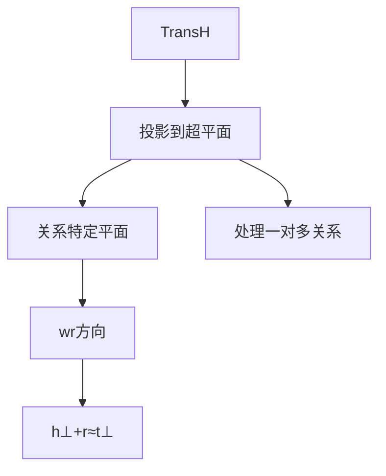

### 图3.11 TransR空间变换
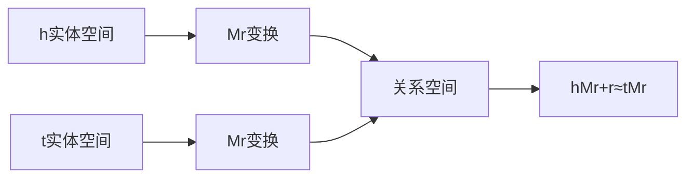

### 图3.12 Trans系列模型对比
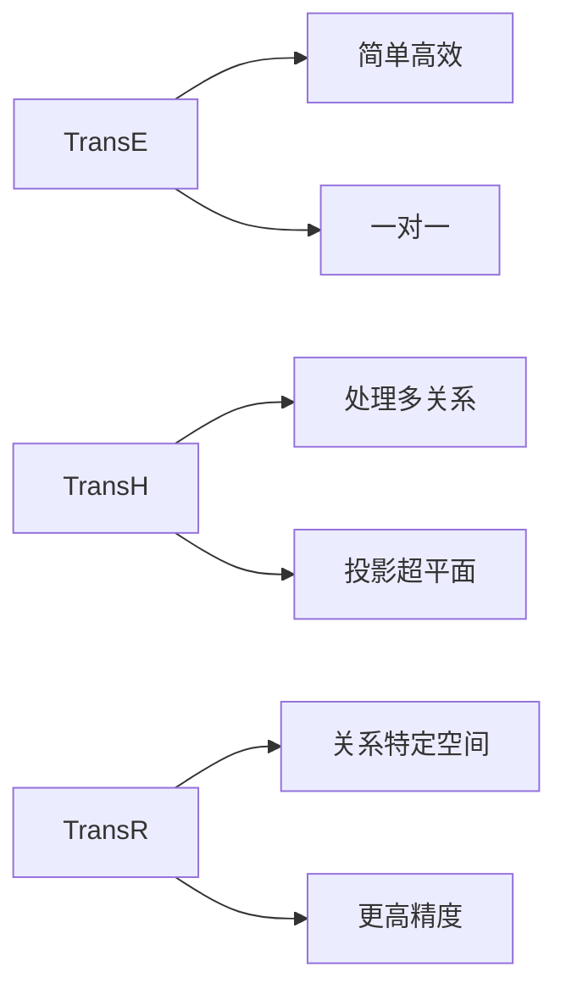

---

## 4. DistMult/ComplEx原理

### 图3.13 DistMult双线性模型
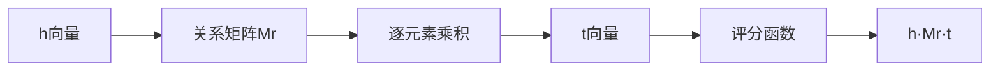

### 图3.14 DistMult评分函数
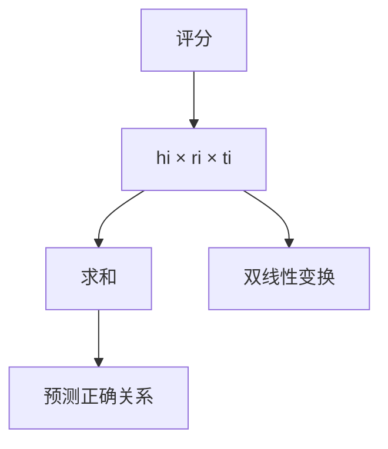

### 图3.15 ComplEx复数模型
```mermaid
flowchart LR
    A[使用复数] --> B[Re(h)·Re(r)·Re(t)]
    A --> C[Im(h)·Re(r)·Im(t)]
    A --> D[等多组合]
    
    B --> E[捕获非对称关系]
    C --> E
    D --> E
```

### 图3.16 DistMult vs ComplEx
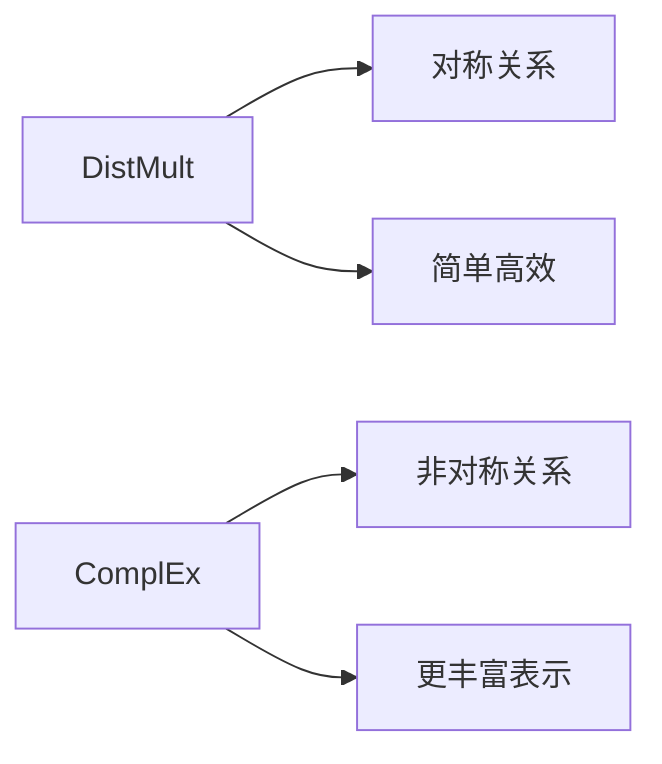

### 图3.17 知识图谱嵌入方法分类
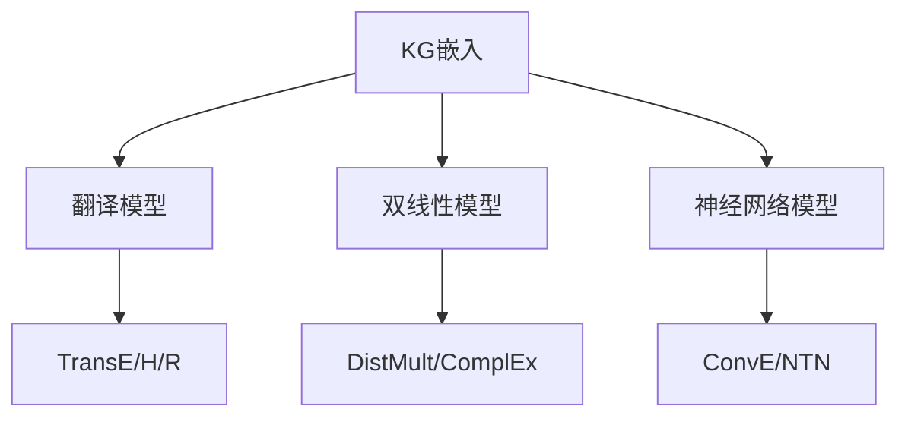

---

## 5. 实体对齐算法

### 图3.18 实体对齐概述
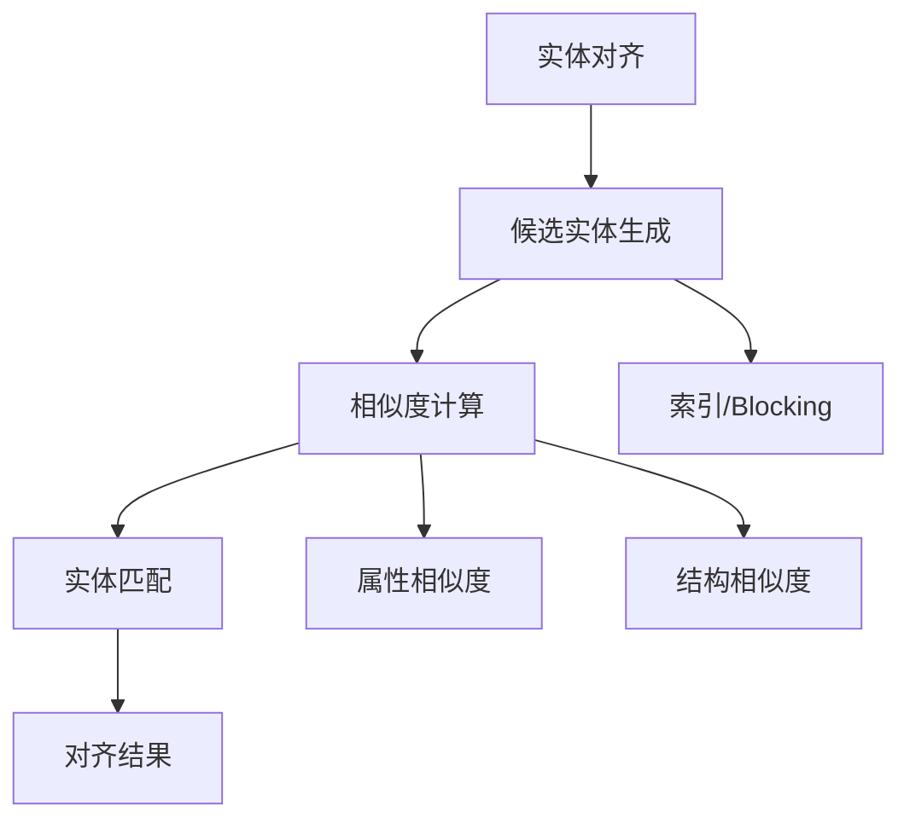

### 图3.19 基于表示学习的实体对齐
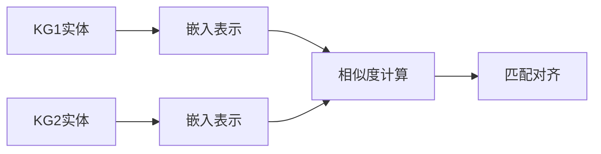

### 图3.20 实体对齐特征
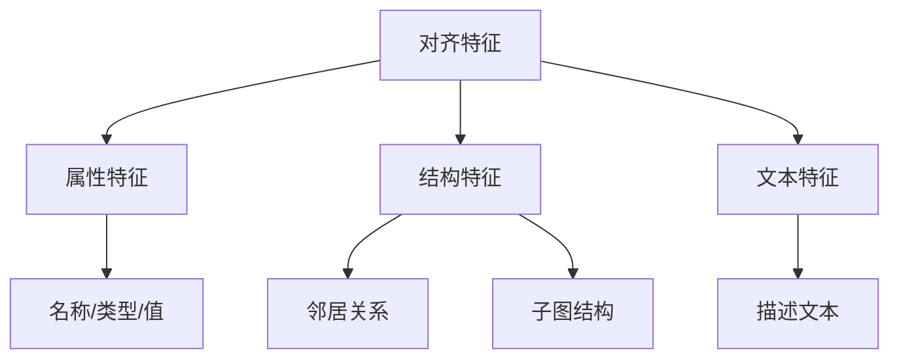

### 图3.21 实体对齐挑战
```mermaid
flowchart TB
    A[对齐挑战] --> B[异构性]
    A --> C[规模问题]
    A --> D[噪声处理]
    A --> E[新实体发现]
    
    B --> B1[模式/语义差异]
    C --> C1[百万级实体]
    D --> D1[数据质量问题]
    E --> E1[冷启动]
```

### 图3.22 迭代式实体对齐
```mermaid
flowchart LR
    A[初始匹配] --> B[种子对齐]
    B --> C[传播增强]
    C --> D[迭代优化]
    D --> E[收敛]
    
    C -->|利用对齐| C1
    D -->|迭代| C
```

---

## 6. 关系抽取流程

### 图3.23 关系抽取任务
```mermaid
flowchart TB
    A[关系抽取] --> B[输入]
    A --> C[处理]
    A --> D[输出]
    
    B --> B1[句子+实体对]
    C --> C1[特征提取]
    C --> C2[关系分类]
    D --> D1[关系类型]
```

### 图3.24 关系抽取方法演进
```mermaid
flowchart LR
    A[规则方法] --> B[监督学习]
    B --> C[远程监督]
    C --> D[深度学习]
    D --> E[预训练模型]
    
    A -->|模板匹配| A1
    B -->|特征工程| B1
    C -->|知识库| C1
    D -->|CNN/RNN| D1
    E --> E1[BERT/ERNIE]
```

### 图3.25 远程监督关系抽取
```mermaid
flowchart TD
    A[知识库] --> B[对齐语料]
    B --> C[噪声标签]
    C --> D[多实例学习]
    D --> E[关系分类]
```

### 图3.26 关系抽取模型架构
```mermaid
flowchart LR
    A[输入句子] --> B[编码层]
    B --> C[注意力层]
    C --> D[分类层]
    D --> E[关系输出]
    
    B --> B1[BERT编码]
    C --> C1[实体位置注意力]
```

### 图3.27 关系抽取评估
```mermaid
flowchart TB
    A[评估指标] --> B[精确率]
    A --> C[召回率]
    A --> D[F1分数]
    
    B --> B1[预测正确率]
    C --> C1[覆盖全面性]
    D --> D1[综合评估]
```

---

## 7. 图谱查询语言

### 图3.28 SPARQL查询
```mermaid
flowchart LR
    A[SPARQL] --> B[SELECT]
    A --> B1[WHERE]
    A --> B2[FILTER]
    A --> B3[ORDER BY]
    
    B --> C[RDF数据查询]
```

### 图3.29 Cypher查询
```mermaid
flowchart LR
    A[Cypher] --> B[MATCH]
    A --> C[WHERE]
    A --> D[RETURN]
    A --> E[CREATE]
    
    B --> F[属性图查询]
```

### 图3.30 Gremlin遍历
```mermaid
flowchart LR
    A[Gremlin] --> B[g.V()]
    A --> C[.out()]
    A --> D[.has()]
    A --> E[.valueMap()]
    
    B --> F[图遍历查询]
```

---

## 8. AliCoCo架构细节

### 图3.31 AliCoCo整体架构
```mermaid
flowchart TB
    A[AliCoCo] --> B[数据层]
    A --> C[构建层]
    A --> D[服务层]
    
    B --> B1[电商数据]
    B1 --> B2[用户行为]
    B1 --> B3[商品信息]
    
    C --> C1[概念抽取]
    C1 --> C2[关系构建]
    C1 --> C3[知识融合]
    
    D --> D1[搜索]
    D1 --> D2[推荐]
    D1 --> D3[问答]
```

### 图3.32 AliCoCo概念层次
```mermaid
flowchart TB
    A[概念层次] --> B[顶层概念]
    A --> C[中层概念]
    A --> D[细粒度概念]
    
    B --> B1[品类]
    C --> C1[品牌/类型]
    D --> D1[属性概念]
```

### 图3.33 AliCoCo构建流程
```mermaid
flowchart TD
    A[商品数据] --> B[文本挖掘]
    B --> C[概念识别]
    C --> D[关系学习]
    D --> E[知识组织]
    
    B --> B1[商品标题/描述]
    C --> C1[实体识别]
    D --> D1[属性-值关系]
```

### 图3.34 AliCoCo应用场景
```mermaid
flowchart TB
    A[AliCoCo应用] --> B[智能搜索]
    A --> C[商品推荐]
    A --> D[知识问答]
    A --> E[语义匹配]
    
    B --> B1[理解用户意图]
    C --> C1[精准推荐]
    D --> D1[商品知识查询]
    E --> E1[跨品类匹配]
```

### 图3.35 电商知识图谱特色
```mermaid
flowchart TB
    A[电商KG特色] --> B[商品知识]
    A --> C[用户知识]
    A --> D[行为知识]
    
    B --> B1[SKU/SPU]
    B --> B2[属性体系]
    
    C --> C1[偏好画像]
    C --> C2[购买力]
    
    D --> D1[浏览/搜索]
    D --> D2[点击/购买]
```

---

## 9. 补充图表

### 图3.36 知识图谱查询示例
```mermaid
flowchart LR
    A[查询] --> B[实体检索]
    B --> C[关系路径]
    C --> D[属性查询]
    D --> E[结果返回]
```

### 图3.37 知识推理类型
```mermaid
flowchart TB
    A[知识推理] --> B[演绎推理]
    A --> C[归纳推理]
    A --> D[类比推理]
    
    B --> B1[规则应用]
    C --> C1[模式学习]
    D --> D1[相似转移]
```

### 图3.38 知识图谱可视化
```mermaid
flowchart LR
    A[可视化] --> B[关系图]
    A --> C[层次图]
    A --> D[热力图]
    
    B --> B1[网络布局]
    C --> C1[树状结构]
    D --> D1[密度分布]
```

---

## 10. 补充知识图谱图表

### 图3.39 图数据库对比
```mermaid
flowchart LR
    DB[图数据库] --> N[Neo4j]
    DB --> J[JanusGraph]
    DB --> N1[Nebula]
```

### 图3.40 本体构建流程
```mermaid
flowchart TD
    Onto[本体构建] --> Cls[类定义]
    Cls --> Prop[属性定义]
    Prop --> Inst[实例填充]
    Inst --> Val[验证]
```

### 图3.41 知识推理方法
```mermaid
flowchart TB
    KR[推理方法] --> R[基于规则]
    KR --> E[基于嵌入]
    KR --> N[基于神经网络]
    
    R --> RL[逻辑规则]
    E --> KE[知识嵌入]
    N --> NL[神经网络的逻辑]
```

### 图3.42 图谱质量评估
```mermaid
flowchart LR
    QA[质量评估] --> C[完整性]
    QA --> A[准确性]
    QA --> F[一致性]
    QA --> U[时效性]
```

### 图3.43 知识增强LLM
```mermaid
flowchart TB
    LLM[LLM] --> RET[检索]
    RET --> KG[知识图谱]
    LLM --> Prompt[提示]
    KG --> Prompt
    Prompt --> Out[输出]
```

---

## 11. 更多补充图表

### 图3.44 图数据库查询优化
```mermaid
flowchart LR
    Opt[查询优化] --> Index[索引]
    Opt --> Cache[缓存]
    Opt --> Plan[执行计划]
```

### 图3.45 本体推理机
```mermaid
flowchart LR
    Reasoner[推理机] --> FOWL[前向链]
    Reasoner --> BOWL[后向链]
    Reasoner --> Table[表推理]
```

### 图3.46 知识图谱可视化
```mermaid
flowchart LR
    Viz[可视化] --> Force[力导向]
    Viz --> Hier[层次布局]
    Viz --> Radial[放射布局]
```

### 图3.47 知识图谱应用场景
```mermaid
flowchart TB
    App[应用] --> Search
    App --> Rec
    App --> Dialog
    App --> Analytics
```

### 图3.48 KG与LLM融合
```mermaid
flowchart LR
    Fusion[融合] --> Embed[嵌入KG]
    Embed --> Prompt[提示中]
    Prompt --> LLM[LLM生成]
```
