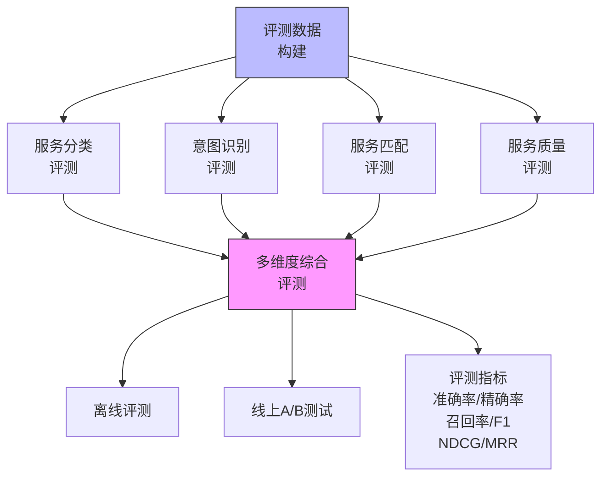

# 图9.1：服务理解评测体系框架

```mermaid
graph TD
    EDC[评测数据<br/>构建] --> SCE[服务分类<br/>评测]
    EDC --> IRE[意图识别<br/>评测]
    EDC --> SME[服务匹配<br/>评测]
    EDC --> SQE[服务质量<br/>评测]
    
    SCE --> MDE[多维度综合<br/>评测]
    IRE --> MDE
    SME --> MDE
    SQE --> MDE
    
    MDE --> FE[离线评测]
    MDE --> OA[线上A/B测试]
    MDE --> MET[评测指标<br/>准确率/精确率<br/>召回率/F1<br/>NDCG/MRR]
    
    style MDE fill:#f9f,stroke:#333
    style EDC fill:#bbf,stroke:#333
```

**说明**：展示服务理解评测体系的完整框架，从数据构建到多维度评测再到离线/在线评估的全流程。
