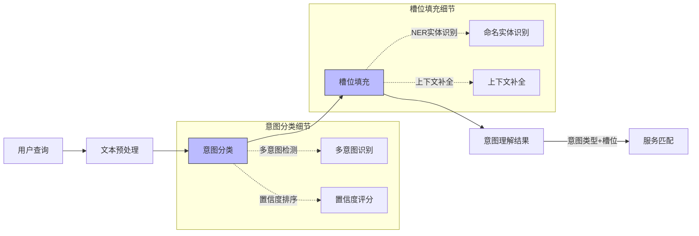

# 图9.2：意图识别与槽位填充流程

```mermaid
graph LR
    UQ[用户查询] --> TP[文本预处理]
    TP --> IC[意图分类]
    IC --> SF[槽位填充]
    SF --> IU[意图理解结果]
    
    IU -->|意图类型+槽位| SM[服务匹配]
    
    subgraph 意图分类细节
    IC -.->|多意图检测| MIC[多意图识别]
    IC -.->|置信度排序| CCS[置信度评分]
    end
    
    subgraph 槽位填充细节
    SF -.->|NER实体识别| NER[命名实体识别]
    SF -.->|上下文补全| CC[上下文补全]
    end
    
    style IC fill:#bbf,stroke:#333
    style SF fill:#bbf,stroke:#333
```

**说明**：展示用户查询从预处理到意图识别和槽位填充的完整流程。
