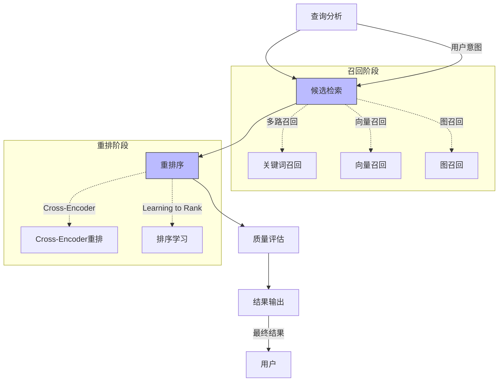

# 图9.3：服务匹配评测流程

```mermaid
graph TD
    QA[查询分析] --> CR[候选检索]
    CR --> RR[重排序]
    RR --> QA2[质量评估]
    QA2 --> RO[结果输出]
    
    subgraph 召回阶段
    CR -.->|多路召回| KC[关键词召回]
    CR -.->|向量召回| VC[向量召回]
    CR -.->|图召回| GC[图召回]
    end
    
    subgraph 重排阶段
    RR -.->|Cross-Encoder| CER[Cross-Encoder重排]
    RR -.->|Learning to Rank| LTR[排序学习]
    end
    
    QA -->|用户意图| CR
    RO -->|最终结果| User[用户]
    
    style CR fill:#bbf,stroke:#333
    style RR fill:#bbf,stroke:#333
```

**说明**：展示服务匹配从查询分析到结果输出的完整评测流程，包括多路召回和重排序阶段。
