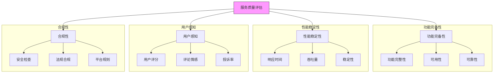

# 图9.4：服务质量多维评估模型

```mermaid
graph TD
    SQD[服务质量评估] --> F[功能完备性]
    SQD --> P[性能稳定性]
    SQD --> UP[用户感知]
    SQD --> C[合规性]
    
    subgraph 功能完备性
    F --> FC[功能完整性]
    F --> AV[可用性]
    F --> RL[可靠性]
    end
    
    subgraph 性能稳定性
    P --> RT[响应时间]
    P --> TH[吞吐量]
    P --> STB[稳定性]
    end
    
    subgraph 用户感知
    UP --> UR[用户评分]
    UP --> RS[评论情感]
    UP --> CR[投诉率]
    end
    
    subgraph 合规性
    C --> SC[安全检查]
    C --> RGC[法规合规]
    C --> PRC[平台规则]
    end
    
    style SQD fill:#f9f,stroke:#333
```

**说明**：展示服务质量的多维度评估模型，包括功能、性能、用户感知和合规性四个核心维度。
