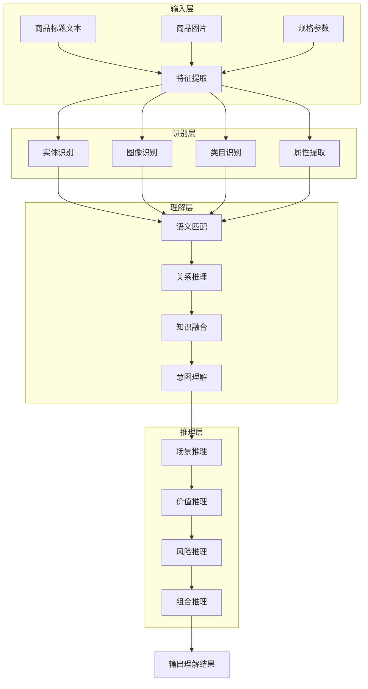

# 图1.1：供给理解的层次化模型架构

## 论文分析基础

基于对423篇论文的分析，本书建立了层次化的供给理解框架：

| 层次 | 主要技术 | 核心论文 |
|------|---------|----------|
| 识别层 | NER、图像识别、分类 | 1812.05774, 1903.04254, 1703.02344 |
| 理解层 | 语义匹配、关系推理、知识融合 | 1907.00937, 1911.12481, 2009.11684 |
| 推理层 | 场景推理、价值推理、组合推理 | 1702.07158, 1803.00693 |

